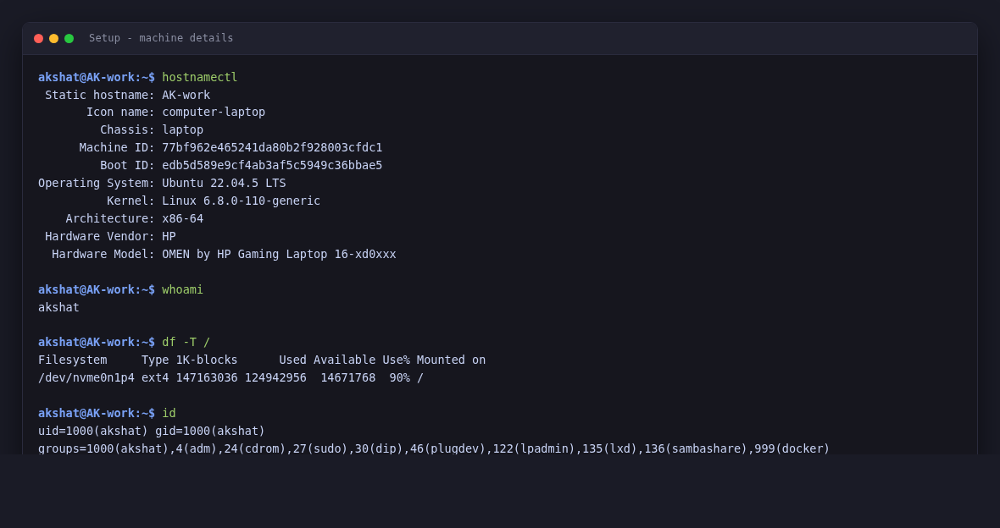
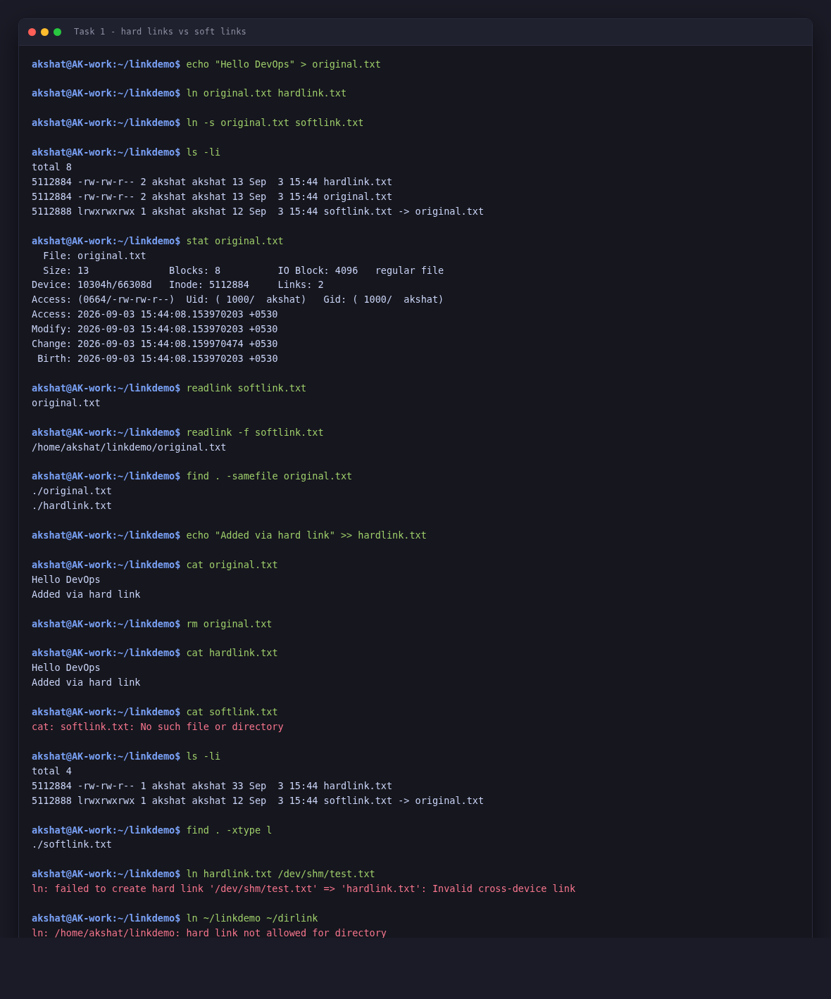
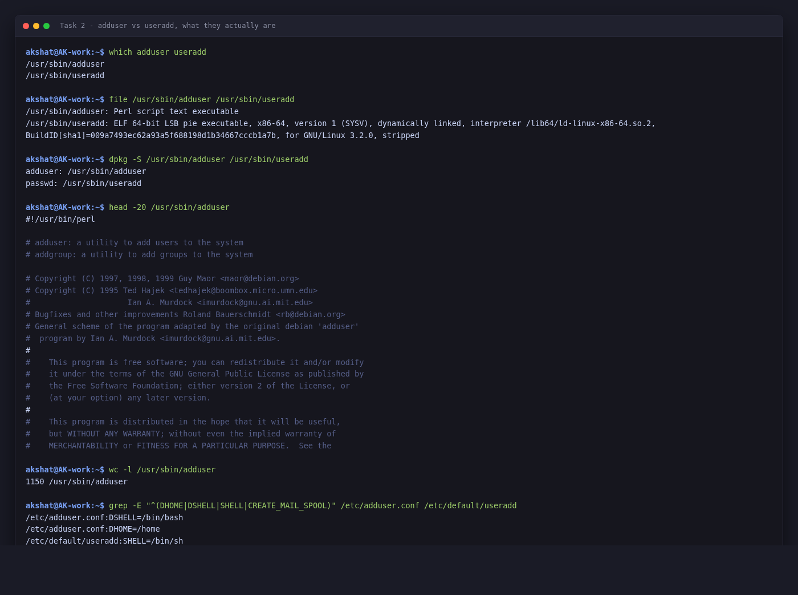
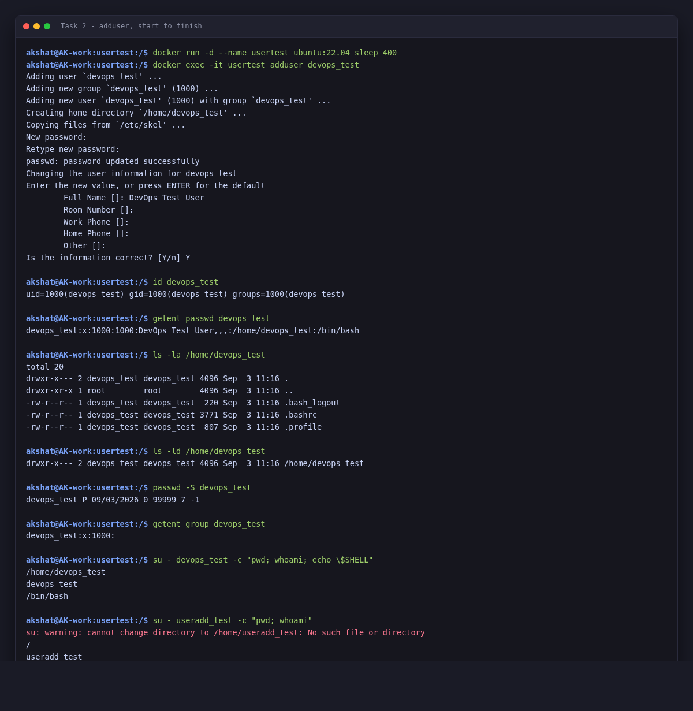
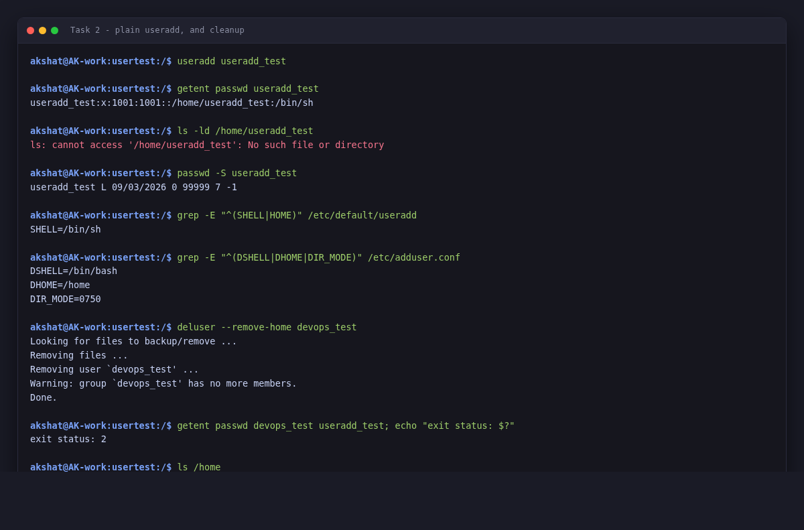
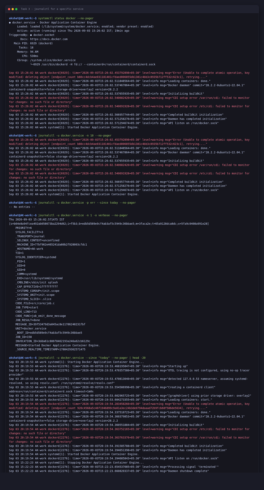
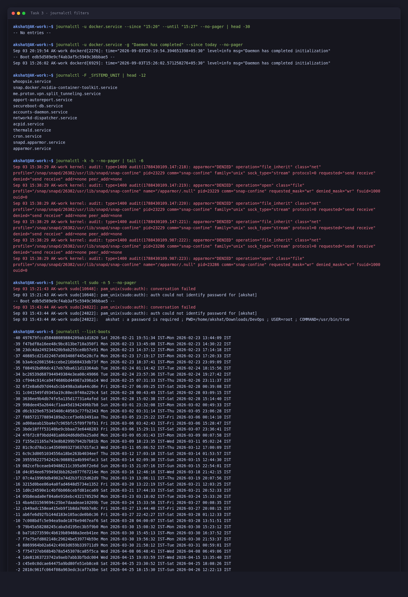

# Linux Fundamentals Homework

**Name:** Akshat Kushwaha
**Enrollment Number:** 24bcs10060
3 September 2026

Four tasks: the difference between the two kinds of link, the difference between the two commands for adding a user, reading logs with `journalctl`, and working through the command cheat sheet.

| Task | Covers |
|---|---|
| [1](#task-1-soft-link--hard-link) | Soft links vs hard links — creating, deleting, and the two things a hard link cannot do |
| [2](#task-2-adduser-vs-useradd) | `adduser` vs `useradd`, which one Ubuntu wants you to use, and creating a test user |
| [3](#task-3-journalctl) | `journalctl` — what it is for, reading system and per-service logs |
| [4](#task-4-linux-command-cheat-sheet) | The command cheat sheet, grouped by what each command is for |

---

## Setup

Everything below was done on my own Ubuntu machine.

```text
akshat@AK-work:~$ hostnamectl
 Static hostname: AK-work
       Icon name: computer-laptop
         Chassis: laptop
      Machine ID: 77bf962e465241da80b2f928003cfdc1
         Boot ID: edb5d589e9cf4ab3af5c5949c36bbae5
Operating System: Ubuntu 22.04.5 LTS
          Kernel: Linux 6.8.0-110-generic
    Architecture: x86-64
 Hardware Vendor: HP
  Hardware Model: OMEN by HP Gaming Laptop 16-xd0xxx
```

```text
akshat@AK-work:~$ df -T /
Filesystem     Type 1K-blocks      Used Available Use% Mounted on
/dev/nvme0n1p4 ext4 147163036 124942956  14671768  90% /
```

Root filesystem is ext4 on an NVMe partition, and my user is UID 1000. That matters for a couple of the link tests later.

---

## Task 1: Soft Link & Hard Link

### The difference

The thing that finally made this click for me is that a filename is not the file. The actual file is the **inode** — the data plus its metadata. A directory is just a table mapping names to inode numbers.

So a **hard link** is nothing more than a second row in that table pointing at the *same* inode. There is no original and no copy. Both names are equally real, and the kernel keeps a count of how many names point at the inode. Delete one name, the count drops by one. The data is only freed when the count hits zero.

A **soft link** (symlink) is a completely different animal. It is its own file, with its own inode, and the "contents" of that file are just a **string** — the path of the thing it points at. The kernel follows that string every time you touch the link. If whatever the string names goes away, the link is still sitting there, it just points at nothing.

| | Hard link | Soft link (symlink) |
|---|---|---|
| What it actually is | Another name for the same inode | A separate file containing a path string |
| Inode | Shared with the target | Its own |
| Command | `ln target link` | `ln -s target link` |
| Across filesystems | Not possible | Fine |
| Point at a directory | Not allowed | Fine |
| Target gets deleted | Still works | Breaks (dangling) |
| Type in `ls -l` | `-`, looks like any file | `l`, shows `link -> target` |
| Size shown | The file's size | Number of characters in the target path |
| Link count column | Goes up with each link | Target's count unchanged |
| Permissions | Same inode, so identical | Always `lrwxrwxrwx`; the target's perms are what apply |

### Commands

```bash
ln    target link      # hard link
ln -s target link      # soft link

ln -sf  target link    # replace an existing link
ln -sfn target dir     # -n so it doesn't get created *inside* an existing symlinked dir
ln -sr  target link    # make the symlink relative instead of absolute
```

For looking at them:

```bash
ls -li                 # -i shows inode numbers, which is how you prove a hard link
stat file              # inode + link count in one place
readlink link          # the raw string stored in the symlink
readlink -f link       # follow it all the way to the real file
find . -xtype l        # broken symlinks
find . -samefile f     # every hard link to the same inode
```

### Practice

Starting clean:

```text
akshat@AK-work:~$ mkdir -p ~/linkdemo && cd ~/linkdemo
akshat@AK-work:~/linkdemo$ echo "Hello DevOps" > original.txt
akshat@AK-work:~/linkdemo$ ls -li
total 4
5112884 -rw-rw-r-- 1 akshat akshat 13 Sep  3 15:44 original.txt
```

One file, inode 5112884, link count 1. Now both kinds of link:

```text
akshat@AK-work:~/linkdemo$ ln original.txt hardlink.txt
akshat@AK-work:~/linkdemo$ ln -s original.txt softlink.txt
akshat@AK-work:~/linkdemo$ ls -li
total 8
5112884 -rw-rw-r-- 2 akshat akshat 13 Sep  3 15:44 hardlink.txt
5112884 -rw-rw-r-- 2 akshat akshat 13 Sep  3 15:44 original.txt
5112888 lrwxrwxrwx 1 akshat akshat 12 Sep  3 15:44 softlink.txt -> original.txt
```

This one listing shows basically everything:

- `original.txt` and `hardlink.txt` both say **5112884** and both say **2**. Same inode, two names, count went from 1 to 2.
- `softlink.txt` has its own inode **5112888**, type `l`, count `1`.
- The symlink's size is **12**. `original.txt` is 12 characters. That is not a coincidence, that string *is* the file.

`stat` says the same thing more explicitly:

```text
akshat@AK-work:~/linkdemo$ stat original.txt
  File: original.txt
  Size: 13        	Blocks: 8          IO Block: 4096   regular file
Device: 10304h/66308d	Inode: 5112884     Links: 2
Access: (0664/-rw-rw-r--)  Uid: ( 1000/  akshat)   Gid: ( 1000/  akshat)
Access: 2026-09-03 15:44:08.153970203 +0530
Modify: 2026-09-03 15:44:08.153970203 +0530
Change: 2026-09-03 15:44:08.159970474 +0530
 Birth: 2026-09-03 15:44:08.153970203 +0530
```

Small thing I noticed: Change is later than Modify. I never touched the contents, but adding the hard link changed the inode's metadata (the link count), and ctime tracks that.

```text
akshat@AK-work:~/linkdemo$ readlink softlink.txt
original.txt
akshat@AK-work:~/linkdemo$ readlink -f softlink.txt
/home/akshat/linkdemo/original.txt
akshat@AK-work:~/linkdemo$ find . -samefile original.txt
./original.txt
./hardlink.txt
```

Writing through one name shows up in the others, because there is only one file:

```text
akshat@AK-work:~/linkdemo$ echo "Added via hard link" >> hardlink.txt
akshat@AK-work:~/linkdemo$ cat original.txt
Hello DevOps
Added via hard link
akshat@AK-work:~/linkdemo$ cat softlink.txt
Hello DevOps
Added via hard link
```

### Deleting the target

This is the part worth remembering, and it is where the two stop looking alike.

```text
akshat@AK-work:~/linkdemo$ rm original.txt
akshat@AK-work:~/linkdemo$ cat hardlink.txt
Hello DevOps
Added via hard link
akshat@AK-work:~/linkdemo$ cat softlink.txt
cat: softlink.txt: No such file or directory
```

The hard link still has the data. The symlink is pointing at a name that no longer exists, so it fails, and the error is about `softlink.txt` even though the missing thing is `original.txt`, which is a bit confusing the first time you see it.

```text
akshat@AK-work:~/linkdemo$ ls -li
total 4
5112884 -rw-rw-r-- 1 akshat akshat 33 Sep  3 15:44 hardlink.txt
5112888 lrwxrwxrwx 1 akshat akshat 12 Sep  3 15:44 softlink.txt -> original.txt
akshat@AK-work:~/linkdemo$ find . -xtype l
./softlink.txt
```

Link count on the surviving file dropped back to 1. In a colour terminal the dead symlink shows up in flashing red, which is a useful tell.

### The two things you cannot do with a hard link

Tried both, mostly to see the actual error messages.

Cross-filesystem — `/dev/shm` is tmpfs so it is definitely a different filesystem from my home:

```text
akshat@AK-work:~/linkdemo$ ln hardlink.txt /dev/shm/test.txt
ln: failed to create hard link '/dev/shm/test.txt' => 'hardlink.txt': Invalid cross-device link
```

Makes sense once you know a directory entry stores an inode *number*. That number means nothing on a different filesystem. A symlink stores a path, which is why the same thing works fine:

```text
akshat@AK-work:~/linkdemo$ ln -s ~/linkdemo/hardlink.txt /dev/shm/test.txt
akshat@AK-work:~/linkdemo$ ls -l /dev/shm/test.txt
lrwxrwxrwx 1 akshat akshat 34 Sep  3 15:44 /dev/shm/test.txt -> /home/akshat/linkdemo/hardlink.txt
```

And directories:

```text
akshat@AK-work:~/linkdemo$ ln ~/linkdemo ~/dirlink
ln: /home/akshat/linkdemo: hard link not allowed for directory
```

Even with sudo. The reason is that it would let you build loops in the directory tree, and then anything that walks the tree (`find`, `du`, `fsck`) can go round forever.

### Cleaning up

```text
akshat@AK-work:~/linkdemo$ rm softlink.txt          # removes the link only
akshat@AK-work:~/linkdemo$ unlink hardlink.txt      # unlink works too
akshat@AK-work:~/linkdemo$ rm /dev/shm/test.txt
akshat@AK-work:~/linkdemo$ cd ~ && rmdir linkdemo
```

One trap worth writing down: if `linkdir` is a symlink to a directory, `rm linkdir` removes the link, but `rm linkdir/` with the trailing slash does not do what you want. Tab completion adds that slash for you, so it is easy to hit by accident.

### Interview prep

Notes to myself, since this comes up constantly.

**Difference in one line?**
Hard link = another name for the same inode. Soft link = a small file holding the path of another file, resolved when you access it.

**Why can't a hard link cross filesystems?**
Directory entries store inode numbers, and inode numbers are only unique within one filesystem. Symlinks store a path string, so they don't care.

**Why can't you hard link a directory?**
It would allow cycles in the tree, which breaks tree traversal and makes the link counting for `.` and `..` unsound. The kernel refuses it outright.

**Delete the original — what happens?**
Hard link keeps working, data survives until the link count is zero. Soft link goes dangling.

**Why is a symlink's size 12 or 31 or whatever?**
That is the length of the path it stores. Its content *is* the path.

**How do you prove two files are hard links?**
`ls -li` and compare inode numbers, or `stat` both, or `find . -samefile x`. Same inode on the same device means the same file.

**Where does this actually come up at work?**
- `systemctl enable` literally just creates a symlink under `/etc/systemd/system/*.wants/`.
- `/etc/nginx/sites-enabled/*` are symlinks into `sites-available`.
- `/etc/alternatives` is how Ubuntu switches java/python versions.
- Deploys: `ln -sfn /opt/app/releases/v2 /opt/app/current` flips the live version in one step, and rolling back is the same command pointing at the old release.
- `rsync --link-dest` and `cp -al` use hard links so daily snapshots share unchanged files instead of duplicating them.

**Does a hard link use extra disk space?**
No, that is the whole point. One copy of the data, several names. Only the directory entry costs anything.

**Relative or absolute symlink?**
Relative (`ln -sr`) survives the tree being moved or mounted somewhere else, which matters in containers and when you mount a broken system under `/mnt` to fix it. Absolute is easier to read but breaks on relocation.

---

## Task 2: `adduser` vs `useradd`

### The difference

Both exist on Ubuntu and they are not two versions of the same thing. Easiest way to see it:

```text
akshat@AK-work:~$ which adduser useradd
/usr/sbin/adduser
/usr/sbin/useradd
akshat@AK-work:~$ file /usr/sbin/adduser /usr/sbin/useradd
/usr/sbin/adduser: Perl script text executable
/usr/sbin/useradd: ELF 64-bit LSB pie executable, x86-64, version 1 (SYSV), dynamically linked, interpreter /lib64/ld-linux-x86-64.so.2, BuildID[sha1]=009a7493ec62a93a5f688198d1b34667cccb1a7b, for GNU/Linux 3.2.0, stripped
```

`useradd` is a compiled binary. `adduser` is a Perl script, and if you read it, it shells out to `useradd`. Different packages too:

```text
akshat@AK-work:~$ dpkg -S /usr/sbin/adduser /usr/sbin/useradd
adduser: /usr/sbin/adduser
passwd: /usr/sbin/useradd
```

So `useradd` is the low-level tool from `shadow`, and `adduser` is Debian's friendly wrapper around it. You can just read the wrapper, which is 1150 lines of Perl:

```text
akshat@AK-work:~$ head -4 /usr/sbin/adduser
#!/usr/bin/perl

# adduser: a utility to add users to the system
# addgroup: a utility to add groups to the system
akshat@AK-work:~$ wc -l /usr/sbin/adduser
1150 /usr/sbin/adduser
```

And the different default shells the table below mentions are not folklore, they are literally two different config files:

```text
akshat@AK-work:~$ grep -E "^(DHOME|DSHELL|SHELL)" /etc/adduser.conf /etc/default/useradd
/etc/adduser.conf:DSHELL=/bin/bash
/etc/adduser.conf:DHOME=/home
/etc/default/useradd:SHELL=/bin/sh
```

| | `useradd` | `adduser` |
|---|---|---|
| What it is | Compiled binary from the `passwd`/shadow package | Perl script that wraps `useradd` |
| Where it exists | Every distro | Debian/Ubuntu. On RHEL, `adduser` is just a symlink to `useradd` |
| Interactive | No, does exactly what the flags say | Yes, prompts for password and details |
| Home directory | Not created unless you pass `-m` | Always created |
| `/etc/skel` dotfiles | Only with `-m` | Copied automatically |
| Password | Left locked, needs a separate `passwd` | Prompts and sets it |
| Default shell | `/bin/sh`, from `/etc/default/useradd` | `/bin/bash`, from `/etc/adduser.conf` |
| Matching group | Created by default (suppress with `-N`) | Same, plus any `EXTRA_GROUPS` from its config |
| Config it reads | `/etc/default/useradd`, `/etc/login.defs` | `/etc/adduser.conf` |
| Good for | Scripts, Dockerfiles, Ansible, cloud-init | A human adding a real account by hand |

### Which one to use on Ubuntu

For adding a normal user by hand on Ubuntu, **`adduser`** is the one to reach for. It is what the Debian and Ubuntu docs point you at, and the reason is simply that it finishes the job. Home directory, skel files, a usable shell, matching group, password set — all in one command. Bare `useradd` on Ubuntu leaves you with an account that has no home, no password and `/bin/sh`, and then you spend ten minutes wondering why the login is broken. I ran both below so the difference is on the page rather than taken on trust.

The flip side is that **`useradd` is the right one in automation**. Three reasons:

1. It exists everywhere. RHEL, Amazon Linux, SUSE, and busybox on Alpine all have `useradd`. A playbook or Dockerfile written against it runs anywhere; one written against `adduser` doesn't.
2. It never prompts, so there is no interactive stdin to fight with in a script or an image build.
3. Every attribute is explicit in the flags, so the result is reproducible instead of depending on whatever is in `/etc/adduser.conf` on that box.

Short version: **person at a keyboard → `adduser`. Script → `useradd` with explicit flags.**

Ansible's `user` module, for what it's worth, drives `useradd` underneath.

### Creating the test user

I did this in a throwaway `ubuntu:22.04` container rather than on the laptop itself. Same distribution, same `adduser` and `useradd` binaries from the same packages, but nothing left behind on my own machine when I am finished — creating and deleting real accounts on a working machine to prove a point is a bad habit to get into.

```text
akshat@AK-work:~$ docker run -d --name usertest ubuntu:22.04 sleep 400
akshat@AK-work:~$ docker exec usertest bash -c 'cat /etc/os-release | head -2; which adduser useradd'
PRETTY_NAME="Ubuntu 22.04.5 LTS"
NAME="Ubuntu"
/usr/sbin/adduser
/usr/sbin/useradd
```

Same 22.04.5 as the host, so the defaults are the ones that matter.

`adduser` is the recommended command, and it is interactive:

```text
root@usertest:/# adduser devops_test
Adding user `devops_test' ...
Adding new group `devops_test' (1000) ...
Adding new user `devops_test' (1000) with group `devops_test' ...
Creating home directory `/home/devops_test' ...
Copying files from `/etc/skel' ...
New password: 
Retype new password: 
passwd: password updated successfully
Changing the user information for devops_test
Enter the new value, or press ENTER for the default
	Full Name []: DevOps Test User
	Room Number []: 
	Work Phone []: 
	Home Phone []: 
	Other []: 
Is the information correct? [Y/n] Y
```

Five distinct jobs in that one command: it made the group, made the user, created the home directory, copied `/etc/skel` into it, and set a password. The GECOS prompts at the end are all optional — Enter skips them.

Checking what it actually built:

```text
root@usertest:/# id devops_test
uid=1000(devops_test) gid=1000(devops_test) groups=1000(devops_test)
root@usertest:/# getent passwd devops_test
devops_test:x:1000:1000:DevOps Test User,,,:/home/devops_test:/bin/bash
root@usertest:/# ls -la /home/devops_test
total 20
drwxr-x--- 2 devops_test devops_test 4096 Sep  3 11:16 .
drwxr-xr-x 1 root        root        4096 Sep  3 11:16 ..
-rw-r--r-- 1 devops_test devops_test  220 Sep  3 11:16 .bash_logout
-rw-r--r-- 1 devops_test devops_test 3771 Sep  3 11:16 .bashrc
-rw-r--r-- 1 devops_test devops_test  807 Sep  3 11:16 .profile
root@usertest:/# passwd -S devops_test
devops_test P 09/03/2026 0 99999 7 -1
root@usertest:/# getent group devops_test
devops_test:x:1000:
```

Four things to read out of that:

- The shell is **`/bin/bash`**.
- The home directory mode is **`drwxr-x---`**, i.e. `0750` — group-readable, not world-readable.
- The three dotfiles came straight from `/etc/skel`.
- `passwd -S` reports **`P`**, meaning a usable password is set.

None of those are accidents. They come from `/etc/adduser.conf`:

```text
root@usertest:/# grep -E "^(DSHELL|DHOME|DIR_MODE)" /etc/adduser.conf
DSHELL=/bin/bash
DHOME=/home
DIR_MODE=0750
```

And logging in works:

```text
root@usertest:/# su - devops_test -c "pwd; whoami; echo \$SHELL"
/home/devops_test
devops_test
/bin/bash
```

Landed in the right home directory, as the right user, with the right shell.

If the account needed admin rights:

```text
root@usertest:/# usermod -aG sudo devops_test
root@usertest:/# id devops_test
uid=1000(devops_test) gid=1000(devops_test) groups=1000(devops_test),27(sudo)
```

The `-a` is not optional. `usermod -G sudo devops_test` without it would *replace* the user's supplementary groups rather than add to them, which is a genuinely nasty way to lock someone out of things.

### What plain `useradd` does instead

The contrast is the whole point of this task, so the same thing with no flags at all:

```text
root@usertest:/# useradd useradd_test
root@usertest:/# getent passwd useradd_test
useradd_test:x:1001:1001::/home/useradd_test:/bin/sh
root@usertest:/# ls -ld /home/useradd_test
ls: cannot access '/home/useradd_test': No such file or directory
root@usertest:/# passwd -S useradd_test
useradd_test L 09/03/2026 0 99999 7 -1
```

Three problems in one command, and they line up exactly with the config files:

1. The passwd entry **claims** a home at `/home/useradd_test` that was never created. `useradd` only creates it with `-m`.
2. The shell is **`/bin/sh`**, which is dash on Ubuntu — no history, no tab completion, no prompt customisation. That comes from `/etc/default/useradd`:

```text
root@usertest:/# grep -E "^SHELL" /etc/default/useradd
SHELL=/bin/sh
```

3. The password status is **`L`**, locked. The account cannot log in at all.

The consequence is visible immediately:

```text
root@usertest:/# su - useradd_test -c "pwd; whoami"
su: warning: cannot change directory to /home/useradd_test: No such file or directory
/
useradd_test
```

The user exists, but they are dumped in `/` with a warning, on a dash shell, with a locked password. That is the account you get from bare `useradd` on Ubuntu, and it is exactly why `adduser` is the one to reach for when adding a person by hand.

The `useradd` form that actually works, which is what belongs in a script or a Dockerfile:

```bash
useradd -m -d /home/devops_test -s /bin/bash -c "DevOps Test User" devops_test
passwd devops_test
```

`-m` create the home directory and copy skel, `-d` where it goes, `-s` login shell, `-c` the comment/GECOS field.

That automation argument is not hypothetical — the multi-stage Dockerfile in Assignment 6 uses exactly this pattern:

```dockerfile
RUN adduser -D -u 10001 appuser
```

and `docker exec hello-multistage id` returns `uid=10001(appuser) gid=10001(appuser)`. That is busybox's `adduser` inside Alpine rather than Debian's Perl one, and `-D` means "no password". Same principle: explicit flags, no prompts, reproducible every build.

### Cleanup

```text
root@usertest:/# deluser --remove-home devops_test
/usr/sbin/deluser: In order to use the --remove-home, --remove-all-files, and --backup features,
you need to install the `perl' package. To accomplish that, run
apt-get install perl.
```

Worth knowing: `deluser` is a Perl script, and the `ubuntu:22.04` base image is stripped down far enough that Perl is not installed. `adduser` itself works because it degrades gracefully; `--remove-home` does not. After `apt-get install -y perl`:

```text
root@usertest:/# deluser --remove-home devops_test
Looking for files to backup/remove ...
Removing files ...
Removing user `devops_test' ...
Warning: group `devops_test' has no more members.
Done.
root@usertest:/# userdel -r useradd_test
userdel: useradd_test mail spool (/var/mail/useradd_test) not found
userdel: useradd_test home directory (/home/useradd_test) not found
root@usertest:/# getent passwd devops_test useradd_test; echo "exit status: $?"
exit status: 2
root@usertest:/# ls /home
```

`userdel -r` complained about the missing home directory and mail spool, which tracks with `useradd` never having created either. Empty output from `getent` and exit status 2 means neither account exists any more, and `/home` is empty.

Then the container itself goes away:

```text
akshat@AK-work:~$ docker rm -f usertest
usertest
```

---

## Task 3: `journalctl`

### What it is for

On anything running systemd, which is Ubuntu since 16.04, there is a daemon called `systemd-journald` that collects log data from more or less everywhere:

- the kernel ring buffer, the same stuff `dmesg` shows
- early boot and initrd, before any normal logging exists
- stdout and stderr of every service systemd starts, so an application that just prints to the console still gets logged properly
- the classic syslog socket
- structured messages sent through the journal API, and anything piped through `systemd-cat`
- audit records

It writes all of that into an indexed binary format, and every single entry carries structured metadata: which unit produced it, PID, UID, which boot, the executable path, priority, timestamps. `journalctl` is the tool for reading it back. You need it because the journal files are binary, so `cat` and `grep` are no help.

The practical reason to like it over digging through `/var/log`: you can filter on that metadata instead of grepping one enormous merged text file. "Errors only, from this service, since an hour ago" is one command rather than a pipeline of greps. Rotation and size limits are handled for you. And the metadata is recorded by journald, not written by the application, so a program cannot lie about which unit it was or what its PID was.

One thing that caught me out: if `/var/log/journal/` doesn't exist, the journal lives in `/run` and is wiped on every reboot, so `journalctl -b -1` gives you nothing. Making it persistent:

```bash
sudo mkdir -p /var/log/journal
sudo systemd-tmpfiles --create --prefix /var/log/journal
sudo systemctl restart systemd-journald
```

Mine was already persistent:

```text
akshat@AK-work:~$ journalctl --disk-usage
Archived and active journals take up 3.9G in the file system.
```

3.9G is a lot — this machine has months of boots retained. That is what `--vacuum-time` and `--vacuum-size` in the housekeeping section below are for.

### Reading logs

The basics:

```bash
journalctl              # everything, oldest first, in a pager
journalctl -e           # jump to the newest
journalctl -r           # newest first
journalctl -n 50        # last 50 entries
journalctl -f           # follow live, like tail -f
journalctl --no-pager   # plain output for scripts and redirection
```

By unit, which is what I use 90% of the time:

```bash
journalctl -u docker.service
journalctl -u docker -u containerd     # several units, interleaved by time
journalctl -u docker -f
journalctl -u docker --since today
```

By boot:

```bash
journalctl -b            # this boot only
journalctl -b -1         # the previous boot, for working out why it rebooted
journalctl --list-boots
journalctl -k            # kernel only, same as dmesg
```

```text
akshat@AK-work:~$ journalctl --list-boots | tail -5
 -4 1de81363723742a9aeb7abb3bfbdc004 Wed 2026-04-15 19:03:59 IST—Wed 2026-04-15 13:35:40 IST
 -3 c45e0c0dcae64475a9bd80fe51eb8ce8 Sat 2026-04-25 23:30:52 IST—Sat 2026-04-25 18:08:26 IST
 -2 2810c961fc064f08a963edc3caf7a3be Sat 2026-04-25 18:15:30 IST—Sun 2026-04-26 12:22:13 IST
 -1 00ede7a4f99e4ad5b22a519a8a5a816c Thu 2026-09-03 14:50:22 IST—Thu 2026-09-03 15:23:53 IST
  0 edb5d589e9cf4ab3af5c5949c36bbae5 Thu 2026-09-03 15:24:57 IST—Thu 2026-09-03 15:45:22 IST
```

Piped through `tail` because there are 41 boots on this machine. Boot `0` is always the current one, and the ID `edb5d589...` matches what `hostnamectl` printed at the top.

A detail worth noticing: on a couple of rows the "last entry" is *earlier* than the "first entry" (`-4` and `-3`). That is not corruption — it is the clock being corrected by NTP part-way through the boot, so entries written before the correction carry a later timestamp than ones written after it.

By priority. These are the syslog levels, 0 emerg through 7 debug:

```text
akshat@AK-work:~$ journalctl -p err -b --no-pager | tail -6
Sep 03 15:29:21 AK-work wpa_supplicant[906]: bgscan simple: Failed to enable signal strength monitoring
Sep 03 15:29:39 AK-work wpa_supplicant[906]: bgscan simple: Failed to enable signal strength monitoring
Sep 03 15:34:46 AK-work systemd[1]: Failed to start Process error reports when automatic reporting is enabled.
Sep 03 15:43:44 AK-work sudo[24822]: pam_unix(sudo:auth): conversation failed
Sep 03 15:43:44 AK-work sudo[24822]: pam_unix(sudo:auth): auth could not identify password for [akshat]
Sep 03 15:43:44 AK-work sudo[24822]:   akshat : a password is required ; PWD=/home/akshat/Downloads/DevOps ; USER=root ; COMMAND=/usr/bin/true
```

The `wpa_supplicant` and `apport` lines are ordinary laptop noise. The three `sudo` lines at the end are me running `sudo -n true` from a non-interactive shell to check whether passwordless sudo was configured — it is not, so PAM refused. That is a good illustration of the point: **journald records the security-relevant metadata itself** (`PWD`, `USER`, `COMMAND`), so the log tells you exactly what was attempted and from where, and the process being logged has no say in it.

`journalctl -p err -b` is the first thing I'd run on a machine that is misbehaving, because it cuts thousands of lines down to a handful.

By time:

```bash
journalctl --since "2026-09-02 20:00:00" --until "2026-09-02 21:00:00"
journalctl --since yesterday
journalctl --since "1 hour ago"
journalctl --since "-15min" -p err
```

By other metadata, which is the part that has no equivalent in plain text logs:

```bash
journalctl _PID=1893
journalctl _UID=1000
journalctl /usr/sbin/sshd          # by executable path
journalctl _COMM=sshd
journalctl -t sudo                 # by syslog tag
journalctl --user -u myapp         # user units rather than system ones
journalctl -F _SYSTEMD_UNIT        # list every unit that has ever logged
```

Output formats:

```bash
journalctl -u docker -o short-iso     # ISO-8601 timestamps
journalctl -u docker -o verbose       # every metadata field
journalctl -u docker -o json-pretty   # structured, for shipping to Loki/ELK
journalctl -u docker -o cat           # message text only
journalctl -xe                     # -x adds catalog explanations, -e jumps to the end
```

Housekeeping:

```bash
journalctl --disk-usage
sudo journalctl --vacuum-time=7d
sudo journalctl --vacuum-size=500M
journalctl --verify
```

### Checking logs for a specific service

The obvious choice would have been `ssh`, but this machine has no `openssh-server` installed:

```text
akshat@AK-work:~$ systemctl status ssh --no-pager
Unit ssh.service could not be found.
```

So I used `docker.service` instead, which is running here and is more relevant to the rest of the module anyway.

```text
akshat@AK-work:~$ systemctl status docker --no-pager
● docker.service - Docker Application Container Engine
     Loaded: loaded (/lib/systemd/system/docker.service; enabled; vendor preset: enabled)
     Active: active (running) since Thu 2026-09-03 15:26:02 IST; 19min ago
TriggeredBy: ● docker.socket
       Docs: https://docs.docker.com
   Main PID: 6929 (dockerd)
      Tasks: 18
     Memory: 94.6M
        CPU: 530ms
     CGroup: /system.slice/docker.service
             └─6929 /usr/bin/dockerd -H fd:// --containerd=/run/containerd/containerd.sock

Sep 03 15:26:02 AK-work dockerd[6929]: time="2026-09-03T15:26:02.511848564+05:30" level=info msg="Loading containers: done."
Sep 03 15:26:02 AK-work dockerd[6929]: time="2026-09-03T15:26:02.537467864+05:30" level=info msg="Docker daemon" commit="28.2.2-0ubuntu1~22.04.1" containerd-snapshotter=false storage-driver=overlay2 version=28.2.2
Sep 03 15:26:02 AK-work dockerd[6929]: time="2026-09-03T15:26:02.571258276+05:30" level=info msg="Daemon has completed initialization"
Sep 03 15:26:02 AK-work dockerd[6929]: time="2026-09-03T15:26:02.571294674+05:30" level=info msg="API listen on /run/docker.sock"
Sep 03 15:26:02 AK-work systemd[1]: Started Docker Application Container Engine.
```

Three useful things in that one screen: `Loaded:` shows the unit file path and that it is `enabled` (starts at boot); `Active:` gives the state and how long it has held it; `Main PID` and `CGroup` show the actual processes, and `TriggeredBy` shows it is socket-activated. Then the last ten log lines are appended for free — that is `systemctl status` reading the journal for you.

The last full stop/start cycle, which is what you would look at after a restart:

```text
akshat@AK-work:~$ journalctl -u docker.service --since today --no-pager
Sep 03 15:22:23 AK-work systemd[1]: Stopping Docker Application Container Engine...
Sep 03 15:22:23 AK-work dockerd[2276]: time="2026-09-03T15:22:23.654537085+05:30" level=info msg="Processing signal 'terminated'"
Sep 03 15:22:23 AK-work dockerd[2276]: time="2026-09-03T15:22:23.660820337+05:30" level=info msg="Daemon shutdown complete"
...
Sep 03 15:26:02 AK-work systemd[1]: Starting Docker Application Container Engine...
Sep 03 15:26:02 AK-work dockerd[6929]: time="2026-09-03T15:26:02.511848564+05:30" level=info msg="Loading containers: done."
Sep 03 15:26:02 AK-work dockerd[6929]: time="2026-09-03T15:26:02.571294674+05:30" level=info msg="API listen on /run/docker.sock"
Sep 03 15:26:02 AK-work systemd[1]: Started Docker Application Container Engine.
```

You can read the whole cycle in order, and the PID changes from **2276** to **6929** — the shutdown lines are tagged `dockerd[2276]`, the startup lines `dockerd[6929]`. `Processing signal 'terminated'` is SIGTERM, systemd asking it to stop politely rather than killing it.

Filtering to just this service's errors for today:

```text
akshat@AK-work:~$ journalctl -u docker.service -p err --since today --no-pager
-- No entries --
```

Nothing, which is the answer you want.

Searching within one service, using `-g`:

```text
akshat@AK-work:~$ journalctl -u docker.service -g "Daemon has completed" --since today --no-pager
Sep 03 20:19:54 AK-work dockerd[2276]: time="2026-09-03T20:19:54.394651398+05:30" level=info msg="Daemon has completed initialization"
-- Boot edb5d589e9cf4ab3af5c5949c36bbae5 --
Sep 03 15:26:02 AK-work dockerd[6929]: time="2026-09-03T15:26:02.571258276+05:30" level=info msg="Daemon has completed initialization"
```

Two hits, one per boot, and journalctl inserts a `-- Boot <id> --` separator so you can see the reboot between them. Handy: "how many times has this daemon actually come up today" is a one-liner.

Full metadata for one entry, which shows how much is attached to a single log line:

```text
akshat@AK-work:~$ journalctl -u docker.service -n 1 -o verbose --no-pager
Thu 2026-09-03 15:26:02.571475 IST [s=b64e8a94fcea492ab058673ba2294d62;i=f5b3;b=edb5d589e9cf4ab3af5c5949c36bbae5;m=3faca2e;t=65a9128dca8dc;x=5fa9c0408a991e28]
    PRIORITY=6
    SYSLOG_FACILITY=3
    _TRANSPORT=journal
    _MACHINE_ID=77bf962e465241da80b2f928003cfdc1
    _HOSTNAME=AK-work
    SYSLOG_IDENTIFIER=systemd
    _PID=1
    _UID=0
    _GID=0
    _COMM=systemd
    _EXE=/usr/lib/systemd/systemd
    _CMDLINE=/sbin/init splash
    _CAP_EFFECTIVE=1ffffffffff
    _SYSTEMD_UNIT=init.scope
    CODE_FILE=src/core/job.c
    CODE_LINE=713
    CODE_FUNC=job_emit_done_message
    JOB_TYPE=start
    JOB_RESULT=done
    UNIT=docker.service
    _BOOT_ID=edb5d589e9cf4ab3af5c5949c36bbae5
    INVOCATION_ID=3dda61c806f8462193a246a62cb6129c
    MESSAGE=Started Docker Application Container Engine.
```

Worth pulling apart, because it explains why the journal is more than a text log:

- `_SYSTEMD_UNIT=init.scope` but `UNIT=docker.service`. The line was *emitted by* PID 1, and it is *about* docker.service. Fields with a leading underscore are trusted — journald attaches them from the sending process's credentials and the sender cannot forge them. Fields without are supplied by the sender.
- `CODE_FILE`, `CODE_LINE`, `CODE_FUNC` point at the exact line of systemd's own source that produced the message.
- `INVOCATION_ID` is unique to this particular start of the unit, so you can isolate one run even across many restarts.
- `_CAP_EFFECTIVE=1ffffffffff` is the full capability set, i.e. it really was root.

Following it live in one terminal while doing something in another. Here I ran `journalctl -u docker.service -f`, then in a second terminal `docker run --rm alpine:3.20 echo "hello from a container"`:

```text
akshat@AK-work:~$ journalctl -u docker.service -f
Sep 03 15:26:02 AK-work dockerd[6929]: time="2026-09-03T15:26:02.566957744+05:30" level=info msg="Completed buildkit initialization"
Sep 03 15:26:02 AK-work dockerd[6929]: time="2026-09-03T15:26:02.571258276+05:30" level=info msg="Daemon has completed initialization"
Sep 03 15:26:02 AK-work dockerd[6929]: time="2026-09-03T15:26:02.571294674+05:30" level=info msg="API listen on /run/docker.sock"
Sep 03 15:26:02 AK-work systemd[1]: Started Docker Application Container Engine.
^C
```

`-f` prints the tail and then blocks waiting for more. Nothing new arrived, which surprised me until I thought about it: a container's own stdout goes to Docker's logging driver, not to journald, so you read it with `docker logs`, not `journalctl`. `journalctl -u docker.service` only shows you the **daemon's** lifecycle. Good thing to have got wrong once.

Two more filters I tried, neither tied to a unit:

```text
akshat@AK-work:~$ journalctl -t sudo -n 5 --no-pager
Sep 03 15:21:43 AK-work sudo[10648]: pam_unix(sudo:auth): conversation failed
Sep 03 15:21:43 AK-work sudo[10648]: pam_unix(sudo:auth): auth could not identify password for [akshat]
-- Boot edb5d589e9cf4ab3af5c5949c36bbae5 --
Sep 03 15:43:44 AK-work sudo[24822]: pam_unix(sudo:auth): conversation failed
Sep 03 15:43:44 AK-work sudo[24822]: pam_unix(sudo:auth): auth could not identify password for [akshat]
Sep 03 15:43:44 AK-work sudo[24822]:   akshat : a password is required ; PWD=/home/akshat/Downloads/DevOps ; USER=root ; COMMAND=/usr/bin/true
```

```text
akshat@AK-work:~$ journalctl -F _SYSTEMD_UNIT | head -12
whoopsie.service
snap.docker.nvidia-container-toolkit.service
me.proton.vpn.split_tunneling.service
apport-autoreport.service
secureboot-db.service
accounts-daemon.service
networkd-dispatcher.service
acpid.service
thermald.service
cron.service
snapd.apparmor.service
apparmor.service
```

`-F` lists every distinct value a field has ever taken. `journalctl -F _SYSTEMD_UNIT` is the fastest way to find out what a unit is actually *called* before you filter on it.

### The routine I'll use when something won't start

```bash
systemctl status <service>          # summary plus the last few lines
journalctl -xeu <service>           # the detail, with explanations, at the end
journalctl -u <service> -b -p err   # errors from this boot only
systemctl cat <service>             # read the unit file that produced all this
```

`journalctl -xeu name.service` is the one to memorise. It answers "why did this fail" more often than anything else.

---

## Task 4: Linux Command Cheat Sheet

Went through the sheet and practised the commands. Writing them out grouped by what they are for, since that is how I actually remember them, with notes on the ones that bit me.

### Files and navigation

| Command | What it does | Usage |
|---|---|---|
| `pwd` | Where am I | `pwd` |
| `ls` | List contents | `ls -lah` |
| `cd` | Change directory | `cd /var/log`, `cd ..`, `cd -` for previous, `cd` alone for home |
| `tree` | Show the hierarchy | `tree -L 2` |
| `mkdir` | Make a directory | `mkdir -p a/b/c` creates parents too |
| `rmdir` | Remove an *empty* directory | `rmdir olddir` |
| `touch` | Create empty file, or bump its timestamp | `touch file.txt` |
| `cp` | Copy | `cp -r src/ dst/`, `cp -a` to preserve everything |
| `mv` | Move or rename, same command | `mv old.txt new.txt` |
| `rm` | Delete | `rm file`, `rm -rf dir/` |
| `ln` | Links | `ln -s target link`, `ln target link` |
| `stat` | Inode, timestamps, link count | `stat file` |
| `file` | What a file actually is | `file /usr/sbin/adduser` |
| `basename` / `dirname` | Split a path | `basename /a/b/c.txt` gives `c.txt` |
| `realpath` | Resolve to a real absolute path | `realpath ./link` |

`rm -rf` has no undo and no confirmation. Habit worth building: run the `ls` first with the same path, and only then change `ls` to `rm -rf`.

### Reading and editing

| Command | What it does | Usage |
|---|---|---|
| `cat` | Print a file | `cat file` |
| `tac` | Print it backwards | `tac file` |
| `less` | Page through it, `/` searches, `q` quits | `less /var/log/syslog` |
| `head` | First lines | `head -20 file` |
| `tail` | Last lines | `tail -50 file`, `tail -f app.log` to follow |
| `nano` | Simple editor | `nano file`, Ctrl+O saves, Ctrl+X exits |
| `vim` | The other editor | `vim file`, `i` to type, Esc, `:wq` to save, `:q!` to bail out |
| `wc` | Count lines/words/bytes | `wc -l file` |
| `diff` | Compare two files | `diff -u old new` |

`less` over `cat` for anything big. `cat` on a large log just floods the terminal.

### Searching

| Command | What it does | Usage |
|---|---|---|
| `grep` | Find text | `grep -rin "error" /var/log` |
| `find` | Find files by attributes | `find /var -name "*.log" -mtime -1 -size +10M` |
| `locate` | Fast name lookup from an index | `sudo updatedb && locate nginx.conf` |
| `which` / `whereis` | Where is this binary | `which python3` |
| `xargs` | Feed stdin in as arguments | `find . -name "*.tmp" -print0 \| xargs -0 rm` |

`grep -r` is recursive, `-i` ignores case, `-n` gives line numbers, `-v` inverts. `find` is picky about argument order: path first, then the tests.

### Permissions

| Command | What it does | Usage |
|---|---|---|
| `chmod` | Change permissions | `chmod 644 file`, `chmod +x script.sh`, `chmod -R 750 dir/` |
| `chown` | Change owner and group | `sudo chown user:group file`, `-R` for recursive |
| `chgrp` | Change group only | `sudo chgrp devs file` |
| `umask` | Default mask for new files | `umask 022` |
| `getfacl` / `setfacl` | Per-user ACLs when groups aren't enough | `setfacl -m u:alice:rw file` |

The numbers are just `r=4, w=2, x=1` added up, per owner/group/other. `755` is `rwxr-xr-x`, `644` is `rw-r--r--`, `600` is owner-only. SSH private keys have to be `600` or ssh refuses to use them.

### Users and groups

| Command | What it does | Usage |
|---|---|---|
| `whoami` / `id` | Who am I / full UID, GID, groups | `id akshat` |
| `adduser` | Add a user, interactive | `sudo adduser devops_test` |
| `useradd` | Add a user, scriptable | `sudo useradd -m -s /bin/bash bob` |
| `passwd` | Set or check a password | `sudo passwd bob`, `passwd -S bob` |
| `usermod` | Modify an account | `sudo usermod -aG sudo bob` |
| `deluser` / `userdel` | Remove a user | `sudo deluser --remove-home bob` |
| `groupadd` / `groupdel` | Add or remove a group | `sudo groupadd devs` |
| `groups` | What groups is someone in | `groups bob` |
| `su` | Become another user | `su - bob`, the dash gives a full login shell |
| `sudo` | Run one command as root | `sudo systemctl restart nginx`, `sudo -i` for a root shell |
| `visudo` | Edit sudoers safely, it syntax-checks | `sudo visudo` |
| `last` / `w` / `who` | Login history, who is on right now | `last -10` |

Files behind all of this: `/etc/passwd` for accounts, `/etc/shadow` for password hashes, `/etc/group`, `/etc/sudoers`.

Never edit `/etc/sudoers` with a normal editor. A syntax error there and sudo stops working entirely, which locks you out of fixing it. `visudo` validates before saving.

### Processes

| Command | What it does | Usage |
|---|---|---|
| `ps` | Snapshot of processes | `ps aux`, `ps -ef \| grep nginx` |
| `top` / `htop` | Live monitor | `top`, `q` quits |
| `kill` | Signal by PID | `kill 1234`, `kill -9 1234` as a last resort |
| `pkill` / `killall` | Signal by name | `pkill -f "python app.py"` |
| `pgrep` | Find PIDs by name | `pgrep -a sshd` |
| `jobs` / `fg` / `bg` | Job control in the shell | `jobs`, `fg %1` |
| `nohup` | Survive logout | `nohup ./run.sh &` |
| `nice` / `renice` | Priority | `nice -n 10 ./batch.sh` |
| `lsof` | What has this file or port open | `sudo lsof -i :8080` |
| `strace` | Trace syscalls when nothing else explains it | `strace -p 1234` |

`kill` sends SIGTERM, which asks nicely and lets the process clean up. `kill -9` is SIGKILL and cannot be caught, so buffers don't flush and temp files don't get removed. Try plain `kill` first.

### System info

| Command | What it does | Usage |
|---|---|---|
| `uname` | Kernel info | `uname -a` |
| `hostnamectl` | Hostname, OS, kernel, virtualisation | `hostnamectl` |
| `lsb_release` | Distro version | `lsb_release -a`, or `cat /etc/os-release` |
| `uptime` | How long up, load average | `uptime` |
| `free` | Memory | `free -h` |
| `vmstat` / `iostat` | CPU, memory, IO stats | `vmstat 1 5` |
| `lscpu` / `lsblk` / `lsusb` / `lspci` | CPU / disks / USB / PCI | `lsblk -f` |
| `timedatectl` | Time and timezone | `timedatectl set-timezone Asia/Kolkata` |
| `env` / `export` | Environment variables | `export PATH=$PATH:/opt/bin` |
| `history` | What I ran before | `history \| grep ssh`, `!123` reruns line 123 |

Load average from `uptime` is three numbers: 1, 5 and 15 minute averages. Compare against your core count, not against 1.0.

### Disk

| Command | What it does | Usage |
|---|---|---|
| `df` | Free space per filesystem | `df -hT` |
| `du` | Space used by directories | `du -sh *`, `du -h --max-depth=1 /var \| sort -h` |
| `mount` / `umount` | Attach or detach a filesystem | `sudo mount /dev/sdb1 /mnt` |
| `fdisk` / `parted` | Partitions | `sudo fdisk -l` |
| `mkfs` | Make a filesystem | `sudo mkfs.ext4 /dev/sdb1` |
| `fsck` | Check and repair | `sudo fsck /dev/sdb1`, unmounted only |
| `blkid` | UUIDs of block devices | `sudo blkid` |

"Disk full" that `df` shows but `du` cannot explain usually means a deleted file still held open by a process. `sudo lsof +L1` finds it, and restarting that process frees the space.

Use UUIDs in `/etc/fstab`, not `/dev/sdb1`. Device names can move between boots; UUIDs don't.

### Networking

| Command | What it does | Usage |
|---|---|---|
| `ip` | Addresses, links, routes | `ip a`, `ip r`, `ip link set eth0 up` |
| `ping` | Is it reachable | `ping -c 4 8.8.8.8` |
| `curl` | HTTP client | `curl -I https://example.com`, `curl -fsSL url -o file` |
| `wget` | Download | `wget https://example.com/file.tar.gz` |
| `ss` | Open sockets and ports | `ss -tulpn` |
| `dig` / `nslookup` | DNS | `dig +short example.com` |
| `traceroute` / `mtr` | Path to a host | `mtr 8.8.8.8` |
| `ssh` | Remote login | `ssh -i key.pem ubuntu@1.2.3.4` |
| `scp` | Copy over SSH | `scp file.txt user@host:/tmp/` |
| `rsync` | Sync efficiently, resumable | `rsync -avz --progress src/ user@host:/dst/` |
| `ufw` | Firewall | `sudo ufw allow 22/tcp && sudo ufw enable` |
| `nc` | Is this port open | `nc -zv host 443` |

`ss -tulpn` is the one to know: TCP, UDP, listening, with the process name and the port number. `netstat` does the same thing but is deprecated and not installed by default on 22.04.

Allow port 22 *before* running `sudo ufw enable` on a remote box. Otherwise the firewall comes up, drops your session, and you have locked yourself out.

### Packages

| Command | What it does | Usage |
|---|---|---|
| `apt update` | Refresh the package index | `sudo apt update` |
| `apt upgrade` | Upgrade what's installed | `sudo apt upgrade -y` |
| `apt install` | Install | `sudo apt install -y nginx` |
| `apt remove` / `purge` | Remove / remove with config files | `sudo apt purge nginx` |
| `apt search` / `show` | Find or inspect a package | `apt show nginx` |
| `apt list --installed` | What's installed | `apt list --installed \| grep nginx` |
| `dpkg` | Low-level .deb handling | `sudo dpkg -i pkg.deb`, `dpkg -l` |
| `apt autoremove` | Drop orphaned dependencies | `sudo apt autoremove` |

`update` and `upgrade` are not the same. `update` only refreshes the list of what is available; `upgrade` actually installs. You need `update` first or you are upgrading from stale information. RHEL uses `dnf`/`yum` and `rpm` for the same jobs.

### Archives

| Command | What it does | Usage |
|---|---|---|
| `tar` | Create and extract archives | `tar -czvf backup.tar.gz dir/`, `tar -xzvf backup.tar.gz -C /dst` |
| `gzip` / `gunzip` | Compress one file | `gzip file`, `gunzip file.gz` |
| `zip` / `unzip` | ZIP | `zip -r out.zip dir/`, `unzip out.zip` |

`tar` flags: `c` create, `x` extract, `t` list, `z` gzip, `j` bzip2, `v` verbose, `f` the filename. `czf` to make one, `xzf` to open one, `tzf` to look inside without extracting.

### Services

| Command | What it does | Usage |
|---|---|---|
| `systemctl status` | State and recent logs | `systemctl status nginx` |
| `systemctl start/stop/restart` | Control it | `sudo systemctl restart nginx` |
| `systemctl reload` | Reread config without dropping connections | `sudo systemctl reload nginx` |
| `systemctl enable/disable` | Start at boot or not | `sudo systemctl enable --now nginx` |
| `systemctl is-active` | Scriptable check | `systemctl is-active nginx` |
| `systemctl list-units --failed` | What is broken right now | `systemctl list-units --failed` |
| `systemctl daemon-reload` | Reload unit files after editing one | `sudo systemctl daemon-reload` |
| `journalctl` | The logs, see Task 3 | `journalctl -u nginx -f` |

`enable` and `start` are separate things. `start` runs it now, `enable` makes it come back after a reboot. `enable --now` does both, and forgetting the difference is why a service can be running fine but vanish after a restart.

After editing a unit file you have to `daemon-reload` before `restart`, or systemd keeps using the old version.

### Text processing

| Command | What it does | Usage |
|---|---|---|
| `\|` | Pipe output into the next command | `ps aux \| grep nginx` |
| `>` / `>>` | Redirect, overwrite or append | `cmd > out.txt 2>&1` |
| `sort` / `uniq` | Sort, then count duplicates | `sort file \| uniq -c \| sort -rn` |
| `cut` | Pull out columns | `cut -d: -f1 /etc/passwd` |
| `awk` | Field-aware processing | `awk -F: '{print $1, $7}' /etc/passwd` |
| `sed` | Find and replace in a stream | `sed -i 's/old/new/g' file` |
| `tr` | Swap or delete characters | `tr 'a-z' 'A-Z' < file` |
| `tee` | Write to a file and to the screen | `cmd \| tee -a log.txt` |

`uniq` only collapses *adjacent* duplicates, so it is nearly always `sort | uniq -c`. And `sed -i` edits in place with no backup unless you give it a suffix like `sed -i.bak`.

### Shortcuts

| Keys | Effect |
|---|---|
| Ctrl+C | Kill the running command |
| Ctrl+Z | Suspend it, `fg` to bring it back |
| Ctrl+D | End of input, or log out |
| Ctrl+L | Clear the screen |
| Ctrl+R | Search backwards through history |
| Ctrl+A / Ctrl+E | Start / end of the line |
| Ctrl+U / Ctrl+K | Delete to start / end of the line |
| Tab | Autocomplete |
| `!!` | Last command again, `sudo !!` is the classic |
| `man cmd` | The manual, and `cmd --help` for the short version |

Ctrl+R is the biggest time saver of the lot. Start typing any part of an old command and it finds it.

---

## Summary

| Requirement | Status |
|---|---|
| Learn the difference between soft and hard links | Done — inode, link count and `stat` evidence in Task 1 |
| Learn the commands to create both | `ln target link` and `ln -s target link` |
| Practise creating and deleting them | Done — including deleting the target to show which link survives |
| Prepare it as an interview question | Written up at the end of Task 1 |
| Learn the difference between `adduser` and `useradd` | Done — one is a Perl wrapper, the other the compiled binary it calls |
| Understand which is preferred on Ubuntu and why | `adduser`, because it finishes the job; evidence in Task 2 |
| Create a test user with the recommended command | Done — `devops_test` via `adduser`, with `useradd_test` as the contrast |
| Learn what `journalctl` is used for | Done — what feeds the journal and why the metadata matters |
| Learn how to view system and service logs | Done — by unit, boot, priority, time and arbitrary metadata |
| Practise checking logs for a specific service | Done — `docker.service`, including a full stop/start cycle |
| Review the command cheat sheet | Task 4 — grouped by purpose, with notes on the ones that caught me out |

---

## Screenshots

**The machine everything was run on**



**Task 1 — hard links vs soft links, start to finish**



**Task 2 — what `adduser` and `useradd` actually are**



**Task 2 — `adduser`, start to finish**



**Task 2 — plain `useradd`, and the cleanup**



**Task 3 — `journalctl` for a specific service**



**Task 3 — `journalctl` filters and metadata**



---
