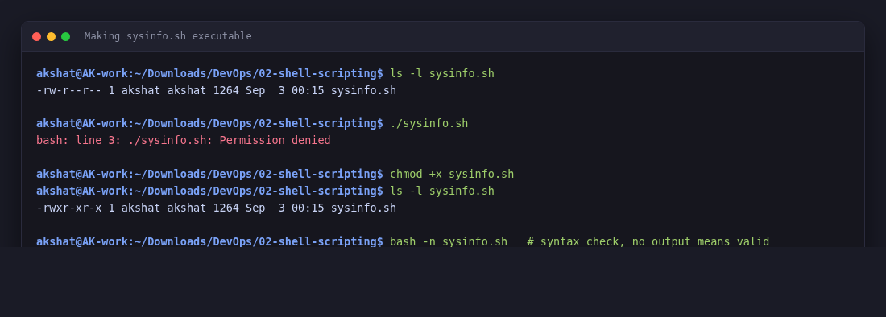
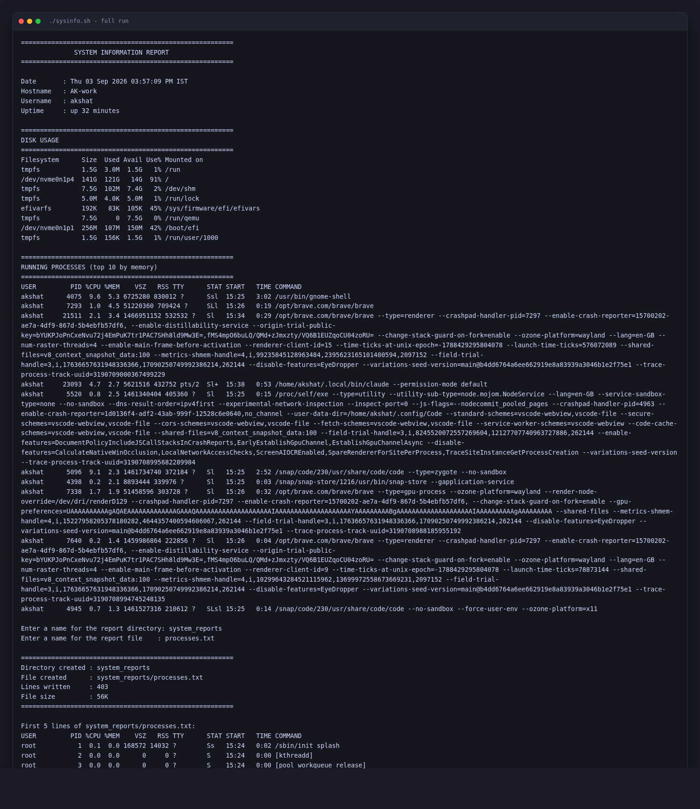
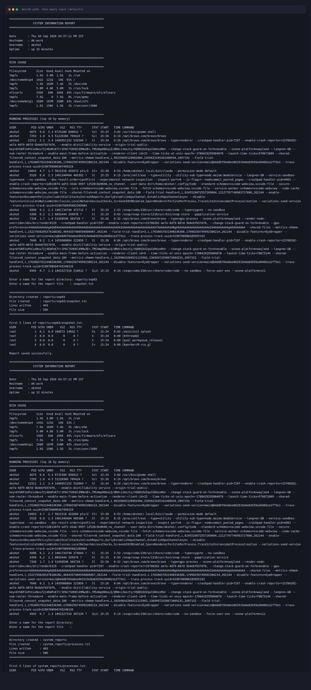
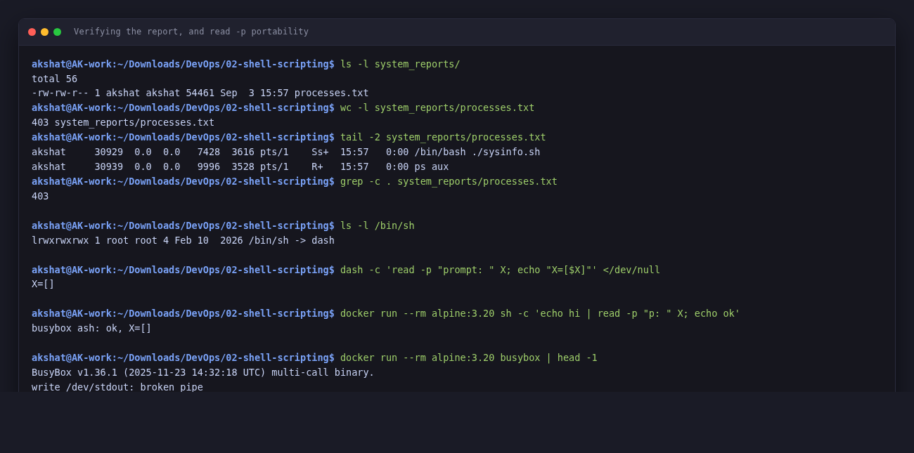

# Shell Scripting Homework — System Information Script

**Akshat Kushwaha**
3 September 2026

Script: [`sysinfo.sh`](./sysinfo.sh)

Ran everything on my Ubuntu machine:

```
akshat@AK-work:~/Downloads/DevOps/02-shell-scripting$ lsb_release -d
Description:	Ubuntu 22.04.5 LTS
akshat@AK-work:~/Downloads/DevOps/02-shell-scripting$ bash --version | head -1
GNU bash, version 5.1.16(1)-release (x86_64-pc-linux-gnu)
```

---

## What the script does

The task listed nine things the script had to cover. Mapping them to where they are in the file:

| Requirement | How it is done |
|---|---|
| Print the current date | `CURRENT_DATE=$(date)` then `echo` |
| Print the hostname | `HOST_NAME=$(hostname)` |
| Print the username | `USER_NAME=$(whoami)` |
| Print the disk usage | `df -h` |
| Print the running processes | `ps aux --sort=-%mem \| head -11` |
| Use variables | `CURRENT_DATE`, `HOST_NAME`, `USER_NAME`, `UPTIME_INFO`, `REPORT_DIR`, `REPORT_FILE`, `REPORT_PATH`, `LINE` |
| Take user input | `read -p` for the directory and file names |
| Create a directory | `mkdir -p "$REPORT_DIR"` |
| Create a file | `touch "$REPORT_PATH"` |
| Store processes in the file | `ps aux > "$REPORT_PATH"` |

I used command substitution (`$(...)`) rather than backticks because it nests properly and is the form everyone uses now.

## Making it executable

```
akshat@AK-work:~/Downloads/DevOps/02-shell-scripting$ ls -l sysinfo.sh
-rw-r--r-- 1 akshat akshat 1264 Sep  3 00:15 sysinfo.sh
akshat@AK-work:~/Downloads/DevOps/02-shell-scripting$ ./sysinfo.sh
bash: ./sysinfo.sh: Permission denied
akshat@AK-work:~/Downloads/DevOps/02-shell-scripting$ chmod +x sysinfo.sh
akshat@AK-work:~/Downloads/DevOps/02-shell-scripting$ ls -l sysinfo.sh
-rwxr-xr-x 1 akshat akshat 1264 Sep  3 00:15 sysinfo.sh
```

I ran it before `chmod` on purpose, to see the actual failure. The `x` bits are what let you run it as `./sysinfo.sh`; without them you would have to say `bash sysinfo.sh` every time, because then *bash* is the thing being executed and the script is just a file it reads.

Syntax-checked it too, which costs nothing:

```
akshat@AK-work:~/Downloads/DevOps/02-shell-scripting$ bash -n sysinfo.sh
```

No output means no syntax errors. `-n` reads and parses the script without running any of it.

## Running it

```
akshat@AK-work:~/Downloads/DevOps/02-shell-scripting$ ./sysinfo.sh
========================================================
              SYSTEM INFORMATION REPORT
========================================================

Date       : Thu 03 Sep 2026 03:57:09 PM IST
Hostname   : AK-work
Username   : akshat
Uptime     : up 32 minutes

========================================================
DISK USAGE
========================================================
Filesystem      Size  Used Avail Use% Mounted on
tmpfs           1.5G  3.0M  1.5G   1% /run
/dev/nvme0n1p4  141G  121G   14G  91% /
tmpfs           7.5G  102M  7.4G   2% /dev/shm
tmpfs           5.0M  4.0K  5.0M   1% /run/lock
efivarfs        192K   83K  105K  45% /sys/firmware/efi/efivars
tmpfs           7.5G     0  7.5G   0% /run/qemu
/dev/nvme0n1p1  256M  107M  150M  42% /boot/efi
tmpfs           1.5G  156K  1.5G   1% /run/user/1000

========================================================
RUNNING PROCESSES (top 10 by memory)
========================================================
USER         PID %CPU %MEM    VSZ   RSS TTY      STAT START   TIME COMMAND
akshat      4075  9.6  5.3 6725280 830012 ?      Ssl  15:25   3:02 /usr/bin/gnome-shell
akshat      7293  1.0  4.5 51220360 709424 ?     SLl  15:26   0:19 /opt/brave.com/brave/brave
akshat     21511  2.1  3.4 1466951152 532532 ?   Sl   15:34   0:29 /opt/brave.com/brave/brave --type=renderer --crashpad-handler-pid=7297 --enable-cra […]
akshat     23093  4.7  2.7 5621516 432752 pts/2  Sl+  15:38   0:53 /home/akshat/.local/bin/claude --permission-mode default
akshat      5520  0.8  2.5 1461340404 405360 ?   Sl   15:25   0:15 /proc/self/exe --type=utility --utility-sub-type=node.mojom.NodeService --lang=en-G […]
akshat      5096  9.1  2.3 1461734740 372184 ?   Sl   15:25   2:52 /snap/code/230/usr/share/code/code --type=zygote --no-sandbox
akshat      4398  0.2  2.1 8893444 339976 ?      Sl   15:25   0:03 /snap/snap-store/1216/usr/bin/snap-store --gapplication-service
akshat      7338  1.7  1.9 51458596 303728 ?     Sl   15:26   0:32 /opt/brave.com/brave/brave --type=gpu-process --ozone-platform=wayland --render-nod […]
akshat      7640  0.2  1.4 1459986864 222856 ?   Sl   15:26   0:04 /opt/brave.com/brave/brave --type=renderer --crashpad-handler-pid=7297 --enable-cra […]
akshat      4945  0.7  1.3 1461527316 210612 ?   SLsl 15:25   0:14 /snap/code/230/usr/share/code/code --no-sandbox --force-user-env --ozone-platform=x […]

Enter a name for the report directory: system_reports
Enter a name for the report file    : processes.txt

========================================================
Directory created : system_reports
File created      : system_reports/processes.txt
Lines written     : 403
File size         : 56K
========================================================

First 5 lines of system_reports/processes.txt:
USER         PID %CPU %MEM    VSZ   RSS TTY      STAT START   TIME COMMAND
root           1  0.1  0.0 168572 14032 ?        Ss   15:24   0:02 /sbin/init splash
root           2  0.0  0.0      0     0 ?        S    15:24   0:00 [kthreadd]
root           3  0.0  0.0      0     0 ?        S    15:24   0:00 [pool_workqueue_release]
root           4  0.0  0.0      0     0 ?        I<   15:24   0:00 [kworker/R-rcu_g]

Report saved successfully.
```

> A few of the `ps` command lines (Brave, VS Code) run to several hundred characters of Chromium flags. I have trimmed those with `[…]` so the block stays readable — everything else is exactly as printed.

## Checking that the file was actually written

```
akshat@AK-work:~/Downloads/DevOps/02-shell-scripting$ ls -l system_reports/
total 56
-rw-rw-r-- 1 akshat akshat 54461 Sep  3 15:57 processes.txt
akshat@AK-work:~/Downloads/DevOps/02-shell-scripting$ wc -l system_reports/processes.txt
403 system_reports/processes.txt
akshat@AK-work:~/Downloads/DevOps/02-shell-scripting$ tail -2 system_reports/processes.txt
akshat     30929  0.0  0.0   7428  3616 pts/1    Ss+  15:57   0:00 /bin/bash ./sysinfo.sh
akshat     30939  0.0  0.0   9996  3528 pts/1    R+   15:57   0:00 ps aux
```

Two things worth pointing out here.

**403 lines in the file versus the 11 printed to the screen.** The redirect captured the whole `ps aux` output, not just what was displayed. The screen output is `ps aux --sort=-%mem | head -11`; the file is a separate, unfiltered `ps aux`.

**The last two lines of the file are the script catching itself.** `ps aux` ran from inside `sysinfo.sh`, so the process table it captured contains `/bin/bash ./sysinfo.sh` and the `ps aux` process itself. That is a nice illustration of `ps` being a snapshot of the moment it runs, including its own existence.

## Running it a second time with different input

Wanted to check the input handling actually did something rather than being decoration:

```
akshat@AK-work:~/Downloads/DevOps/02-shell-scripting$ ./sysinfo.sh
...
Enter a name for the report directory: reports/sep03
Enter a name for the report file    : snapshot.txt

========================================================
Directory created : reports/sep03
File created      : reports/sep03/snapshot.txt
Lines written     : 403
File size         : 56K
========================================================
akshat@AK-work:~/Downloads/DevOps/02-shell-scripting$ find reports -type f
reports/sep03/snapshot.txt
akshat@AK-work:~/Downloads/DevOps/02-shell-scripting$ ls -lR reports/
reports/:
total 4
drwxrwxr-x 2 akshat akshat 4096 Sep  3 15:57 sep03

reports/sep03:
total 56
-rw-rw-r-- 1 akshat akshat 54460 Sep  3 15:57 snapshot.txt
```

The nested path worked because of `mkdir -p`. Without the `-p` it would have failed with `mkdir: cannot create directory 'reports/sep03': No such file or directory`, since `reports` did not exist yet.

And pressing Enter at both prompts falls back to the defaults:

```
akshat@AK-work:~/Downloads/DevOps/02-shell-scripting$ ./sysinfo.sh
...
Enter a name for the report directory: 
Enter a name for the report file    : 

========================================================
Directory created : system_reports
File created      : system_reports/processes.txt
Lines written     : 403
File size         : 56K
========================================================
```

That is the `${REPORT_DIR:-system_reports}` syntax, which substitutes the default when the variable is empty or unset.

---

## Things I learned doing this

**`>` versus `>>`.** `>` truncates the file first and then writes, `>>` appends. I ran the script three times and the line count came out 403 every time instead of tripling, which confirmed it overwrites each time. The small variation between runs is just processes starting and stopping on a live desktop. For a report that is what you want; for a log you would want `>>`.

**`touch` before `>` is not strictly needed.** The redirect creates the file on its own. The task asked for `touch` so it is in there, and it does make the intent obvious, but I tested removing it and the script still worked. Where `touch` genuinely matters is when you want the file to exist even if the command produces no output at all.

**Quoting variables.** I wrote `mkdir -p $REPORT_DIR` at first, then typed `my reports` at the prompt and got two directories, `my` and `reports`. Adding the quotes around `"$REPORT_DIR"` fixed it. Any variable that might contain a space needs the quotes.

**`read -p` is bash, not POSIX — but the failure is not the one I expected.** POSIX only specifies `read [-r] var`, so I assumed running the script with `sh` would blow up on line 33. On Ubuntu 22.04 it does not:

```
akshat@AK-work:~/Downloads/DevOps/02-shell-scripting$ ls -l /bin/sh
lrwxrwxrwx 1 root root 4 Feb 10  2026 /bin/sh -> dash
akshat@AK-work:~/Downloads/DevOps/02-shell-scripting$ sh sysinfo.sh
...
Enter a name for the report directory: mydir
Enter a name for the report file    : myfile.txt

========================================================
Directory created : mydir
File created      : mydir/myfile.txt
```

Dash 0.5.11 has its own `-p` extension, so it accepts the flag and prints the prompt. Busybox `ash`, which is what `/bin/sh` is inside an Alpine container, accepts it too:

```
akshat@AK-work:~/Downloads/DevOps/02-shell-scripting$ docker run --rm alpine:3.20 sh -c 'echo hi | read -p "p: " X; echo "busybox ash: ok"'
busybox ash: ok
```

So the real lesson is narrower than "it breaks under sh": `read -p` is *not in the POSIX spec*, and whether it works depends entirely on which `sh` you happen to land on. The two most common ones both tolerate it, which is exactly what makes it a trap — it works on your machine and on Alpine, then fails on some stricter shell later. The shebang here is `#!/bin/bash`, so none of this affects the script as written. It only matters if someone invokes it as `sh sysinfo.sh`.

```
akshat@AK-work:~/Downloads/DevOps/02-shell-scripting$ grep -n "read -p" sysinfo.sh
33:read -p "Enter a name for the report directory: " REPORT_DIR
34:read -p "Enter a name for the report file    : " REPORT_FILE
```

**`ps aux --sort=-%mem`.** The minus in front of the field name sorts descending. `head -11` rather than `head -10` because the first line is the header.

---

## Screenshots

| | |
|---|---|
| Making it executable, and the syntax check |  |
| A full run with named values |  |
| Nested path, and the empty-input defaults |  |
| Verifying the file, and the `sh` portability test |  |

---

## Files

```
02-shell-scripting/
├── README.md
└── sysinfo.sh
```

The `system_reports/` and `reports/` directories are generated when the script runs, so they are not committed.
