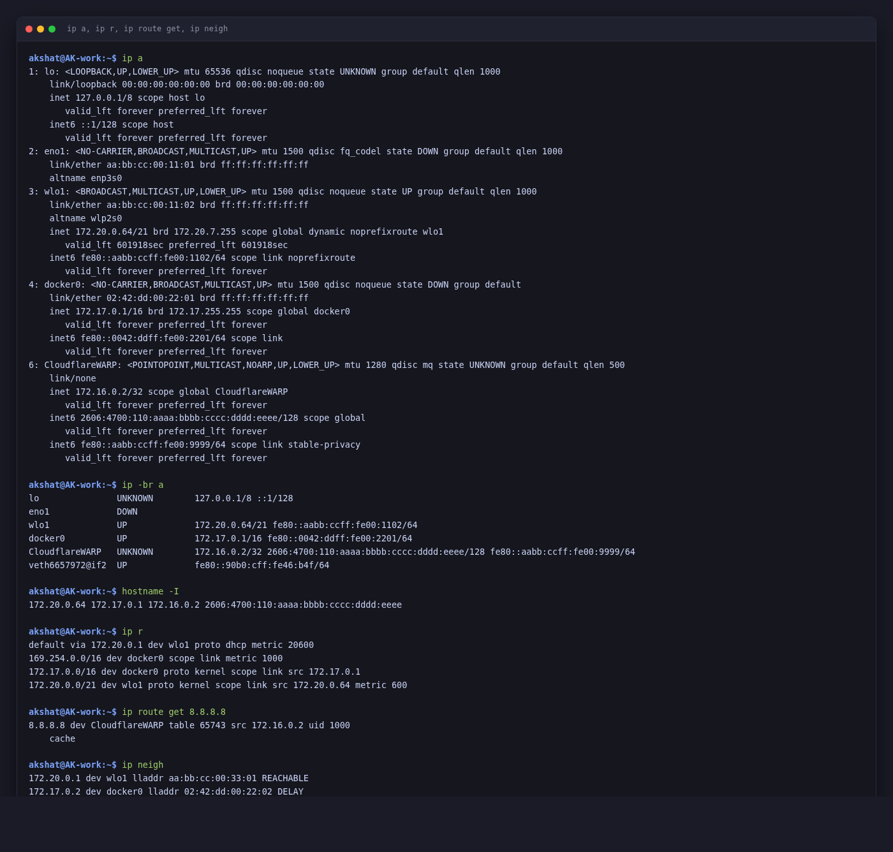
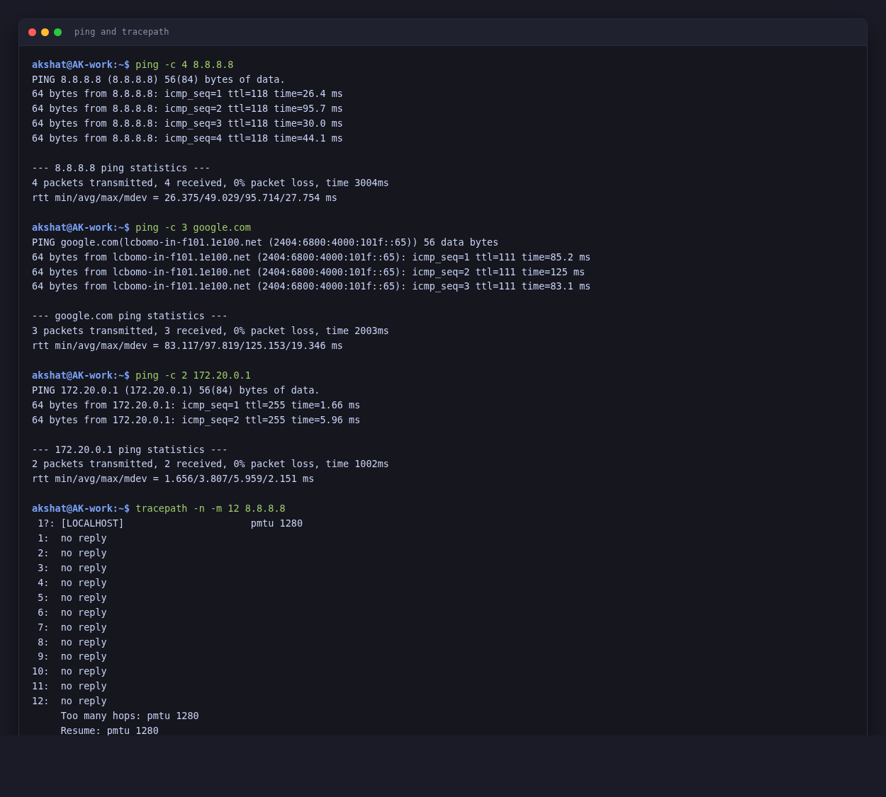
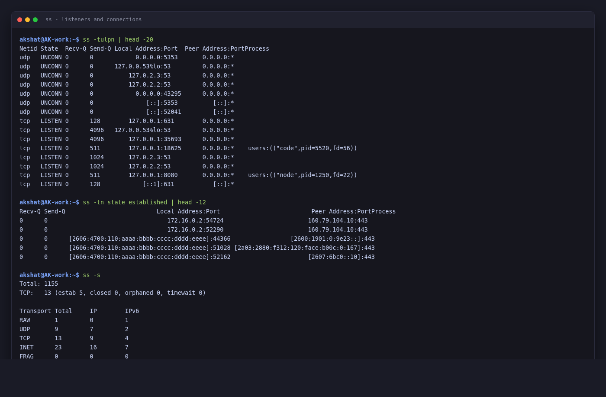
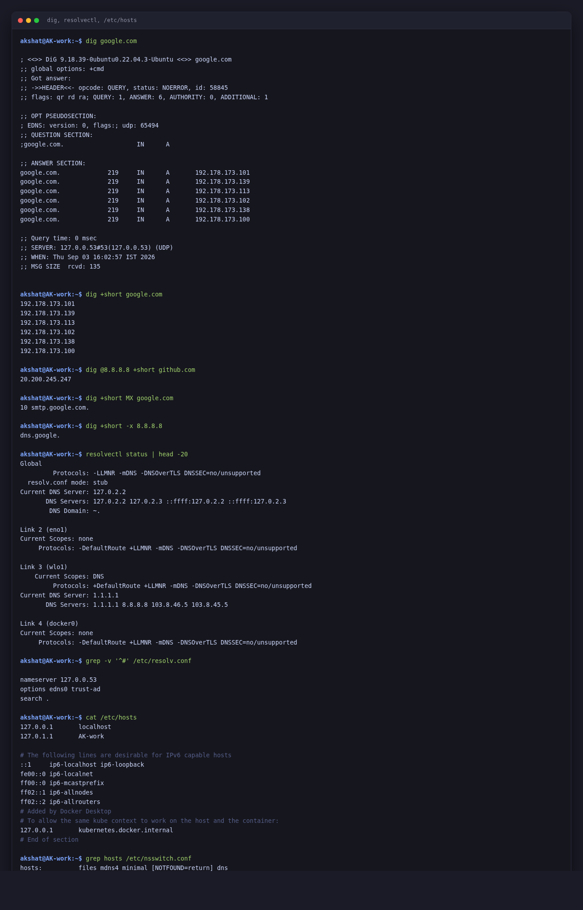
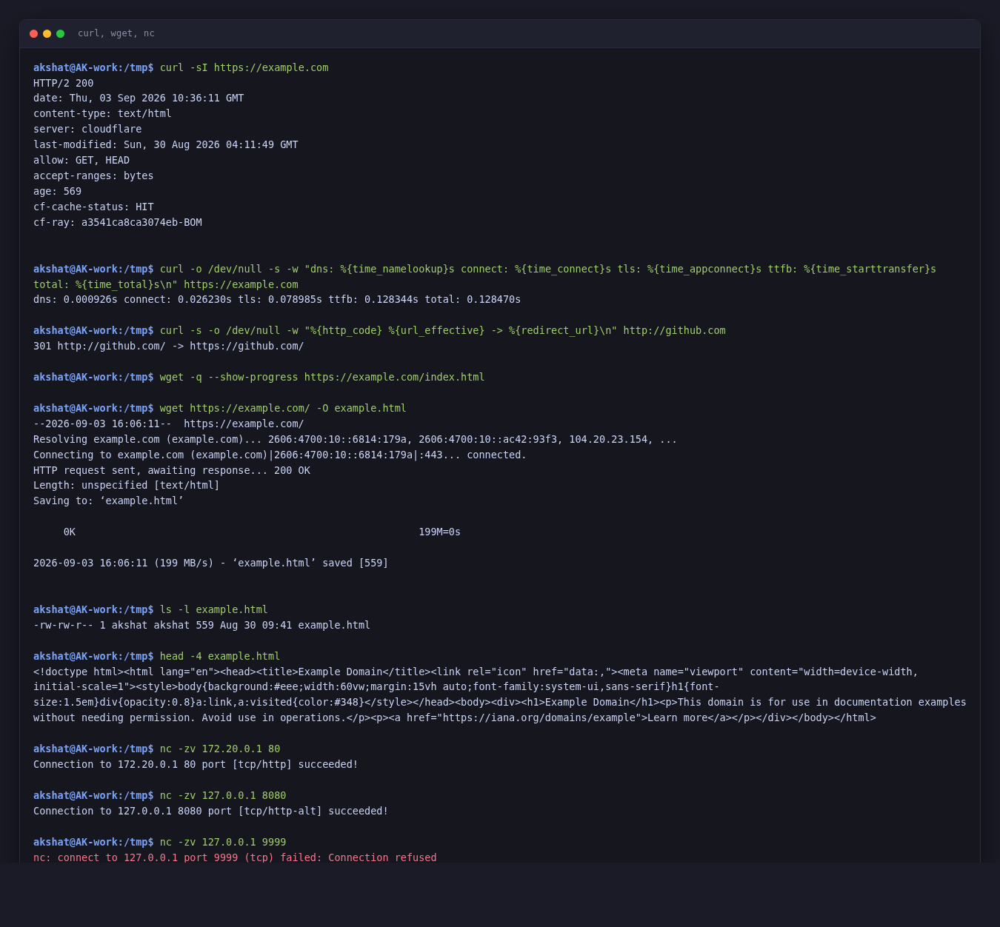
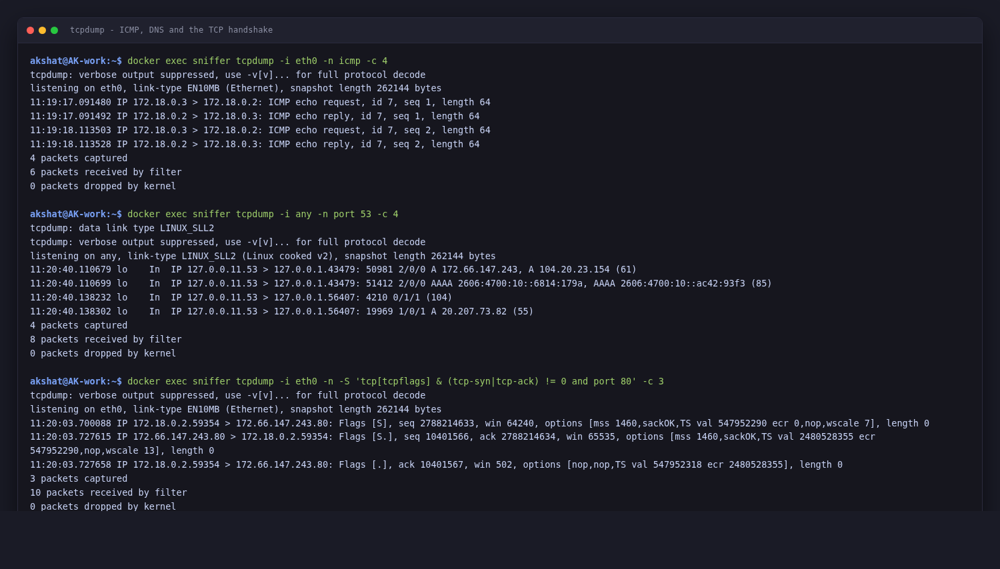

# Networking Homework

**Akshat Kushwaha**
3 September 2026

Every command below was run on my own machine and the output is what it printed.

```
akshat@AK-work:~$ lsb_release -d
Description:	Ubuntu 22.04.5 LTS
akshat@AK-work:~$ hostname
AK-work
```

> **One edit to the output.** This repository is public, so MAC addresses and my Cloudflare WARP IPv6 address have been replaced with clearly fake placeholders (`aa:bb:cc:…`, `02:42:dd:…`, and a `2606:4700:110:aaaa:…` IPv6). Nothing else has been altered — private-range IPv4 like `172.20.0.64` and `172.17.0.1` is left exactly as captured, since those addresses mean nothing outside my own LAN.

### One thing that shapes all of the output below

This laptop has **Cloudflare WARP** running, which is a WireGuard VPN. It shows up as a `CloudflareWARP` interface and it puts almost all outbound traffic into its own routing table. That changes what several of these commands report, and rather than turn it off I have pointed out where it matters — working out *why* the output was not what I expected taught me more than clean output would have.

---

## 1. `ip a` — what addresses do I have

Lists every network interface and the addresses assigned to it. The modern replacement for `ifconfig`, which is not even installed by default on Ubuntu any more.

```
akshat@AK-work:~$ ip a
1: lo: <LOOPBACK,UP,LOWER_UP> mtu 65536 qdisc noqueue state UNKNOWN group default qlen 1000
    link/loopback 00:00:00:00:00:00 brd 00:00:00:00:00:00
    inet 127.0.0.1/8 scope host lo
       valid_lft forever preferred_lft forever
    inet6 ::1/128 scope host 
       valid_lft forever preferred_lft forever
2: eno1: <NO-CARRIER,BROADCAST,MULTICAST,UP> mtu 1500 qdisc fq_codel state DOWN group default qlen 1000
    link/ether aa:bb:cc:00:11:01 brd ff:ff:ff:ff:ff:ff
    altname enp3s0
3: wlo1: <BROADCAST,MULTICAST,UP,LOWER_UP> mtu 1500 qdisc noqueue state UP group default qlen 1000
    link/ether aa:bb:cc:00:11:02 brd ff:ff:ff:ff:ff:ff
    altname wlp2s0
    inet 172.20.0.64/21 brd 172.20.7.255 scope global dynamic noprefixroute wlo1
       valid_lft 601918sec preferred_lft 601918sec
    inet6 fe80::aabb:ccff:fe00:1102/64 scope link noprefixroute 
       valid_lft forever preferred_lft forever
4: docker0: <NO-CARRIER,BROADCAST,MULTICAST,UP> mtu 1500 qdisc noqueue state DOWN group default 
    link/ether 02:42:dd:00:22:01 brd ff:ff:ff:ff:ff:ff
    inet 172.17.0.1/16 brd 172.17.255.255 scope global docker0
       valid_lft forever preferred_lft forever
    inet6 fe80::0042:ddff:fe00:2201/64 scope link 
       valid_lft forever preferred_lft forever
6: CloudflareWARP: <POINTOPOINT,MULTICAST,NOARP,UP,LOWER_UP> mtu 1280 qdisc mq state UNKNOWN group default qlen 500
    link/none 
    inet 172.16.0.2/32 scope global CloudflareWARP
       valid_lft forever preferred_lft forever
    inet6 2606:4700:110:aaaa:bbbb:cccc:dddd:eeee/128 scope global 
       valid_lft forever preferred_lft forever
    inet6 fe80::aabb:ccff:fe00:9999/64 scope link stable-privacy 
       valid_lft forever preferred_lft forever
```

Reading that:

- **`lo`** is loopback, always `127.0.0.1`. Traffic to it never leaves the machine.
- **`eno1`** is the wired port. `NO-CARRIER` and `state DOWN` — no cable plugged in. It has a MAC but no IP.
- **`wlo1`** is the Wi-Fi, and the one actually carrying my traffic: `172.20.0.64/21`. The `/21` means the local network is 172.20.0.0 – 172.20.7.255, which is bigger than the usual `/24`. `dynamic` means DHCP gave it to me, and `valid_lft 601918sec` is the remaining lease, about 7 days.
- **`docker0`** is the bridge Docker creates, `172.17.0.1/16`. It says `DOWN` because no containers were running at that moment — it comes up when one starts.
- **`CloudflareWARP`** is the VPN tunnel. `POINTOPOINT` and `NOARP` because it is a tunnel, not a real broadcast segment, and `link/none` because there is no Ethernet layer to have a MAC address. Note `mtu 1280` against 1500 on the Wi-Fi — the tunnel needs room for its own headers.

The short version is easier to scan:

```
akshat@AK-work:~$ ip -br a
lo               UNKNOWN        127.0.0.1/8 ::1/128 
eno1             DOWN           
wlo1             UP             172.20.0.64/21 fe80::aabb:ccff:fe00:1102/64 
docker0          UP             172.17.0.1/16 fe80::0042:ddff:fe00:2201/64 
CloudflareWARP   UNKNOWN        172.16.0.2/32 2606:4700:110:aaaa:bbbb:cccc:dddd:eeee/128 fe80::aabb:ccff:fe00:9999/64 
veth6657972@if2  UP             fe80::90b0:cff:fe46:b4f/64
```

And just the addresses:

```
akshat@AK-work:~$ hostname -I
172.20.0.64 172.17.0.1 172.16.0.2 2606:4700:110:aaaa:bbbb:cccc:dddd:eeee
```

Four addresses on one machine, which is normal once you have a VPN and Docker.

---

## 2. `ip r` — where does traffic go

The routing table. For any destination, the kernel picks the most specific matching route.

```
akshat@AK-work:~$ ip r
default via 172.20.0.1 dev wlo1 proto dhcp metric 20600 
169.254.0.0/16 dev docker0 scope link metric 1000 
172.17.0.0/16 dev docker0 proto kernel scope link src 172.17.0.1 
172.20.0.0/21 dev wlo1 proto kernel scope link src 172.20.0.64 metric 600 
akshat@AK-work:~$ ip route get 8.8.8.8
8.8.8.8 dev CloudflareWARP table 65743 src 172.16.0.2 uid 1000 
    cache
```

- **`default via 172.20.0.1 dev wlo1`** — anything with no more specific match goes to the router at 172.20.0.1. That is the gateway.
- **`172.20.0.0/21 dev wlo1 ... scope link`** — my own LAN, reachable directly with no router in between.
- **`172.17.0.0/16 dev docker0`** — Docker's container subnet.

`ip route get` is the useful one, because it asks the kernel to actually decide:

```
akshat@AK-work:~$ ip route get 8.8.8.8
8.8.8.8 dev CloudflareWARP table 65743 src 172.16.0.2 uid 1000 
    cache
```

**This is where WARP shows up.** I expected `via 172.20.0.1 dev wlo1`. Instead it says `dev CloudflareWARP table 65743` — the VPN installed policy routing rules that divert traffic into a separate table. The source address is `172.16.0.2`, the tunnel's address, not my Wi-Fi address.

That table is enormous, because WARP enumerates almost the whole IPv4 space in order to capture it without literally overriding the default route:

```
akshat@AK-work:~$ ip route show table 65743 | head -8
0.0.0.0/5 dev CloudflareWARP proto static scope link 
8.0.0.0/7 dev CloudflareWARP proto static scope link 
11.0.0.0/8 dev CloudflareWARP proto static scope link 
12.0.0.0/6 dev CloudflareWARP proto static scope link 
16.0.0.0/8 dev CloudflareWARP proto static scope link 
17.0.0.0/11 dev CloudflareWARP proto static scope link 
17.32.0.0/12 dev CloudflareWARP proto static scope link 
17.48.0.0/13 dev CloudflareWARP proto static scope link 
akshat@AK-work:~$ ip route show table 65743 | wc -l
142
```

142 routes carving up the address space. Note `0.0.0.0/5`, `8.0.0.0/7` and so on skip `10.0.0.0/8` — private ranges are deliberately left out so LAN traffic still goes over the LAN. That is split tunnelling, visible in the routing table.

---

## 3. `ping` — is it reachable, and how far away

Sends ICMP echo requests and times the replies.

```
akshat@AK-work:~$ ping -c 4 8.8.8.8
PING 8.8.8.8 (8.8.8.8) 56(84) bytes of data.
64 bytes from 8.8.8.8: icmp_seq=1 ttl=118 time=26.4 ms
64 bytes from 8.8.8.8: icmp_seq=2 ttl=118 time=95.7 ms
64 bytes from 8.8.8.8: icmp_seq=3 ttl=118 time=30.0 ms
64 bytes from 8.8.8.8: icmp_seq=4 ttl=118 time=44.1 ms

--- 8.8.8.8 ping statistics ---
4 packets transmitted, 4 received, 0% packet loss, time 3004ms
rtt min/avg/max/mdev = 26.375/49.029/95.714/27.754 ms
akshat@AK-work:~$ ping -c 3 google.com
PING google.com(lcbomo-in-f101.1e100.net (2404:6800:4000:101f::65)) 56 data bytes
64 bytes from lcbomo-in-f101.1e100.net (2404:6800:4000:101f::65): icmp_seq=1 ttl=111 time=85.2 ms
64 bytes from lcbomo-in-f101.1e100.net (2404:6800:4000:101f::65): icmp_seq=2 ttl=111 time=125 ms
64 bytes from lcbomo-in-f101.1e100.net (2404:6800:4000:101f::65): icmp_seq=3 ttl=111 time=83.1 ms

--- google.com ping statistics ---
3 packets transmitted, 3 received, 0% packet loss, time 2003ms
rtt min/avg/max/mdev = 83.117/97.819/125.153/19.346 ms
akshat@AK-work:~$ ping -c 2 172.20.0.1
PING 172.20.0.1 (172.20.0.1) 56(84) bytes of data.
64 bytes from 172.20.0.1: icmp_seq=1 ttl=255 time=1.66 ms
64 bytes from 172.20.0.1: icmp_seq=2 ttl=255 time=5.96 ms

--- 172.20.0.1 ping statistics ---
2 packets transmitted, 2 received, 0% packet loss, time 1002ms
rtt min/avg/max/mdev = 1.656/3.807/5.959/2.151 ms
```

- **`ttl=118`** on the Google reply. TTL starts at a round number (128 here) and each router decrements it, so roughly 10 hops away. The gateway ping comes back `ttl=255`, one hop.
- **`time=`** is the round trip. 1.6ms to my own router, 26–95ms to Google. The spread on the 8.8.8.8 pings (26ms to 95ms) is Wi-Fi plus the VPN.
- **`0% packet loss`** is the number that matters when you are diagnosing something.
- Pinging `google.com` resolved to an **IPv6** address (`2404:6800:4000:101f::65`) and pinged that. `ping` follows the system's address preference, which is IPv6 first.

`ping` is testing three things at once — DNS resolves, a route exists, and the host answers. When it fails, work out which of the three broke.

---

## 4. `tracepath` — which routers is it going through

`traceroute` is not installed here, so `tracepath` — same idea, no root needed.

```
akshat@AK-work:~$ tracepath -n -m 12 8.8.8.8
 1?: [LOCALHOST]                      pmtu 1280
 1:  no reply
 2:  no reply
 3:  no reply
 4:  no reply
 5:  no reply
 6:  no reply
 7:  no reply
 8:  no reply
 9:  no reply
10:  no reply
11:  no reply
12:  no reply
     Too many hops: pmtu 1280
     Resume: pmtu 1280
```

**Every hop is `no reply`,** which looks like a failure but is not. `ping 8.8.8.8` works fine. The reason is the VPN: traffic is encapsulated and sent through the WireGuard tunnel, so the intermediate routers on the physical path never see the inner packet and cannot return the ICMP "time exceeded" messages that traceroute depends on. Cloudflare's edge does not generate them either.

So the real lesson: **traceroute through a VPN shows you nothing**, and `pmtu 1280` at the top is a hint as to why — that is the tunnel MTU, not a normal Ethernet 1500.

---

## 5. `ss` — what is listening, and who is connected

`ss` replaces `netstat`. `-t` TCP, `-u` UDP, `-l` listening, `-p` process, `-n` numeric.

```
akshat@AK-work:~$ ss -tulpn | head -20
Netid State  Recv-Q Send-Q Local Address:Port  Peer Address:PortProcess                         
udp   UNCONN 0      0            0.0.0.0:5353       0.0.0.0:*                                   
udp   UNCONN 0      0      127.0.0.53%lo:53         0.0.0.0:*                                   
udp   UNCONN 0      0          127.0.2.3:53         0.0.0.0:*                                   
udp   UNCONN 0      0          127.0.2.2:53         0.0.0.0:*                                   
udp   UNCONN 0      0            0.0.0.0:43295      0.0.0.0:*                                   
udp   UNCONN 0      0               [::]:5353          [::]:*                                   
udp   UNCONN 0      0               [::]:52041         [::]:*                                   
tcp   LISTEN 0      128        127.0.0.1:631        0.0.0.0:*                                   
tcp   LISTEN 0      4096   127.0.0.53%lo:53         0.0.0.0:*                                   
tcp   LISTEN 0      4096       127.0.0.1:35693      0.0.0.0:*                                   
tcp   LISTEN 0      511        127.0.0.1:18625      0.0.0.0:*    users:(("code",pid=5520,fd=56))
tcp   LISTEN 0      1024       127.0.2.3:53         0.0.0.0:*                                   
tcp   LISTEN 0      1024       127.0.2.2:53         0.0.0.0:*                                   
tcp   LISTEN 0      511        127.0.0.1:8080       0.0.0.0:*    users:(("node",pid=1250,fd=22))
tcp   LISTEN 0      128            [::1]:631           [::]:*
```

- **`127.0.0.53:53`** is `systemd-resolved`, the local DNS stub. Everything on this machine asks it, and it forwards upstream.
- **`127.0.0.1:631`** is CUPS, the print server.
- **`127.0.0.1:8080`** is `code-server`, bound to loopback only. Worth noting: a loopback-only listener still owns the port as far as the rest of the system is concerned, which is why the Docker assignments publish their containers elsewhere.
- **`0.0.0.0:5353`** is mDNS, for `.local` name discovery.

The distinction that matters: **`127.0.0.1:` is reachable only from this machine, `0.0.0.0:` is reachable from the network.** If you meant a service to be private and it says `0.0.0.0`, that is a finding.

Established connections rather than listeners:

```
akshat@AK-work:~$ ss -tn state established | head -12
Recv-Q Send-Q                          Local Address:Port                          Peer Address:PortProcess
0      0                                  172.16.0.2:54724                        160.79.104.10:443        
0      0                                  172.16.0.2:52290                        160.79.104.10:443        
0      0      [2606:4700:110:aaaa:bbbb:cccc:dddd:eeee]:44366                 [2600:1901:0:9e23::]:443        
0      0      [2606:4700:110:aaaa:bbbb:cccc:dddd:eeee]:51028 [2a03:2880:f312:120:face:b00c:0:167]:443        
0      0      [2606:4700:110:aaaa:bbbb:cccc:dddd:eeee]:52162                      [2607:6bc0::10]:443
```

The local address on every one of those is `172.16.0.2` or the WARP IPv6 — the VPN, not my Wi-Fi address. Everything is going through the tunnel.

Summary counts:

```
akshat@AK-work:~$ ss -s
Total: 1155
TCP:   13 (estab 5, closed 0, orphaned 0, timewait 0)

Transport Total     IP        IPv6
RAW	  1         0         1        
UDP	  9         7         2        
TCP	  13        9         4        
INET	  23        16        7        
FRAG	  0         0         0
```

---

## 6. `dig` — DNS in detail

```
akshat@AK-work:~$ dig google.com

; <<>> DiG 9.18.39-0ubuntu0.22.04.3-Ubuntu <<>> google.com
;; global options: +cmd
;; Got answer:
;; ->>HEADER<<- opcode: QUERY, status: NOERROR, id: 58845
;; flags: qr rd ra; QUERY: 1, ANSWER: 6, AUTHORITY: 0, ADDITIONAL: 1

;; OPT PSEUDOSECTION:
; EDNS: version: 0, flags:; udp: 65494
;; QUESTION SECTION:
;google.com.			IN	A

;; ANSWER SECTION:
google.com.		219	IN	A	192.178.173.101
google.com.		219	IN	A	192.178.173.139
google.com.		219	IN	A	192.178.173.113
google.com.		219	IN	A	192.178.173.102
google.com.		219	IN	A	192.178.173.138
google.com.		219	IN	A	192.178.173.100

;; Query time: 0 msec
;; SERVER: 127.0.0.53#53(127.0.0.53) (UDP)
;; WHEN: Thu Sep 03 16:02:57 IST 2026
;; MSG SIZE  rcvd: 135
```

The sections are the structure of a DNS response:

- **`status: NOERROR`** — the query succeeded. `NXDOMAIN` means no such name.
- **`QUESTION`** — what was asked.
- **`ANSWER`** — six A records. Google returns several so clients spread across them.
- **`219`** is the TTL in seconds: how long this answer may be cached.
- **`SERVER: 127.0.0.53#53`** — answered by the local stub resolver.
- **`Query time: 0 msec`** — zero because it was already cached. A cold lookup is 20–50ms.

`+short` when you just want the value:

```
akshat@AK-work:~$ dig +short google.com
192.178.173.101
192.178.173.139
192.178.173.113
192.178.173.102
192.178.173.138
192.178.173.100
```

Other record types and reverse lookups:

```
akshat@AK-work:~$ dig @8.8.8.8 +short github.com
20.200.245.247
akshat@AK-work:~$ dig +short MX google.com
10 smtp.google.com.
akshat@AK-work:~$ dig +short -x 8.8.8.8
dns.google.
```

`@8.8.8.8` bypasses the local resolver and asks Google directly — the first thing to try when you suspect the local DNS is stale or wrong. `-x` does a reverse lookup, IP to name.

Where the resolver config actually lives:

```
akshat@AK-work:~$ resolvectl status | head -20
Global
         Protocols: -LLMNR -mDNS -DNSOverTLS DNSSEC=no/unsupported
  resolv.conf mode: stub
Current DNS Server: 127.0.2.2
       DNS Servers: 127.0.2.2 127.0.2.3 ::ffff:127.0.2.2 ::ffff:127.0.2.3
        DNS Domain: ~.

Link 2 (eno1)
Current Scopes: none
     Protocols: -DefaultRoute +LLMNR -mDNS -DNSOverTLS DNSSEC=no/unsupported

Link 3 (wlo1)
    Current Scopes: DNS
         Protocols: +DefaultRoute +LLMNR -mDNS -DNSOverTLS DNSSEC=no/unsupported
Current DNS Server: 1.1.1.1
       DNS Servers: 1.1.1.1 8.8.8.8 103.8.46.5 103.8.45.5

Link 4 (docker0)
Current Scopes: none
     Protocols: -DefaultRoute +LLMNR -mDNS -DNSOverTLS DNSSEC=no/unsupported
akshat@AK-work:~$ grep -v '^#' /etc/resolv.conf

nameserver 127.0.0.53
options edns0 trust-ad
search .
```

Three layers, and they have to be read in order:

1. `/etc/resolv.conf` says `nameserver 127.0.0.53` — the systemd-resolved stub, not a real DNS server.
2. `resolvectl status` shows what the stub forwards to: `1.1.1.1`, `8.8.8.8` and two ISP servers on the `wlo1` link.
3. The global `Current DNS Server: 127.0.2.2` is WARP again, intercepting DNS so lookups go through the tunnel too.

So `cat /etc/resolv.conf` on a modern Ubuntu box tells you almost nothing. `resolvectl status` is the command that actually answers "what DNS am I using".

---

## 7. `/etc/hosts` and the resolution order

```
akshat@AK-work:~$ cat /etc/hosts
127.0.0.1	localhost
127.0.1.1	AK-work

# The following lines are desirable for IPv6 capable hosts
::1     ip6-localhost ip6-loopback
fe00::0 ip6-localnet
ff00::0 ip6-mcastprefix
ff02::1 ip6-allnodes
ff02::2 ip6-allrouters
# Added by Docker Desktop
# To allow the same kube context to work on the host and the container:
127.0.0.1	kubernetes.docker.internal
# End of section
akshat@AK-work:~$ grep hosts /etc/nsswitch.conf
hosts:          files mdns4_minimal [NOTFOUND=return] dns
```

`hosts: files mdns4_minimal [NOTFOUND=return] dns` is the order name resolution is tried in:

1. **`files`** — `/etc/hosts` first. A name here wins over DNS, which is how you point a domain at a test box.
2. **`mdns4_minimal`** — multicast DNS for `.local` names.
3. **`dns`** — normal DNS last.

`[NOTFOUND=return]` means: if mDNS positively says the name does not exist, stop, do not fall through to DNS.

The `kubernetes.docker.internal` entry was added by Docker Desktop. `127.0.1.1 AK-work` is Debian's convention for making the machine's own hostname resolve without needing DNS.

---

## 8. `curl` — actually talk to a web server

```
akshat@AK-work:~$ curl -sI https://example.com
HTTP/2 200 
date: Thu, 03 Sep 2026 10:36:11 GMT
content-type: text/html
server: cloudflare
last-modified: Sun, 30 Aug 2026 04:11:49 GMT
allow: GET, HEAD
accept-ranges: bytes
age: 569
cf-cache-status: HIT
cf-ray: a3541ca8ca3074eb-BOM
```

`-I` sends a `HEAD` request — headers only, no body. `HTTP/2 200` is the status. `server: cloudflare` and `cf-cache-status: HIT` say the page came from a Cloudflare edge cache rather than the origin.

`-w` prints timing broken down by phase, which is the useful part:

```
akshat@AK-work:~$ curl -o /dev/null -s -w "dns: %{time_namelookup}s connect: %{time_connect}s tls: %{time_appconnect}s ttfb: %{time_starttransfer}s total: %{time_total}s\n" https://example.com
dns: 0.000926s connect: 0.026230s tls: 0.078985s ttfb: 0.128344s total: 0.128470s
```

DNS was 0.9ms (cached), TCP connect 26ms, TLS handshake finished at 79ms, first byte at 128ms. So of 128ms total, **about 60% was TLS**. If a site felt slow, that breakdown tells you which phase to look at rather than guessing.

Following a redirect:

```
akshat@AK-work:~$ curl -s -o /dev/null -w "%{http_code} %{url_effective} -> %{redirect_url}\n" http://github.com
301 http://github.com/ -> https://github.com/
```

`301` to `https://` — the plain HTTP endpoint just redirects.

---

## 9. `wget` — download files

```
akshat@AK-work:~$ wget https://example.com/ -O example.html
--2026-09-03 16:06:11--  https://example.com/
Resolving example.com (example.com)... 2606:4700:10::6814:179a, 2606:4700:10::ac42:93f3, 104.20.23.154, ...
Connecting to example.com (example.com)|2606:4700:10::6814:179a|:443... connected.
HTTP request sent, awaiting response... 200 OK
Length: unspecified [text/html]
Saving to: ‘example.html’

     0K                                                         199M=0s

2026-09-03 16:06:11 (199 MB/s) - ‘example.html’ saved [559]
akshat@AK-work:~$ ls -l example.html
-rw-rw-r-- 1 akshat akshat 559 Aug 30 09:41 example.html
akshat@AK-work:~$ head -4 example.html
<!doctype html><html lang="en"><head><title>Example Domain</title><link rel="icon" href="data:,"><meta name="viewport" content="width=device-width, initial-scale=1"><style>body{background:#eee;width:60vw;margin:15vh auto;font-family:system-ui,sans-serif}h1{font-size:1.5em}div{opacity:0.8}a:link,a:visited{color:#348}</style></head><body><div><h1>Example Domain</h1><p>This domain is for use in documentation examples without needing permission. Avoid use in operations.</p><p><a href="https://iana.org/domains/example">Learn more</a></p></div></body></html>
```

The difference from `curl`: **`wget` saves to a file by default, `curl` prints to stdout.** `curl` is for talking to APIs, `wget` for fetching files (and it can recurse a whole site).

Worth noting the first line of the output — `Resolving example.com... 2606:4700:10::ac42:93f3, ...` and then `Connecting to ...|2606:...|:443` — it tried IPv6 first and got it, same as `ping` did.

---

## 10. `nc` — is that port actually open

Netcat. `-z` just checks, sends no data; `-v` says what happened.

```
akshat@AK-work:~$ nc -zv 172.20.0.1 80
Connection to 172.20.0.1 80 port [tcp/http] succeeded!
akshat@AK-work:~$ nc -zv 127.0.0.1 8080
Connection to 127.0.0.1 8080 port [tcp/http-alt] succeeded!
akshat@AK-work:~$ nc -zv 127.0.0.1 9999
nc: connect to 127.0.0.1 port 9999 (tcp) failed: Connection refused
```

Three outcomes worth knowing apart:

- **`succeeded` / `open`** — something is listening and accepted the connection.
- **`Connection refused`** — the host is reachable and actively said no. Nothing is listening on that port. This is a *fast* failure.
- **A timeout** (rather than refusal) usually means a firewall is dropping packets silently.

That distinction is the whole diagnostic value: "refused" means you reached the machine and the service is down; "timed out" means you probably did not reach the machine at all.

---

## 11. `ip neigh` — who is on my local network

The ARP table: which IP maps to which MAC on the local segment.

```
akshat@AK-work:~$ ip neigh
172.20.0.1 dev wlo1 lladdr aa:bb:cc:00:33:01 REACHABLE
172.17.0.2 dev docker0 lladdr 02:42:dd:00:22:02 DELAY
```

`REACHABLE` means confirmed recently. `DELAY` and `STALE` mean the entry is aging and will be re-verified before use. ARP only covers the local segment — you never see a MAC for anything past the router, which is why only the gateway and a Docker container appear here.

---

## 12. `hostname` and name lookups from the shell

```
akshat@AK-work:~$ hostname
AK-work
akshat@AK-work:~$ hostname -I
172.20.0.64 172.17.0.1 172.16.0.2 2606:4700:110:aaaa:bbbb:cccc:dddd:eeee 
akshat@AK-work:~$ hostname -f
AK-work
akshat@AK-work:~$ getent hosts google.com
2404:6800:4000:100e::8b google.com
2404:6800:4000:100e::71 google.com
2404:6800:4000:100e::64 google.com
2404:6800:4000:100e::8a google.com
akshat@AK-work:~$ host github.com
github.com has address 20.207.73.82
github.com mail is handled by 0 github-com.mail.protection.outlook.com.
```

`hostname -I` lists every address rather than resolving the name. `getent hosts` goes through NSS — the same path a normal program takes, honouring `/etc/hosts` — whereas `dig` talks to DNS directly. When `dig` works and your application does not, that difference is usually the reason.

---

## 13. `tcpdump` — see the actual packets

Everything above tells you *about* the network. `tcpdump` shows you what is actually on the wire.

I ran this between two containers on their own bridge network. A container gets `CAP_NET_RAW` in Docker's default capability set, which is exactly the privilege packet capture needs, so this works without touching the host:

```
akshat@AK-work:~$ docker network create capture-net
akshat@AK-work:~$ docker run -d --name sniffer --network capture-net alpine:3.20 sleep 400
akshat@AK-work:~$ docker run -d --name pinger  --network capture-net alpine:3.20 sleep 400
akshat@AK-work:~$ docker exec sniffer apk add --no-cache tcpdump
akshat@AK-work:~$ docker exec sniffer grep CapEff /proc/self/status
CapEff:	00000000a80425fb
```

That capability mask has bit 13 set, which is `CAP_NET_RAW` — the right to open a raw socket.

Which interfaces it can see:

```
1.eth0 [Up, Running, Connected]
2.any (Pseudo-device that captures on all interfaces) [Up, Running]
3.lo [Up, Running, Loopback]
4.nflog (Linux netfilter log (NFLOG) interface) [none]
5.nfqueue (Linux netfilter queue (NFQUEUE) interface) [none]
```

`eth0` is the container's side of the bridge, and `any` is a pseudo-device that captures on all of them at once.

### ICMP

`tcpdump` in one shell, `ping` from the other container:

```
akshat@AK-work:~$ docker exec -d sniffer sh -c 'tcpdump -i eth0 -n icmp -c 4 > /tmp/icmp.txt'
akshat@AK-work:~$ docker exec pinger ping -c 4 172.18.0.2
akshat@AK-work:~$ docker exec sniffer cat /tmp/icmp.txt
tcpdump: verbose output suppressed, use -v[v]... for full protocol decode
listening on eth0, link-type EN10MB (Ethernet), snapshot length 262144 bytes
11:19:17.091480 IP 172.18.0.3 > 172.18.0.2: ICMP echo request, id 7, seq 1, length 64
11:19:17.091492 IP 172.18.0.2 > 172.18.0.3: ICMP echo reply, id 7, seq 1, length 64
11:19:18.113503 IP 172.18.0.3 > 172.18.0.2: ICMP echo request, id 7, seq 2, length 64
11:19:18.113528 IP 172.18.0.2 > 172.18.0.3: ICMP echo reply, id 7, seq 2, length 64
4 packets captured
6 packets received by filter
0 packets dropped by kernel
```

The flags: `-i eth0` picks the interface, `-n` skips reverse DNS so it does not stall on every address, `icmp` is the filter expression, and `-c 4` stops after four packets.

The output is the request/reply pairing, alternating: `172.18.0.3 > 172.18.0.2: ICMP echo request` then `172.18.0.2 > 172.18.0.3: ICMP echo reply`, with matching `id` and incrementing `seq`. That is what `ping` reports as one line of `icmp_seq=1 ttl=64 time=0.079 ms` — here you can see both halves of it separately.

`6 packets received by filter, 4 packets captured` — the filter saw six, and `-c 4` stopped the capture at four.

### DNS

The interesting one, because it shows something the earlier sections only described:

```
akshat@AK-work:~$ docker exec -d sniffer sh -c 'tcpdump -i any -n port 53 -c 4 > /tmp/dns.txt'
akshat@AK-work:~$ docker exec sniffer nslookup example.com
akshat@AK-work:~$ docker exec sniffer cat /tmp/dns.txt
tcpdump: data link type LINUX_SLL2
tcpdump: verbose output suppressed, use -v[v]... for full protocol decode
listening on any, link-type LINUX_SLL2 (Linux cooked v2), snapshot length 262144 bytes
11:20:40.110679 lo    In  IP 127.0.0.11.53 > 127.0.0.1.43479: 50981 2/0/0 A 172.66.147.243, A 104.20.23.154 (61)
11:20:40.110699 lo    In  IP 127.0.0.11.53 > 127.0.0.1.43479: 51412 2/0/0 AAAA 2606:4700:10::6814:179a, AAAA 2606:4700:10::ac42:93f3 (85)
11:20:40.138232 lo    In  IP 127.0.0.11.53 > 127.0.0.1.56407: 4210 0/1/1 (104)
11:20:40.138302 lo    In  IP 127.0.0.11.53 > 127.0.0.1.56407: 19969 1/0/1 A 20.207.73.82 (55)
4 packets captured
8 packets received by filter
0 packets dropped by kernel
```

Captured on `any` rather than `eth0`, because Docker's embedded DNS server lives at **`127.0.0.11`** — on loopback, not on the bridge. Filtering `port 53` on `eth0` returns nothing at all, which is a good lesson in picking the right interface.

Reading the answers: one query came back with two **A** records and a separate one with two **AAAA** records — the resolver asks for both address families in parallel. `2/0/0` is the answer/authority/additional counts. The `0/1/1` line is a negative response, one authority record and no answer.

### The TCP handshake

```
akshat@AK-work:~$ docker exec -d sniffer sh -c 'tcpdump -i eth0 -n -S "tcp[tcpflags] & (tcp-syn|tcp-ack) != 0 and port 80" -c 3 > /tmp/tcp.txt'
akshat@AK-work:~$ docker exec sniffer curl -s -o /dev/null http://example.com
akshat@AK-work:~$ docker exec sniffer cat /tmp/tcp.txt
tcpdump: verbose output suppressed, use -v[v]... for full protocol decode
listening on eth0, link-type EN10MB (Ethernet), snapshot length 262144 bytes
11:20:03.700088 IP 172.18.0.2.59354 > 172.66.147.243.80: Flags [S], seq 2788214633, win 64240, options [mss 1460,sackOK,TS val 547952290 ecr 0,nop,wscale 7], length 0
11:20:03.727615 IP 172.66.147.243.80 > 172.18.0.2.59354: Flags [S.], seq 10401566, ack 2788214634, win 65535, options [mss 1460,sackOK,TS val 2480528355 ecr 547952290,nop,wscale 13], length 0
11:20:03.727658 IP 172.18.0.2.59354 > 172.66.147.243.80: Flags [.], ack 10401567, win 502, options [nop,nop,TS val 547952318 ecr 2480528355], length 0
3 packets captured
10 packets received by filter
0 packets dropped by kernel
```

This is the three-way handshake, and `-S` prints absolute sequence numbers so the arithmetic is visible:

1. **`Flags [S]`, `seq 2788214633`** — the client's SYN with its initial sequence number.
2. **`Flags [S.]`, `seq 10401566, ack 2788214634`** — SYN-ACK. The `.` in `[S.]` is the ACK bit. Note the ack is the client's seq **+ 1**.
3. **`Flags [.]`, `ack 10401567`** — the client's final ACK, again the server's seq + 1.

Connection established, no data sent yet — all three are `length 0`. The `options` field shows the MSS negotiation (`mss 1460`), selective ACK, timestamps and window scaling, all agreed during the handshake.

The filter itself is worth keeping: `tcp[tcpflags] & (tcp-syn|tcp-ack) != 0` matches packets with either flag set, which isolates handshakes from the data that follows.

### Useful filters

```bash
tcpdump -i eth0 -n icmp                  # ping traffic
tcpdump -i any  -n port 53               # DNS
tcpdump -i eth0 -n port 80 or port 443   # web traffic
tcpdump -i eth0 -n host 8.8.8.8          # anything to or from one address
tcpdump -i eth0 -n -A port 80            # print payload as ASCII
tcpdump -i eth0 -w capture.pcap          # write a file for Wireshark
tcpdump -r capture.pcap -n               # read one back
```

`-w` then Wireshark is the combination for anything non-trivial — `tcpdump` on the server to collect, Wireshark on your laptop to read.

### One thing about this machine

On the host rather than in a container, capturing ICMP to `8.8.8.8` on `wlo1` would show **encrypted WireGuard UDP**, not readable ICMP, because Cloudflare WARP encapsulates it. You would capture on `-i CloudflareWARP` to see the echo requests in the clear. It is the same reason `tracepath` came back empty in section 4 — the tunnel is doing its job.

---

## Summary

| Command | Answers |
|---|---|
| `ip a` | What interfaces and addresses do I have |
| `ip r` / `ip route get` | Where will traffic to X actually go |
| `ping` | Is the host reachable, and how far |
| `tracepath` / `traceroute` | What path does it take |
| `ss -tulpn` | What is listening on this machine |
| `ss -tn state established` | Who am I currently connected to |
| `dig` | What does DNS say, and from which server |
| `resolvectl status` | What DNS am I actually using |
| `curl` | Does the web service respond, and how fast per phase |
| `wget` | Fetch a file |
| `nc -zv` | Is that one port open |
| `ip neigh` | Who is on my local segment |
| `tcpdump` | What is actually on the wire |

The debugging order I ended up with: **`ip a` → `ip r` → `ping` gateway → `ping 8.8.8.8` → `dig` → `curl`.** Each step rules out one layer, so by the time something fails you know whether it is the interface, the route, the network, DNS, or the application.

---

## Screenshots

| | |
|---|---|
| Addresses and routing |  |
| `ping` and `tracepath` |  |
| `ss` — listeners and connections |  |
| DNS: `dig` and `resolvectl` |  |
| `curl`, `wget`, `nc` |  |
| `tcpdump` — ICMP, DNS and the TCP handshake |  |
