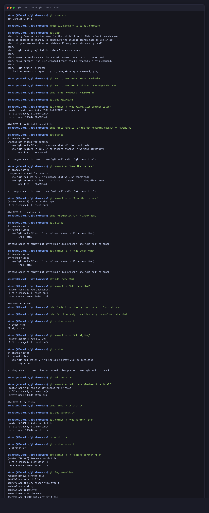
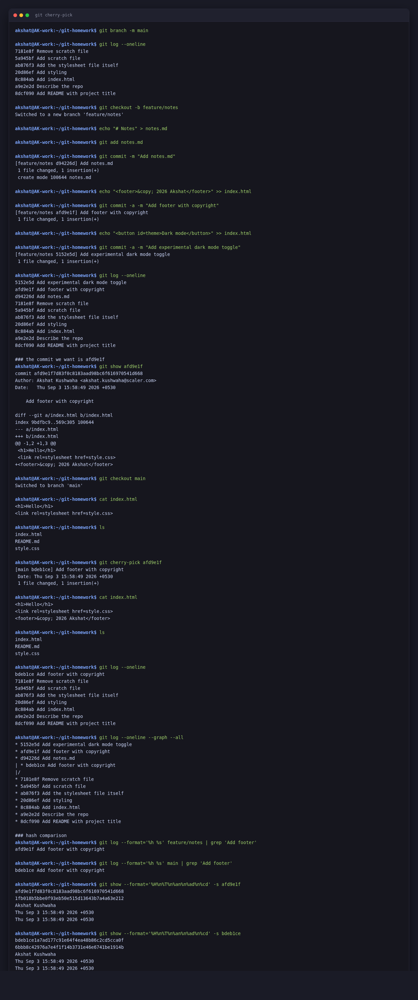
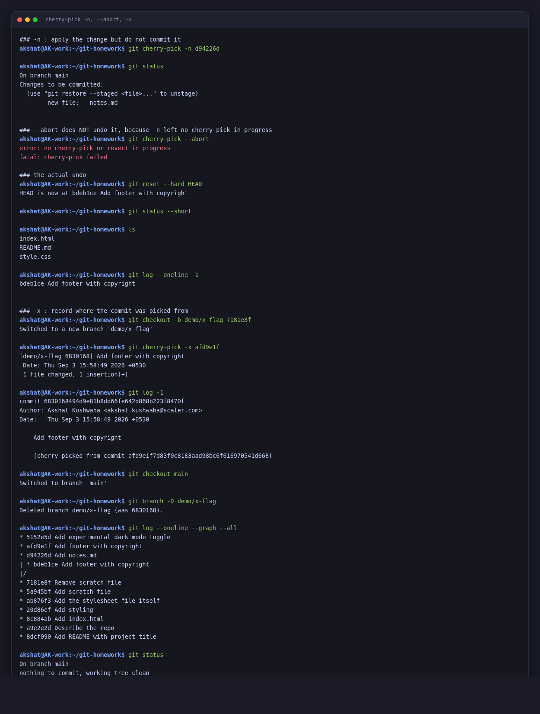

# Git Homework

**Name:** Akshat Kushwaha
**Enrollment Number:** 24bcs10060
3 September 2026

```text
akshat@AK-work:~$ git --version
git version 2.34.1
```

Everything below is a real session in a throwaway repo at `~/git-homework`. The commit hashes are the ones git actually generated, so they are internally consistent — the hash in one block is the same hash in the next.

---

## Task 1: `git commit -m` vs `git commit -a -m`

### Setting up a repo to test in

```text
akshat@AK-work:~$ mkdir git-homework && cd git-homework
akshat@AK-work:~/git-homework$ git init
hint: Using 'master' as the name for the initial branch. This default branch name
hint: is subject to change. To configure the initial branch name to use in all
hint: of your new repositories, which will suppress this warning, call:
hint: 
hint: 	git config --global init.defaultBranch <name>
hint: 
hint: Names commonly chosen instead of 'master' are 'main', 'trunk' and
hint: 'development'. The just-created branch can be renamed via this command:
hint: 
hint: 	git branch -m <name>
Initialized empty Git repository in /home/akshat/git-homework/.git/
akshat@AK-work:~/git-homework$ git config user.name "Akshat Kushwaha"
akshat@AK-work:~/git-homework$ git config user.email "akshat.kushwaha@scaler.com"
akshat@AK-work:~/git-homework$ echo "# Git Homework" > README.md
akshat@AK-work:~/git-homework$ git add README.md
akshat@AK-work:~/git-homework$ git commit -m "Add README with project title"
[master (root-commit) 8dcf090] Add README with project title
 1 file changed, 1 insertion(+)
 create mode 100644 README.md
```

Git 2.34 still defaults the first branch to `master` and prints that hint. I renamed it to `main` at the start of Task 2 with `git branch -m main`, which is why the branch name changes partway down this file.

I set `user.name` and `user.email` locally (no `--global`) so this throwaway repo does not touch my normal git identity.

### The difference

Short version: **`-a` automatically stages every file git is already tracking that has been modified or deleted, then commits.** It does not touch untracked files. `git commit -m` on its own commits only what is already in the staging area.

So `git commit -a -m "msg"` is really `git add -u` followed by `git commit -m "msg"`.

Four tests, one per case that behaves differently.

### Test 1: modifying a file that is already tracked

```text
akshat@AK-work:~/git-homework$ echo "This repo is for the git homework tasks." >> README.md
akshat@AK-work:~/git-homework$ git status
On branch master
Changes not staged for commit:
  (use "git add <file>..." to update what will be committed)
  (use "git restore <file>..." to discard changes in working directory)
	modified:   README.md

no changes added to commit (use "git add" and/or "git commit -a")
```

`README.md` is modified but not staged. Plain `git commit -m` refuses:

```text
akshat@AK-work:~/git-homework$ git commit -m "Describe the repo"
On branch master
Changes not staged for commit:
  (use "git add <file>..." to update what will be committed)
  (use "git restore <file>..." to discard changes in working directory)
	modified:   README.md

no changes added to commit (use "git add" and/or "git commit -a")
```

No commit was created — it printed the status back at me and stopped. Note git even tells you the fix in that last line: *"use git add and/or git commit -a"*.

With `-a`:

```text
akshat@AK-work:~/git-homework$ git commit -a -m "Describe the repo"
[master a9e2e2d] Describe the repo
 1 file changed, 1 insertion(+)
```

Committed as `a9e2e2d`, no `git add` needed. **This is the case `-a` exists for.**

### Test 2: a brand new file

```text
akshat@AK-work:~/git-homework$ echo "<h1>Hello</h1>" > index.html
akshat@AK-work:~/git-homework$ git status
On branch master
Untracked files:
  (use "git add <file>..." to include in what will be committed)
	index.html

nothing added to commit but untracked files present (use "git add" to track)
```

Now `-a`:

```text
akshat@AK-work:~/git-homework$ git commit -a -m "Add index.html"
On branch master
Untracked files:
  (use "git add <file>..." to include in what will be committed)
	index.html

nothing added to commit but untracked files present (use "git add" to track)
```

**`-a` did nothing.** This is the important half of the answer. `-a` means "stage the changes to files git already knows about", and git has never seen `index.html`, so it is not included. Same message as before, no commit.

You still need `git add`:

```text
akshat@AK-work:~/git-homework$ git add index.html
akshat@AK-work:~/git-homework$ git commit -m "Add index.html"
[master 8c884ab] Add index.html
 1 file changed, 1 insertion(+)
 create mode 100644 index.html
```

### Test 3: mixed, one tracked and one new

This is where it gets genuinely easy to make a mistake. One modified tracked file and one new untracked file, committed with `-a`:

```text
akshat@AK-work:~/git-homework$ echo "body { font-family: sans-serif; }" > style.css
akshat@AK-work:~/git-homework$ echo "<link rel=stylesheet href=style.css>" >> index.html
akshat@AK-work:~/git-homework$ git status --short
 M index.html
?? style.css
akshat@AK-work:~/git-homework$ git commit -a -m "Add styling"
[master 20d86ef] Add styling
 1 file changed, 1 insertion(+)
```

**"1 file changed"** — it committed the `index.html` edit and silently left `style.css` behind. The commit message says "Add styling" and the stylesheet is not in it. If you did not read that line carefully you would push a broken page.

```text
akshat@AK-work:~/git-homework$ git status
On branch master
Untracked files:
  (use "git add <file>..." to include in what will be committed)
	style.css

nothing added to commit but untracked files present (use "git add" to track)
akshat@AK-work:~/git-homework$ git add style.css
akshat@AK-work:~/git-homework$ git commit -m "Add the stylesheet file itself"
[master ab876f3] Add the stylesheet file itself
 1 file changed, 1 insertion(+)
 create mode 100644 style.css
```

The `M` / `??` columns in `git status --short` are the tell: `M` is tracked-and-modified, `??` is untracked. `-a` only ever picks up the first kind.

### Test 4: deletions

`-a` covers deletions too, which surprised me — "all" really does mean all tracked changes, not just edits.

```text
akshat@AK-work:~/git-homework$ echo "temp" > scratch.txt
akshat@AK-work:~/git-homework$ git add scratch.txt
akshat@AK-work:~/git-homework$ git commit -m "Add scratch file"
[master 5a945bf] Add scratch file
 1 file changed, 1 insertion(+)
 create mode 100644 scratch.txt
akshat@AK-work:~/git-homework$ rm scratch.txt
akshat@AK-work:~/git-homework$ git status --short
 D scratch.txt
akshat@AK-work:~/git-homework$ git commit -a -m "Remove scratch file"
[master 7181e8f] Remove scratch file
 1 file changed, 1 deletion(-)
 delete mode 100644 scratch.txt
```

`delete mode 100644 scratch.txt` — the removal was staged and committed without a `git rm` or `git add`. So a stray `rm` followed by a routine `git commit -a -m` will record the deletion whether you meant it or not.

### Summary

| | `git commit -m` | `git commit -a -m` |
|---|---|---|
| Modified tracked file | Only if you `git add` it first | Staged automatically |
| Deleted tracked file | Only if you `git add`/`git rm` it | Staged automatically |
| New untracked file | Needs `git add` | **Ignored**, still needs `git add` |
| Partially staged file | Commits exactly what you staged | Commits the whole current file, losing the distinction |
| Equivalent to | commit the index as-is | `git add -u && git commit -m` |

That fourth row is the other reason to be careful. If you deliberately staged only part of a file with `git add -p`, then `-a` throws that away and commits everything.

My takeaway: `-a` is fine for a quick fix to files that already exist, but `git status` before committing is the habit that actually prevents problems. Test 3 is the one to remember — `-a` fails *silently* and *partially*, which is worse than failing loudly.

---

## Task 2: Cherry-pick

### Step 1 and 2: commits on main, then view them

Carrying on in the same repo, renamed to `main` first:

```text
akshat@AK-work:~/git-homework$ git branch -m main
akshat@AK-work:~/git-homework$ git log --oneline
7181e8f Remove scratch file
5a945bf Add scratch file
ab876f3 Add the stylesheet file itself
20d86ef Add styling
8c884ab Add index.html
a9e2e2d Describe the repo
8dcf090 Add README with project title
```

Seven commits on main, which covers the "2–4 commits" the task asked for.

### Step 3: create a new branch

```text
akshat@AK-work:~/git-homework$ git checkout -b feature/notes
Switched to a new branch 'feature/notes'
```

`-b` creates and switches in one step. The branch starts pointing at `7181e8f`, the tip of main.

### Step 4: three commits on the branch

```text
akshat@AK-work:~/git-homework$ echo "# Notes" > notes.md
akshat@AK-work:~/git-homework$ git add notes.md
akshat@AK-work:~/git-homework$ git commit -m "Add notes.md"
[feature/notes d94226d] Add notes.md
 1 file changed, 1 insertion(+)
 create mode 100644 notes.md
akshat@AK-work:~/git-homework$ echo "<footer>&copy; 2026 Akshat</footer>" >> index.html
akshat@AK-work:~/git-homework$ git commit -a -m "Add footer with copyright"
[feature/notes afd9e1f] Add footer with copyright
 1 file changed, 1 insertion(+)
akshat@AK-work:~/git-homework$ echo "<button id=theme>Dark mode</button>" >> index.html
akshat@AK-work:~/git-homework$ git commit -a -m "Add experimental dark mode toggle"
[feature/notes 5152e5d] Add experimental dark mode toggle
 1 file changed, 1 insertion(+)
```

The middle one is deliberately the interesting case: the footer is a finished, self-contained change, while `notes.md` and the dark mode toggle are work-in-progress. That is exactly the real-world shape where cherry-pick is the right tool — you want one commit out of a branch that is not ready.

### Step 5: find the commit to pick

```text
akshat@AK-work:~/git-homework$ git log --oneline
5152e5d Add experimental dark mode toggle
afd9e1f Add footer with copyright
d94226d Add notes.md
7181e8f Remove scratch file
5a945bf Add scratch file
ab876f3 Add the stylesheet file itself
20d86ef Add styling
8c884ab Add index.html
a9e2e2d Describe the repo
8dcf090 Add README with project title
```

`afd9e1f` is the one. Checking it really is the change I want before picking it:

```text
akshat@AK-work:~/git-homework$ git show afd9e1f
commit afd9e1f7d83f0c8183aad98bc6f616970541d668
Author: Akshat Kushwaha <akshat.kushwaha@scaler.com>
Date:   Thu Sep 3 15:58:49 2026 +0530

    Add footer with copyright

diff --git a/index.html b/index.html
index 9bdfbc9..569c305 100644
--- a/index.html
+++ b/index.html
@@ -1,2 +1,3 @@
 <h1>Hello</h1>
 <link rel=stylesheet href=style.css>
+<footer>&copy; 2026 Akshat</footer>
```

One line added to one file. `git show` before `git cherry-pick` is worth the two seconds.

### Step 6: cherry-pick it onto main

```text
akshat@AK-work:~/git-homework$ git checkout main
Switched to branch 'main'
akshat@AK-work:~/git-homework$ cat index.html
<h1>Hello</h1>
<link rel=stylesheet href=style.css>
akshat@AK-work:~/git-homework$ ls
index.html  README.md  style.css
```

No footer, and no `notes.md` — main is as it was. Now the pick:

```text
akshat@AK-work:~/git-homework$ git cherry-pick afd9e1f
[main bdeb1ce] Add footer with copyright
 Date: Thu Sep 3 15:58:49 2026 +0530
 1 file changed, 1 insertion(+)
```

### Step 7: verify

```text
akshat@AK-work:~/git-homework$ cat index.html
<h1>Hello</h1>
<link rel=stylesheet href=style.css>
<footer>&copy; 2026 Akshat</footer>
akshat@AK-work:~/git-homework$ ls
index.html  README.md  style.css
akshat@AK-work:~/git-homework$ git log --oneline
bdeb1ce Add footer with copyright
7181e8f Remove scratch file
5a945bf Add scratch file
ab876f3 Add the stylesheet file itself
20d86ef Add styling
8c884ab Add index.html
a9e2e2d Describe the repo
8dcf090 Add README with project title
```

This is the verification the task asked for, and there are two halves to it:

- The footer **is** in `index.html` on main.
- `notes.md` is **not** there, and neither is the dark mode toggle. `ls` shows the same three files as before.

That second half is the whole point. One commit came across; the two either side of it did not.

### The thing worth noticing: the hash changed

On the branch that commit is `afd9e1f`. On main it is `bdeb1ce`. Same author, same message, same diff — different hash.

```text
akshat@AK-work:~/git-homework$ git show -s --format='author:    %aI%ncommitter: %cI%ntree:      %T%nparent:    %P' afd9e1f
author:    2026-09-03T15:58:49+05:30
committer: 2026-09-03T15:58:49+05:30
tree:      1fb018b5bbe0f93eb50e515d13643b7a4a63e212
parent:    d94226d091f9c0d37c83eade713a05770021607e

akshat@AK-work:~/git-homework$ git show -s --format='author:    %aI%ncommitter: %cI%ntree:      %T%nparent:    %P' bdeb1ce
author:    2026-09-03T15:58:49+05:30
committer: 2026-09-03T15:58:49+05:30
tree:      6bbb8c42976a7e4f1f14b3731e46e6741be1914b
parent:    7181e8f906e8c6365116490ebeb7984e1ff14aa5
```

A commit hash is a checksum over the tree, the parent, the author and committer lines and the message. Two of those differ:

- **The parent.** `d94226d` (the `notes.md` commit) on the branch, `7181e8f` (the scratch-file removal) on main.
- **The tree.** `1fb018b…` on the branch contains `notes.md`; `6bbb8c4…` on main does not. Same *diff*, different resulting snapshot — because git stores snapshots, not patches.

So cherry-pick does not move or copy a commit. It takes the diff, replays it, and builds a **new** commit object.

The author date is preserved (`15:58:49` on both), which is why the cherry-pick output printed an explicit `Date:` line. The committer date is when the pick happened — here they match to the second only because I ran the whole thing inside one minute.

The diff really is identical, blob hashes and all:

```text
akshat@AK-work:~/git-homework$ git diff bdeb1ce^ bdeb1ce -- index.html
diff --git a/index.html b/index.html
index 9bdfbc9..569c305 100644
--- a/index.html
+++ b/index.html
@@ -1,2 +1,3 @@
 <h1>Hello</h1>
 <link rel=stylesheet href=style.css>
+<footer>&copy; 2026 Akshat</footer>
```

`9bdfbc9..569c305` are the same before/after blob hashes as in the original `git show afd9e1f` further up.

Both copies now exist, one on each branch:

```text
akshat@AK-work:~/git-homework$ git log --oneline --graph --all
* 5152e5d Add experimental dark mode toggle
* afd9e1f Add footer with copyright
* d94226d Add notes.md
| * bdeb1ce Add footer with copyright
|/  
* 7181e8f Remove scratch file
* 5a945bf Add scratch file
* ab876f3 Add the stylesheet file itself
* 20d86ef Add styling
* 8c884ab Add index.html
* a9e2e2d Describe the repo
* 8dcf090 Add README with project title
```

You can see the fork at `7181e8f` and "Add footer with copyright" appearing twice, once on each side.

```text
akshat@AK-work:~/git-homework$ git branch -vv
  feature/notes 5152e5d Add experimental dark mode toggle
* main          bdeb1ce Add footer with copyright
```

That duplicate is the trade-off. When `feature/notes` eventually gets merged, git usually works out that the change is already present, but it can also produce a conflict on that hunk. It is why cherry-pick is for genuine one-off situations — pulling a hotfix back into a release branch — rather than a normal way of moving work between branches.

### Useful options I tried

**`-n` (`--no-commit`)** applies the change and stages it, but stops short of committing, so you can edit first:

```text
akshat@AK-work:~/git-homework$ git cherry-pick -n d94226d
akshat@AK-work:~/git-homework$ git status
On branch main
Changes to be committed:
  (use "git restore --staged <file>..." to unstage)
	new file:   notes.md
```

I assumed `git cherry-pick --abort` would undo that. It does not:

```text
akshat@AK-work:~/git-homework$ git cherry-pick --abort
error: no cherry-pick or revert in progress
fatal: cherry-pick failed
```

That is worth knowing. `--abort` only works while a cherry-pick is genuinely *in progress* — i.e. it hit a conflict and left the sequencer state in `.git/`. A clean `-n` pick finishes immediately and leaves nothing to abort; the change is just sitting in your index like any other staged edit. The undo is the ordinary one:

```text
akshat@AK-work:~/git-homework$ git reset --hard HEAD
HEAD is now at bdeb1ce Add footer with copyright
akshat@AK-work:~/git-homework$ git status --short
akshat@AK-work:~/git-homework$ ls
index.html  README.md  style.css
```

**`-x`** is the one I will actually use in future. It appends a provenance line to the message:

```text
akshat@AK-work:~/git-homework$ git checkout -b demo/x-flag 7181e8f
Switched to a new branch 'demo/x-flag'
akshat@AK-work:~/git-homework$ git cherry-pick -x afd9e1f
[demo/x-flag 6830168] Add footer with copyright
 Date: Thu Sep 3 15:58:49 2026 +0530
 1 file changed, 1 insertion(+)
akshat@AK-work:~/git-homework$ git log -1
commit 6830168494d9e81b8dd66fe642d868b223f8470f
Author: Akshat Kushwaha <akshat.kushwaha@scaler.com>
Date:   Thu Sep 3 15:58:49 2026 +0530

    Add footer with copyright
    
    (cherry picked from commit afd9e1f7d83f0c8183aad98bc6f616970541d668)
```

Six months later you can see where the commit came from. For anything shared, that trail is worth having. I did this on a throwaway branch and deleted it afterwards so it does not clutter the graph above:

```text
akshat@AK-work:~/git-homework$ git checkout main
Switched to branch 'main'
akshat@AK-work:~/git-homework$ git branch -D demo/x-flag
Deleted branch demo/x-flag (was 6830168).
akshat@AK-work:~/git-homework$ git status
On branch main
nothing to commit, working tree clean
```

---

## Screenshots

**Task 1 — all four `-a` tests**



**Task 2 — branch, cherry-pick, verify**



**The `-n` / `--abort` / `-x` options**



---

## Summary

| Task | Done |
|---|---|
| Practise `git commit -a -m` | Yes, four tests covering modified, new, mixed and deleted files |
| Understand the difference | `-a` auto-stages tracked modified and deleted files, ignores untracked ones |
| Test both and observe | Yes — `git commit -m` refused with nothing staged; `-a` silently skipped the new file |
| 2–4 commits on main | 7 commits |
| `git log` to view | Yes, plus `--graph --all` at the end |
| New branch | `feature/notes` |
| 2–3 commits on the branch | 3 |
| `git log` to identify one | Picked `afd9e1f` |
| Cherry-pick into main | Yes, landed as `bdeb1ce` |
| Verify it is in main | Yes — footer present, `notes.md` and dark mode toggle absent |

The two results worth carrying forward: `-a` stages **deletions**, not just edits — so a stray `rm` gets committed by a routine `git commit -a -m` — and `cherry-pick --abort` only works while a pick is genuinely mid-conflict, so a clean `-n` pick is undone with `git reset --hard` instead.
