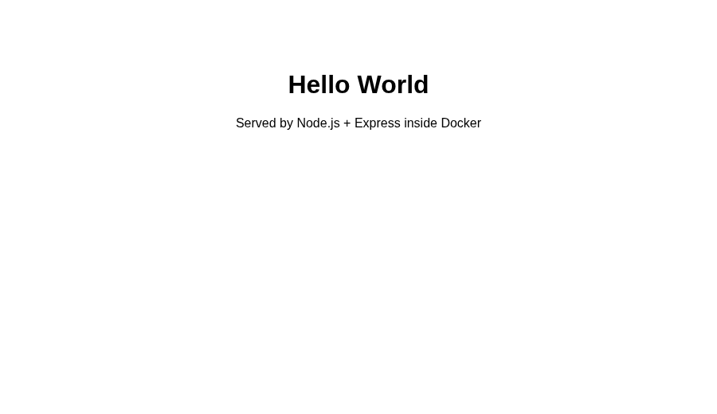
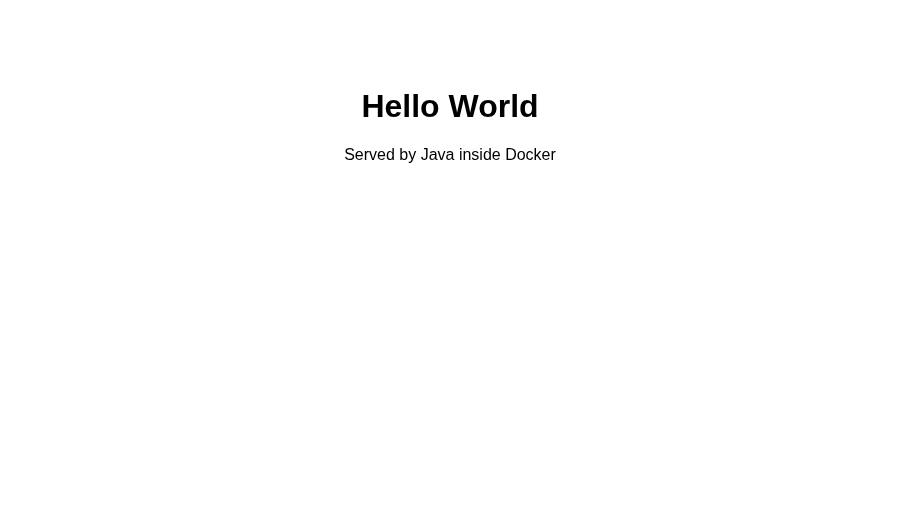
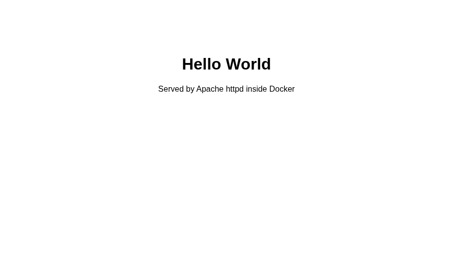
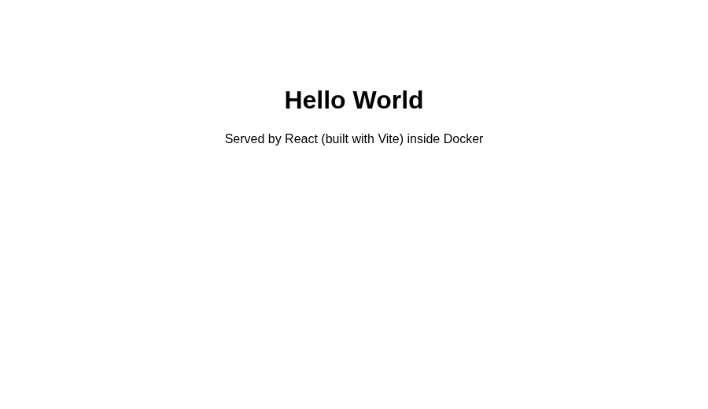
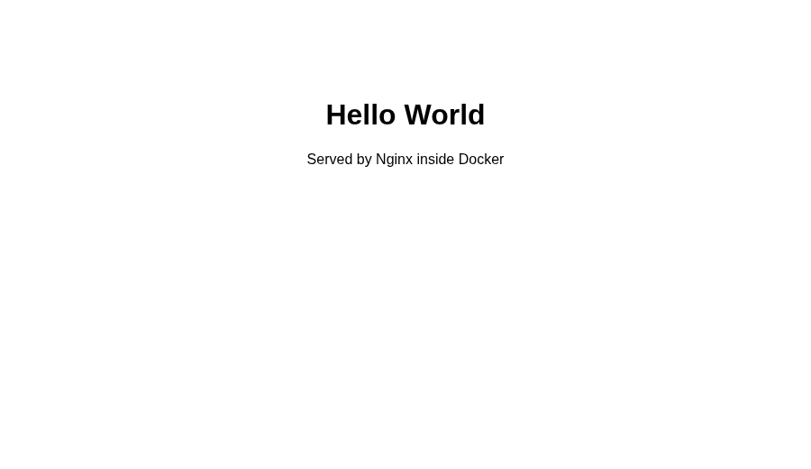
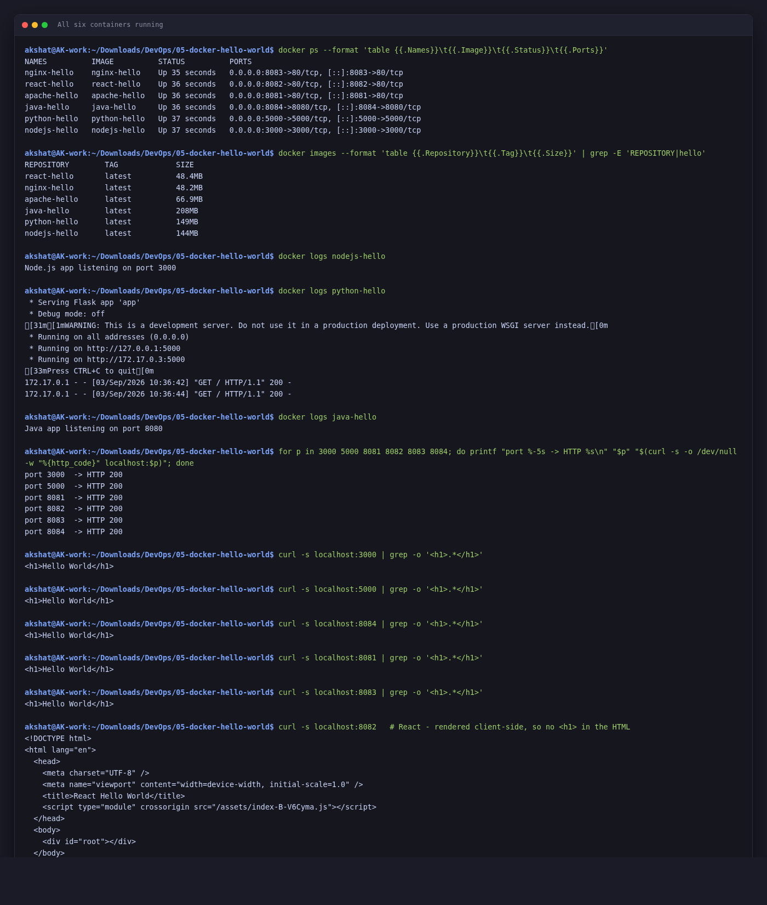
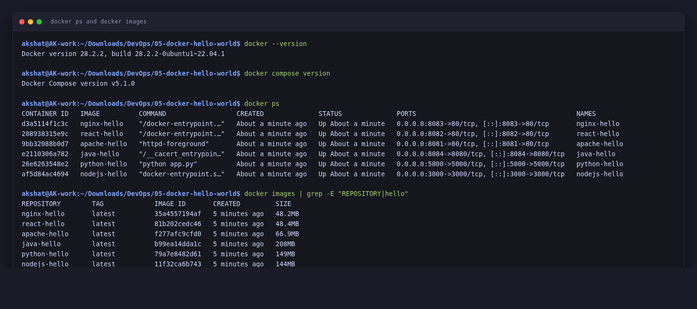

# Docker Homework — Hello World Applications

**Akshat Kushwaha**
3 September 2026

Six Hello World web apps, each in its own folder with its own Dockerfile, all built and run as containers, and all six verified in a browser.

```
akshat@AK-work:~/Downloads/DevOps/05-docker-hello-world$ docker --version
Docker version 28.2.2, build 28.2.2-0ubuntu1~22.04.1
akshat@AK-work:~/Downloads/DevOps/05-docker-hello-world$ docker compose version
Docker Compose version v5.1.0
```

> **A note on the build output below.** This machine does not have the `buildx` plugin installed, so `docker build` falls back to the legacy builder and prints `Step 1/N` lines rather than BuildKit's `[+] Building` tree. Every build below shows that legacy format. It builds the same image either way; only the output formatting differs. Docker does warn about it on each run:
>
> ```
> DEPRECATED: The legacy builder is deprecated and will be removed in a future release.
>             Install the buildx component to build images with BuildKit:
> ```
>
> I have trimmed that repeated warning out of the blocks below to keep them readable.

## Folder structure

```
05-docker-hello-world/
├── nodejs-app/
│   ├── Dockerfile
│   ├── package.json
│   ├── server.js
│   └── .dockerignore
├── python-app/
│   ├── Dockerfile
│   ├── app.py
│   ├── requirements.txt
│   └── .dockerignore
├── java-app/
│   ├── Dockerfile
│   └── HelloWorld.java
├── Apache-app/
│   ├── Dockerfile
│   └── index.html
├── React-app/
│   ├── Dockerfile
│   ├── package.json
│   ├── vite.config.js
│   ├── index.html
│   ├── src/
│   │   ├── App.jsx
│   │   └── main.jsx
│   └── .dockerignore
├── nginx-app/
│   ├── Dockerfile
│   └── index.html
└── README.md
```

Folder names are exactly as the task specified them, including the capitalised `Apache-app` and `React-app`.

## Port assignments

Gave each one a different host port so I could have them all running at once and compare.

| App | Container port | Host port | URL |
|---|---|---|---|
| nodejs-app | 3000 | 3000 | http://localhost:3000 |
| python-app | 5000 | 5000 | http://localhost:5000 |
| java-app | 8080 | 8084 | http://localhost:8084 |
| Apache-app | 80 | 8081 | http://localhost:8081 |
| React-app | 80 | 8082 | http://localhost:8082 |
| nginx-app | 80 | 8083 | http://localhost:8083 |

---

## 1. Node.js app

Express server returning an HTML page.

```
$ cd ~/05-docker-hello-world/nodejs-app && docker build -t nodejs-hello .


Sending build context to Docker daemon   5.12kB

Step 1/7 : FROM node:20-alpine
 ---> 11cedc39e663
Step 2/7 : WORKDIR /app
 ---> Running in c1a809ae3001
 ---> Removed intermediate container c1a809ae3001
 ---> 96b2e0038f7a
Step 3/7 : COPY package*.json ./
 ---> 1f2e8183cd2b
Step 4/7 : RUN npm install --omit=dev
 ---> Running in e9f29270fcba

added 68 packages, and audited 69 packages in 2s

15 packages are looking for funding
  run `npm fund` for details

3 moderate severity vulnerabilities

To address all issues, run:
  npm audit fix

Run `npm audit` for details.
npm notice
npm notice New major version of npm available! 10.8.2 -> 12.0.2
npm notice Changelog: https://github.com/npm/cli/releases/tag/v12.0.2
npm notice To update run: npm install -g npm@12.0.2
npm notice
 ---> Removed intermediate container e9f29270fcba
 ---> 9aeda2099df6
Step 5/7 : COPY server.js ./
 ---> a6aebe4d517e
Step 6/7 : EXPOSE 3000
 ---> Running in 13701fa8fbc3
 ---> Removed intermediate container 13701fa8fbc3
 ---> ebcd765c8fdb
Step 7/7 : CMD ["node", "server.js"]
 ---> Running in a123e4621bc6
 ---> Removed intermediate container a123e4621bc6
 ---> 11f32ca6b743
Successfully built 11f32ca6b743
Successfully tagged nodejs-hello:latest
```

```
akshat@AK-work:~/Downloads/DevOps/05-docker-hello-world/nodejs-app$ docker run -d -p 3000:3000 --name nodejs-hello nodejs-hello
af5d84ac469447062b7cc1de1b97439b31669f6592c8d9bfa2edd229b1ffb693
akshat@AK-work:~/Downloads/DevOps/05-docker-hello-world/nodejs-app$ docker logs nodejs-hello
Node.js app listening on port 3000
akshat@AK-work:~/Downloads/DevOps/05-docker-hello-world/nodejs-app$ curl -s localhost:3000 | grep -o '<h1>.*</h1>'
<h1>Hello World</h1>
```

Verified in the browser at `http://localhost:3000`:



**Note on the Dockerfile.** `COPY package*.json ./` and `npm install` come before `COPY server.js`. That ordering matters: Docker caches each layer, and a layer is only rebuilt if it or something above it changed. Since `server.js` changes constantly and `package.json` rarely does, this way editing the source does not re-run `npm install`. I tested it by building a second time with nothing changed:

```
$ docker build -t nodejs-hello .   # second build, everything cached
Sending build context to Docker daemon   5.12kB
Step 1/7 : FROM node:20-alpine
 ---> 11cedc39e663
Step 2/7 : WORKDIR /app
 ---> Using cache
 ---> 96b2e0038f7a
Step 3/7 : COPY package*.json ./
 ---> Using cache
 ---> 1f2e8183cd2b
Step 4/7 : RUN npm install --omit=dev
 ---> Using cache
 ---> 9aeda2099df6
Step 5/7 : COPY server.js ./
 ---> Using cache
 ---> a6aebe4d517e
Step 6/7 : EXPOSE 3000
 ---> Using cache
 ---> ebcd765c8fdb
Step 7/7 : CMD ["node", "server.js"]
 ---> Using cache
 ---> 11f32ca6b743
Successfully built 11f32ca6b743
Successfully tagged nodejs-hello:latest
```

Every step after the first says `Using cache`, and the whole build returns instantly instead of re-running `npm install`. (`Using cache` is the legacy builder's wording; BuildKit prints `CACHED`.)

---

## 2. Python app

Flask, on port 5000.

```
$ cd ~/05-docker-hello-world/python-app && docker build -t python-hello .


Sending build context to Docker daemon   5.12kB

Step 1/7 : FROM python:3.11-slim
 ---> b8fe4ce3655e
Step 2/7 : WORKDIR /app
 ---> Running in 45a3c5a8633e
 ---> Removed intermediate container 45a3c5a8633e
 ---> 71273fb7da07
Step 3/7 : COPY requirements.txt .
 ---> bdf2b870c465
Step 4/7 : RUN pip install --no-cache-dir -r requirements.txt
 ---> Running in f3c3ed604525
Collecting flask==3.0.3 (from -r requirements.txt (line 1))
  Downloading flask-3.0.3-py3-none-any.whl.metadata (3.2 kB)
Collecting Werkzeug>=3.0.0 (from flask==3.0.3->-r requirements.txt (line 1))
  Downloading werkzeug-3.1.8-py3-none-any.whl.metadata (4.0 kB)
Collecting Jinja2>=3.1.2 (from flask==3.0.3->-r requirements.txt (line 1))
  Downloading jinja2-3.1.6-py3-none-any.whl.metadata (2.9 kB)
Collecting itsdangerous>=2.1.2 (from flask==3.0.3->-r requirements.txt (line 1))
  Downloading itsdangerous-2.2.0-py3-none-any.whl.metadata (1.9 kB)
Collecting click>=8.1.3 (from flask==3.0.3->-r requirements.txt (line 1))
  Downloading click-8.5.0-py3-none-any.whl.metadata (2.6 kB)
Collecting blinker>=1.6.2 (from flask==3.0.3->-r requirements.txt (line 1))
  Downloading blinker-1.9.0-py3-none-any.whl.metadata (1.6 kB)
Collecting MarkupSafe>=2.0 (from Jinja2>=3.1.2->flask==3.0.3->-r requirements.txt (line 1))
  Downloading markupsafe-3.0.3-cp311-cp311-manylinux2014_x86_64.manylinux_2_17_x86_64.manylinux_2_28_x86_64.whl.metadata (2.7 kB)
Downloading flask-3.0.3-py3-none-any.whl (101 kB)
   ━━━━━━━━━━━━━━━━━━━━━━━━━━━━━━━━━━━━━━━━ 101.7/101.7 kB 1.6 MB/s eta 0:00:00
Downloading blinker-1.9.0-py3-none-any.whl (8.5 kB)
Downloading click-8.5.0-py3-none-any.whl (125 kB)
   ━━━━━━━━━━━━━━━━━━━━━━━━━━━━━━━━━━━━━━━━ 125.3/125.3 kB 4.7 MB/s eta 0:00:00
Downloading itsdangerous-2.2.0-py3-none-any.whl (16 kB)
Downloading jinja2-3.1.6-py3-none-any.whl (134 kB)
   ━━━━━━━━━━━━━━━━━━━━━━━━━━━━━━━━━━━━━━━━ 134.9/134.9 kB 2.1 MB/s eta 0:00:00
Downloading werkzeug-3.1.8-py3-none-any.whl (226 kB)
   ━━━━━━━━━━━━━━━━━━━━━━━━━━━━━━━━━━━━━━━━ 226.5/226.5 kB 8.0 MB/s eta 0:00:00
Downloading markupsafe-3.0.3-cp311-cp311-manylinux2014_x86_64.manylinux_2_17_x86_64.manylinux_2_28_x86_64.whl (22 kB)
Installing collected packages: MarkupSafe, itsdangerous, click, blinker, Werkzeug, Jinja2, flask
Successfully installed Jinja2-3.1.6 MarkupSafe-3.0.3 Werkzeug-3.1.8 blinker-1.9.0 click-8.5.0 flask-3.0.3 itsdangerous-2.2.0
WARNING: Running pip as the 'root' user can result in broken permissions and conflicting behaviour with the system package manager. It is recommended to use a virtual environment instead: https://pip.pypa.io/warnings/venv

[notice] A new release of pip is available: 24.0 -> 26.2.1
[notice] To update, run: pip install --upgrade pip
 ---> Removed intermediate container f3c3ed604525
 ---> efb2ce7ee21b
Step 5/7 : COPY app.py .
 ---> 4230bc7ff56a
Step 6/7 : EXPOSE 5000
 ---> Running in 224ec82c9206
 ---> Removed intermediate container 224ec82c9206
 ---> c76531a22dd1
Step 7/7 : CMD ["python", "app.py"]
 ---> Running in 4008f5d32fe4
 ---> Removed intermediate container 4008f5d32fe4
 ---> 79a7e8482d61
Successfully built 79a7e8482d61
Successfully tagged python-hello:latest
```

```
akshat@AK-work:~/Downloads/DevOps/05-docker-hello-world/python-app$ docker run -d -p 5000:5000 --name python-hello python-hello
26e6263548e23d811755e64fbdebde6e598c80c58f8cf45d833f370ad312983d
akshat@AK-work:~/Downloads/DevOps/05-docker-hello-world/python-app$ docker logs python-hello
 * Serving Flask app 'app'
 * Debug mode: off
WARNING: This is a development server. Do not use it in a production deployment. Use a production WSGI server instead.
 * Running on all addresses (0.0.0.0)
 * Running on http://127.0.0.1:5000
 * Running on http://172.17.0.3:5000
Press CTRL+C to quit
akshat@AK-work:~/Downloads/DevOps/05-docker-hello-world/python-app$ curl -s localhost:5000 | grep -o '<h1>.*</h1>'
<h1>Hello World</h1>
```


Two things I had to get right here. `app.run(host="0.0.0.0")` rather than the default `127.0.0.1` — with the default, Flask only listens on the container's loopback and the port mapping goes nowhere. I hit this first and got an empty reply from the host even though `docker logs` looked fine. Second, `--no-cache-dir` on pip, which keeps the wheel cache out of the image.

The warning about the development server is expected. For anything real this would be gunicorn.

A nice detail visible in the logs after loading the page: Flask logs the request, and the client IP is `172.17.0.1` — the Docker bridge gateway, not my laptop's LAN address. From inside the container, all traffic arriving through a published port appears to come from the bridge.

---

## 3. Java app

Plain Java using the JDK's built-in `HttpServer`, so there is no Maven or Gradle to set up. The Dockerfile is two-stage: compile with the JDK, ship on the smaller JRE.

```
$ cd ~/05-docker-hello-world/java-app && docker build -t java-hello .


Sending build context to Docker daemon  4.096kB

Step 1/9 : FROM eclipse-temurin:21-jdk-alpine AS build
 ---> c610389f4719
Step 2/9 : WORKDIR /src
 ---> Running in 5aeef90b4b78
 ---> Removed intermediate container 5aeef90b4b78
 ---> a405fd4cbd8e
Step 3/9 : COPY HelloWorld.java .
 ---> 4010357f1041
Step 4/9 : RUN javac HelloWorld.java
 ---> Running in 1d07f74f278c
 ---> Removed intermediate container 1d07f74f278c
 ---> 2fe5769c8054
Step 5/9 : FROM eclipse-temurin:21-jre-alpine
 ---> d61c725e9bb2
Step 6/9 : WORKDIR /app
 ---> Running in 928ccb1cf7b5
 ---> Removed intermediate container 928ccb1cf7b5
 ---> 06665a117848
Step 7/9 : COPY --from=build /src/HelloWorld.class .
 ---> 0a4336e473df
Step 8/9 : EXPOSE 8080
 ---> Running in 551732a73b84
 ---> Removed intermediate container 551732a73b84
 ---> a90402a16cf9
Step 9/9 : CMD ["java", "HelloWorld"]
 ---> Running in 8a86b5fc7f0e
 ---> Removed intermediate container 8a86b5fc7f0e
 ---> b99ea14dda1c
Successfully built b99ea14dda1c
Successfully tagged java-hello:latest
```

```
akshat@AK-work:~/Downloads/DevOps/05-docker-hello-world/java-app$ docker run -d -p 8084:8080 --name java-hello java-hello
e2110306a782dec4273afb8295acb7e3a5ac0e59669a5278e422498ebe77896d
akshat@AK-work:~/Downloads/DevOps/05-docker-hello-world/java-app$ docker logs java-hello
Java app listening on port 8080
akshat@AK-work:~/Downloads/DevOps/05-docker-hello-world/java-app$ curl -s localhost:8084 | grep -o '<h1>.*</h1>'
<h1>Hello World</h1>
```



Note the port mapping is `8084:8080` — the app listens on 8080 inside the container, and I published it on 8084 on the host. The container port is fixed by the app; the host port is my choice. (On this machine 8080 was already taken by something else, which made the distinction concrete.)

You can see the two stages in the build output: `Step 1/9 : FROM eclipse-temurin:21-jdk-alpine AS build` compiles, then `Step 5/9 : FROM eclipse-temurin:21-jre-alpine` starts a fresh image and only the `.class` file is copied across. The saving is real:

```
akshat@AK-work:~/Downloads/DevOps/05-docker-hello-world$ docker images | grep temurin
eclipse-temurin   21-jdk-alpine   364MB
eclipse-temurin   21-jre-alpine   208MB
```

364MB down to 208MB, just by not shipping the compiler. The finished `java-hello` image is 208MB — the same as the JRE base, because a single `.class` file rounds to nothing.

---

## 4. Apache app

Just a static page on the official `httpd` image.

```
$ cd ~/05-docker-hello-world/Apache-app && docker build -t apache-hello .


Sending build context to Docker daemon  3.072kB

Step 1/3 : FROM httpd:2.4-alpine
 ---> 9436aee6e00c
Step 2/3 : COPY index.html /usr/local/apache2/htdocs/index.html
 ---> 4be66e32fc04
Step 3/3 : EXPOSE 80
 ---> Running in a25c1d0effef
 ---> Removed intermediate container a25c1d0effef
 ---> f277afc9cfd0
Successfully built f277afc9cfd0
Successfully tagged apache-hello:latest
```

```
akshat@AK-work:~/Downloads/DevOps/05-docker-hello-world/Apache-app$ docker run -d -p 8081:80 --name apache-hello apache-hello
9bb32088b0d7d2fac21fd611d32fb11f36118f4967246bf2b6db306b9760bd04
akshat@AK-work:~/Downloads/DevOps/05-docker-hello-world/Apache-app$ curl -s localhost:8081 | grep -o '<h1>.*</h1>'
<h1>Hello World</h1>
```



The only thing to know is the document root: Apache serves from `/usr/local/apache2/htdocs`, which is different from nginx. Put the file in the wrong place and you get the default "It works!" page instead, which is what happened to me the first time.

No `CMD` needed because the base image already has one — you can see it as `httpd-foreground` in the `docker ps` output further down.

---

## 5. React app

A real Vite + React app, built to static files and then served by nginx. This is a multi-stage build: stage one has Node and all the build tooling, stage two is just nginx with the compiled bundle copied in.

```
$ cd ~/05-docker-hello-world/React-app && docker build -t react-hello .


Sending build context to Docker daemon  8.704kB

Step 1/10 : FROM node:20-alpine AS build
 ---> 11cedc39e663
Step 2/10 : WORKDIR /app
 ---> Using cache
 ---> 96b2e0038f7a
Step 3/10 : COPY package*.json ./
 ---> 6ded7ce70f20
Step 4/10 : RUN npm install
 ---> Running in 611c4d3dfc6c

added 62 packages, and audited 63 packages in 12s

7 packages are looking for funding
  run `npm fund` for details

2 vulnerabilities (1 moderate, 1 high)

To address all issues (including breaking changes), run:
  npm audit fix --force

Run `npm audit` for details.
npm notice
npm notice New major version of npm available! 10.8.2 -> 12.0.2
npm notice Changelog: https://github.com/npm/cli/releases/tag/v12.0.2
npm notice To update run: npm install -g npm@12.0.2
npm notice
 ---> Removed intermediate container 611c4d3dfc6c
 ---> 34a147086226
Step 5/10 : COPY . .
 ---> 5b492080f507
Step 6/10 : RUN npm run build
 ---> Running in efaa7928da65

> react-hello-world@1.0.0 build
> vite build

vite v5.4.21 building for production...
transforming...
✓ 30 modules transformed.
rendering chunks...
computing gzip size...
dist/index.html                  0.33 kB │ gzip:  0.24 kB
dist/assets/index-B-V6Cyma.js  142.83 kB │ gzip: 45.90 kB
✓ built in 494ms
 ---> Removed intermediate container efaa7928da65
 ---> 75a058d37909
Step 7/10 : FROM nginx:1.27-alpine
 ---> 6769dc3a703c
Step 8/10 : COPY --from=build /app/dist /usr/share/nginx/html
 ---> aae422adbf97
Step 9/10 : EXPOSE 80
 ---> Running in 707e31001966
 ---> Removed intermediate container 707e31001966
 ---> 2a3553fd781b
Step 10/10 : CMD ["nginx", "-g", "daemon off;"]
 ---> Running in 4ed28b05d088
 ---> Removed intermediate container 4ed28b05d088
 ---> 81b202cedc46
Successfully built 81b202cedc46
Successfully tagged react-hello:latest
```

```
akshat@AK-work:~/Downloads/DevOps/05-docker-hello-world/React-app$ docker run -d -p 8082:80 --name react-hello react-hello
208938315e9cab0f8c867a57cda0af2e3e4c8cacef33ac67c68d5bf585d6b0a4
akshat@AK-work:~/Downloads/DevOps/05-docker-hello-world/React-app$ curl -s localhost:8082
<!DOCTYPE html>
<html lang="en">
  <head>
    <meta charset="UTF-8" />
    <meta name="viewport" content="width=device-width, initial-scale=1.0" />
    <title>React Hello World</title>
    <script type="module" crossorigin src="/assets/index-B-V6Cyma.js"></script>
  </head>
  <body>
    <div id="root"></div>
  </body>
</html>
```

**`curl` shows an empty `<div id="root">`** because React renders into it in the browser with JavaScript. There is no `<h1>` anywhere in the served HTML. This is the one app where `curl` genuinely cannot tell you whether it works — you have to load it in a browser:



The `Hello World` heading in that screenshot exists only after the 142 kB JS bundle has run.

The size difference from the multi-stage build is the interesting part:

```
akshat@AK-work:~/Downloads/DevOps/05-docker-hello-world$ docker images | grep -E 'react-hello|node|nginx'
react-hello   latest          48.4MB
node          20-alpine       136MB
nginx         1.27-alpine     48.2MB
```

48.4MB final, versus 136MB for the Node base image alone before any `node_modules` were added. The finished image is nginx (48.2MB) plus about 0.2MB of built assets — Vite reported `dist/assets/index-B-V6Cyma.js  142.83 kB`. No Node, no `node_modules`, no Vite in the runtime image at all.

**`.dockerignore` matters here.** The Dockerfile does `COPY . .`, so without it the local `node_modules` would be copied into the build context. With it, the build context is 8.7 kB:

```
Sending build context to Docker daemon  8.704kB
```

---

## 6. Nginx app

Same idea as Apache, different server.

```
$ cd ~/05-docker-hello-world/nginx-app && docker build -t nginx-hello .


Sending build context to Docker daemon  3.072kB

Step 1/3 : FROM nginx:1.27-alpine
 ---> 6769dc3a703c
Step 2/3 : COPY index.html /usr/share/nginx/html/index.html
 ---> 983595d6ea65
Step 3/3 : EXPOSE 80
 ---> Running in 1d726ad35e50
 ---> Removed intermediate container 1d726ad35e50
 ---> 35a4557194af
Successfully built 35a4557194af
Successfully tagged nginx-hello:latest
```

```
akshat@AK-work:~/Downloads/DevOps/05-docker-hello-world/nginx-app$ docker run -d -p 8083:80 --name nginx-hello nginx-hello
d3a5114f1c3c0b9a7973be8e32ef5a88e24467ccef4fb8e97ddac65b3054b2b4
akshat@AK-work:~/Downloads/DevOps/05-docker-hello-world/nginx-app$ curl -s localhost:8083 | grep -o '<h1>.*</h1>'
<h1>Hello World</h1>
```



Document root here is `/usr/share/nginx/html`, not Apache's `/usr/local/apache2/htdocs`. Same job, different path, and mixing them up is an easy mistake. Three steps in the whole build, and the image is 48.2MB — identical to the base, since one HTML file rounds to nothing.

---

## All six running together

```
akshat@AK-work:~/Downloads/DevOps/05-docker-hello-world$ docker ps
CONTAINER ID   IMAGE          COMMAND                  CREATED              STATUS              PORTS                                         NAMES
d3a5114f1c3c   nginx-hello    "/docker-entrypoint.…"   About a minute ago   Up About a minute   0.0.0.0:8083->80/tcp, [::]:8083->80/tcp       nginx-hello
208938315e9c   react-hello    "/docker-entrypoint.…"   About a minute ago   Up About a minute   0.0.0.0:8082->80/tcp, [::]:8082->80/tcp       react-hello
9bb32088b0d7   apache-hello   "httpd-foreground"       About a minute ago   Up About a minute   0.0.0.0:8081->80/tcp, [::]:8081->80/tcp       apache-hello
e2110306a782   java-hello     "/__cacert_entrypoin…"   About a minute ago   Up About a minute   0.0.0.0:8084->8080/tcp, [::]:8084->8080/tcp   java-hello
26e6263548e2   python-hello   "python app.py"          About a minute ago   Up About a minute   0.0.0.0:5000->5000/tcp, [::]:5000->5000/tcp   python-hello
af5d84ac4694   nodejs-hello   "docker-entrypoint.s…"   About a minute ago   Up About a minute   0.0.0.0:3000->3000/tcp, [::]:3000->3000/tcp   nodejs-hello
```

The `COMMAND` column is worth reading: `httpd-foreground` and `/docker-entrypoint.…` come from the base images, `python app.py` and `docker-entrypoint.s…` from my `CMD` lines. `/__cacert_entrypoin…` is Temurin's wrapper that installs CA certificates before running `java HelloWorld`.

Checking all six respond, in one loop:

```
akshat@AK-work:~/Downloads/DevOps/05-docker-hello-world$ for p in 3000 5000 8081 8082 8083 8084; do
>   printf "port %-5s -> HTTP %s\n" "$p" "$(curl -s -o /dev/null -w '%{http_code}' localhost:$p)"
> done
port 3000  -> HTTP 200
port 5000  -> HTTP 200
port 8081  -> HTTP 200
port 8082  -> HTTP 200
port 8083  -> HTTP 200
port 8084  -> HTTP 200
```



## Image sizes

```
akshat@AK-work:~/Downloads/DevOps/05-docker-hello-world$ docker images | grep -E 'REPOSITORY|hello'
REPOSITORY        TAG             IMAGE ID       CREATED         SIZE
nginx-hello       latest          35a4557194af   5 minutes ago   48.2MB
react-hello       latest          81b202cedc46   5 minutes ago   48.4MB
apache-hello      latest          f277afc9cfd0   5 minutes ago   66.9MB
java-hello        latest          b99ea14dda1c   5 minutes ago   208MB
python-hello      latest          79a7e8482d61   5 minutes ago   149MB
nodejs-hello      latest          11f32ca6b743   5 minutes ago   144MB
```

| Image | Size | Base | Added by me |
|---|---|---|---|
| nginx-hello | 48.2MB | nginx:1.27-alpine 48.2MB | one HTML file |
| react-hello | 48.4MB | nginx:1.27-alpine 48.2MB | 0.2MB of built assets |
| apache-hello | 66.9MB | httpd:2.4-alpine 66.9MB | one HTML file |
| python-hello | 149MB | python:3.11-slim 133MB | Flask, 16MB |
| nodejs-hello | 144MB | node:20-alpine 136MB | 68 npm packages, 8MB |
| java-hello | 208MB | eclipse-temurin:21-jre-alpine 208MB | one .class file |

The two static-file servers are the smallest by a wide margin. **The React app is effectively tied with plain nginx despite being by far the most complicated to build**, because the entire Node toolchain was discarded in the multi-stage build. Java is the largest even on a JRE, since the runtime alone is substantial.



## Cleanup

```
akshat@AK-work:~/Downloads/DevOps/05-docker-hello-world$ docker rm -f nodejs-hello python-hello java-hello apache-hello react-hello nginx-hello
nodejs-hello
python-hello
java-hello
apache-hello
react-hello
nginx-hello
akshat@AK-work:~/Downloads/DevOps/05-docker-hello-world$ docker ps
CONTAINER ID   IMAGE     COMMAND   CREATED   STATUS    PORTS     NAMES
```

`docker rm -f` stops and removes in one step, rather than `docker stop` followed by `docker rm`.

---

## What I took away from this

**`0.0.0.0` versus `127.0.0.1` inside a container.** The Flask default of `127.0.0.1` means "loopback of the container", which nothing outside the container can reach, including the port mapping. Every app has to bind to `0.0.0.0`. This cost me the most time.

**`-p host:container` order.** Left is the host, right is the container. The Java app makes this concrete: `-p 8084:8080` because the app is hard-coded to 8080 inside, but 8080 was already in use on my machine.

**Layer caching follows the order of instructions.** Copy dependency manifests and install before copying source. Doing it the other way round means every source edit reinstalls everything — proved above with the second Node build.

**Multi-stage builds are not only for compiled languages.** The React app has no runtime at all in the final image, just static files and nginx, and it ended up smaller than the plain Node app — 48.4MB against 144MB.

**Document roots differ per server.** nginx `/usr/share/nginx/html`, Apache `/usr/local/apache2/htdocs`.

**`curl` is not always a valid test.** For the React app it returns an empty `<div id="root">` and a `<script>` tag. The app is fine; `curl` just does not run JavaScript. Client-rendered apps have to be checked in a browser, which is why there is a screenshot for every one of the six above.

---

## Commands used

```bash
docker build -t <name> .            # build an image from the Dockerfile in this directory
docker run -d -p host:container --name <name> <image>
docker ps                           # running containers
docker ps -a                        # including stopped ones
docker logs <name>                  # stdout/stderr of the container
docker images                       # local images with sizes
docker rm -f <name>                 # stop and remove in one step
docker exec -it <name> sh           # shell inside a running container
```
