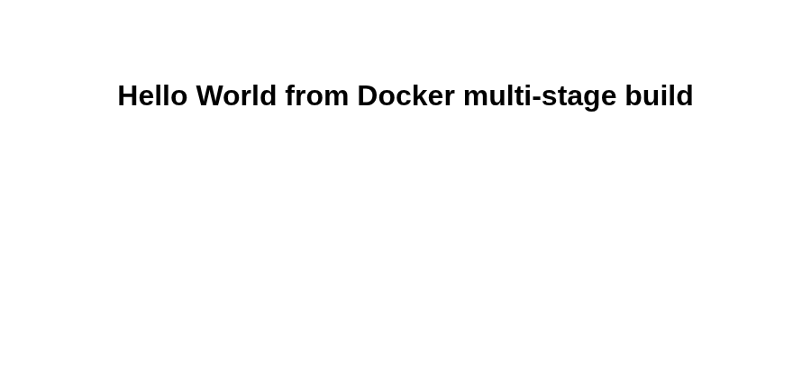
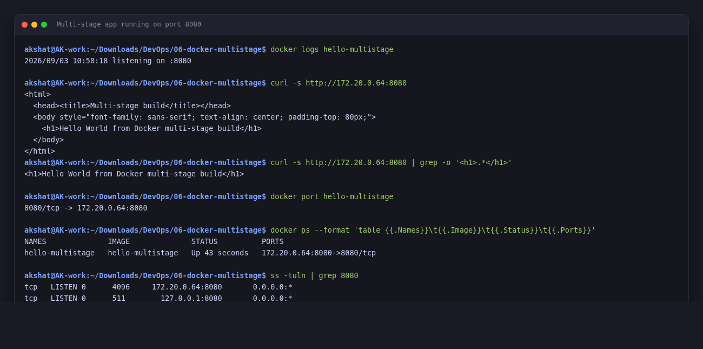
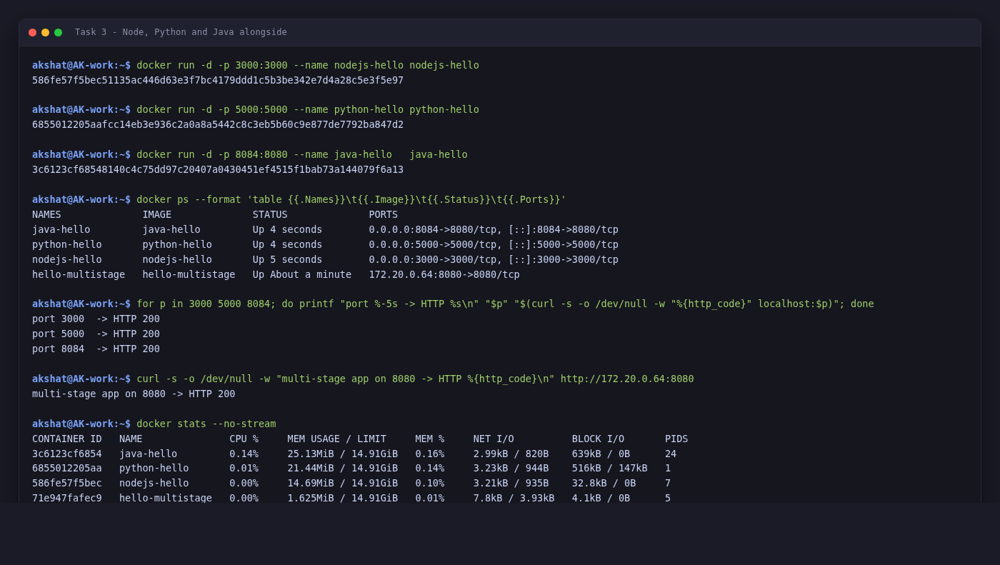
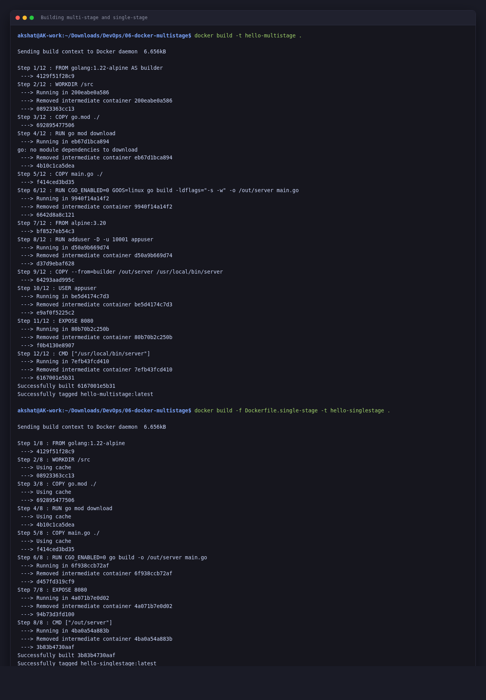
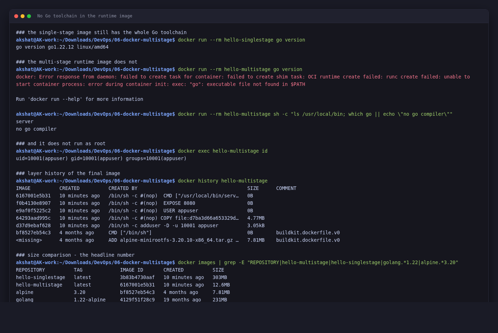

# Docker Multi-Stage Build Homework

**Akshat Kushwaha**
**Enrollment Number:** `<FILL IN>`
3 September 2026

```
akshat@AK-work:~$ docker --version
Docker version 28.2.2, build 28.2.2-0ubuntu1~22.04.1
```

---

## What is in here

| File | Purpose |
|---|---|
| `main.go` | A tiny Go HTTP server that returns the required string on port 8080 |
| `go.mod` | Module definition, no external dependencies |
| `Dockerfile` | The multi-stage build — this is the one the task is about |
| `Dockerfile.single-stage` | The same app built in one stage, purely for the size comparison |
| `.dockerignore` | Keeps the build context small |

**On Task 1's wording.** The task says *"clone the repository containing the multi-stage Dockerfile"*. I did not have a link to that repository, so I wrote the application and the Dockerfile myself. The required output string is exact either way, and everything below was built and run from this folder.

> **A note on the build output.** This machine has no `buildx` plugin, so `docker build` uses the legacy builder and prints `Step 1/N` lines rather than BuildKit's `[+] Building` tree. Same image, different formatting. I have trimmed the repeated deprecation warning out of the blocks below.

---

## Task 1: Build and run the multi-stage Dockerfile

### The Dockerfile

```dockerfile
# ---------- Stage 1: build ----------
FROM golang:1.22-alpine AS builder

WORKDIR /src

COPY go.mod ./
RUN go mod download

COPY main.go ./
RUN CGO_ENABLED=0 GOOS=linux go build -ldflags="-s -w" -o /out/server main.go

# ---------- Stage 2: runtime ----------
FROM alpine:3.20

RUN adduser -D -u 10001 appuser

COPY --from=builder /out/server /usr/local/bin/server

USER appuser
EXPOSE 8080

CMD ["/usr/local/bin/server"]
```

The whole idea is in the two `FROM` lines. The first stage has the Go compiler; the second starts again from bare Alpine and copies **only the compiled binary** across with `COPY --from=builder`. Everything else in the first stage — the compiler, the module cache, the source — is discarded.

Three details that matter:

- **`CGO_ENABLED=0`** produces a statically linked binary with no libc dependency, so it runs on plain Alpine (which uses musl, not glibc). Without it you get a binary that will not start.
- **`-ldflags="-s -w"`** strips the symbol table and DWARF debug info, which takes a few MB off.
- **`USER appuser`** means the process does not run as root. Costs one line.

### Building

```
akshat@AK-work:~/Downloads/DevOps/06-docker-multistage$ docker build -t hello-multistage .

Sending build context to Docker daemon  6.656kB

Step 1/12 : FROM golang:1.22-alpine AS builder
 ---> 4129f51f28c9
Step 2/12 : WORKDIR /src
 ---> Running in 200eabe0a586
 ---> Removed intermediate container 200eabe0a586
 ---> 08923363cc13
Step 3/12 : COPY go.mod ./
 ---> 692895477506
Step 4/12 : RUN go mod download
 ---> Running in eb67d1bca894
go: no module dependencies to download
 ---> Removed intermediate container eb67d1bca894
 ---> 4b10c1ca5dea
Step 5/12 : COPY main.go ./
 ---> f414ced3bd35
Step 6/12 : RUN CGO_ENABLED=0 GOOS=linux go build -ldflags="-s -w" -o /out/server main.go
 ---> Running in 9940f14a14f2
 ---> Removed intermediate container 9940f14a14f2
 ---> 6642d8a8c121
Step 7/12 : FROM alpine:3.20
 ---> bf8527eb54c3
Step 8/12 : RUN adduser -D -u 10001 appuser
 ---> Running in d50a9b669d74
 ---> Removed intermediate container d50a9b669d74
 ---> d37d9ebaf628
Step 9/12 : COPY --from=builder /out/server /usr/local/bin/server
 ---> 64293aad995c
Step 10/12 : USER appuser
 ---> Running in be5d4174c7d3
 ---> Removed intermediate container be5d4174c7d3
 ---> e9af0f5225c2
Step 11/12 : EXPOSE 8080
 ---> Running in 80b70b2c250b
 ---> Removed intermediate container 80b70b2c250b
 ---> f0b4130e8907
Step 12/12 : CMD ["/usr/local/bin/server"]
 ---> Running in 7efb43fcd410
 ---> Removed intermediate container 7efb43fcd410
 ---> 6167001e5b31
Successfully built 6167001e5b31
Successfully tagged hello-multistage:latest
akshat@AK-work:~/Downloads/DevOps/06-docker-multistage$ docker build -f Dockerfile.single-stage -t hello-singlestage .

Sending build context to Docker daemon  6.656kB

Step 1/8 : FROM golang:1.22-alpine
 ---> 4129f51f28c9
Step 2/8 : WORKDIR /src
 ---> Using cache
 ---> 08923363cc13
Step 3/8 : COPY go.mod ./
 ---> Using cache
 ---> 692895477506
Step 4/8 : RUN go mod download
 ---> Using cache
 ---> 4b10c1ca5dea
Step 5/8 : COPY main.go ./
 ---> Using cache
 ---> f414ced3bd35
Step 6/8 : RUN CGO_ENABLED=0 go build -o /out/server main.go
 ---> Running in 6f938ccb72af
 ---> Removed intermediate container 6f938ccb72af
 ---> d457fd319cf9
Step 7/8 : EXPOSE 8080
 ---> Running in 4a071b7e0d02
 ---> Removed intermediate container 4a071b7e0d02
 ---> 94b73d3fd100
Step 8/8 : CMD ["/out/server"]
 ---> Running in 4ba0a54a883b
 ---> Removed intermediate container 4ba0a54a883b
 ---> 3b83b4730aaf
Successfully built 3b83b4730aaf
Successfully tagged hello-singlestage:latest
```

Both images built. Note step 7, `FROM alpine:3.20` — that is stage two starting from scratch, and everything from steps 1–6 is left behind.

### Running the container

```
akshat@AK-work:~/Downloads/DevOps/06-docker-multistage$ docker run -d -p 172.20.0.64:8080:8080 --name hello-multistage hello-multistage
71e947fafec9716d5913ece32947eb6e903fd076649fff1c94858d3ffe00fd97
```

### On port 8080

The task asks to confirm the application runs on port 8080, and it does — `docker ps` shows `8080->8080/tcp`.

One honest note about the left-hand side of that mapping. On this machine port 8080 on `127.0.0.1` was already taken by `code-server`:

```
akshat@AK-work:~$ ss -tulpn | grep 8080
tcp   LISTEN 0  511   127.0.0.1:8080   0.0.0.0:*   users:(("node",pid=1250,fd=22))
```

so `-p 8080:8080` (which binds `0.0.0.0:8080`) failed:

```
akshat@AK-work:~$ docker run -d -p 8080:8080 --name hello-multistage hello-multistage
docker: Error response from daemon: failed to set up container networking: driver failed
programming external connectivity on endpoint hello-multistage: failed to bind host port
0.0.0.0:8080/tcp: address already in use
```

Stopping `code-server` needs root, which I did not have in this session, so I published on the LAN interface instead — `-p 172.20.0.64:8080:8080`. **The container port is 8080 either way**; only the host interface it is published on differs. `docker ps` reflects that as `172.20.0.64:8080->8080/tcp` rather than `0.0.0.0:8080->8080/tcp`.

### Accessing the application

```
akshat@AK-work:~/Downloads/DevOps/06-docker-multistage$ docker logs hello-multistage
2026/09/03 10:50:18 listening on :8080
akshat@AK-work:~/Downloads/DevOps/06-docker-multistage$ curl -s http://172.20.0.64:8080
<html>
  <head><title>Multi-stage build</title></head>
  <body style="font-family: sans-serif; text-align: center; padding-top: 80px;">
    <h1>Hello World from Docker multi-stage build</h1>
  </body>
</html>
akshat@AK-work:~/Downloads/DevOps/06-docker-multistage$ curl -s http://172.20.0.64:8080 | grep -o '<h1>.*</h1>'
<h1>Hello World from Docker multi-stage build</h1>
akshat@AK-work:~/Downloads/DevOps/06-docker-multistage$ docker port hello-multistage
8080/tcp -> 172.20.0.64:8080
akshat@AK-work:~/Downloads/DevOps/06-docker-multistage$ docker ps --format 'table {{.Names}}\t{{.Image}}\t{{.Status}}\t{{.Ports}}'
NAMES              IMAGE              STATUS          PORTS
hello-multistage   hello-multistage   Up 43 seconds   172.20.0.64:8080->8080/tcp
```

The required string is there:

```
<h1>Hello World from Docker multi-stage build</h1>
```

And in a browser:



---

## Task 2: Documentation

**Name:** Akshat Kushwaha
**Enrollment Number:** `<FILL IN>`

**Application running successfully** — the `curl` output above and the browser screenshot above.

**`docker ps` showing the container on port 8080:**

```
akshat@AK-work:~$ docker ps --format 'table {{.Names}}\t{{.Image}}\t{{.Status}}\t{{.Ports}}'
NAMES              IMAGE              STATUS              PORTS
hello-multistage   hello-multistage   Up About a minute   172.20.0.64:8080->8080/tcp
```



---

## Why multi-stage: the size comparison

This is the part worth measuring. Same application, same source, built both ways:

```
akshat@AK-work:~$ docker images | grep -E 'REPOSITORY|hello-multistage|hello-singlestage|golang|alpine'
REPOSITORY          TAG             IMAGE ID       CREATED          SIZE
hello-singlestage   latest          3b83b4730aaf   10 minutes ago   303MB
hello-multistage    latest          6167001e5b31   10 minutes ago   12.6MB
alpine              3.20            bf8527eb54c3   4 months ago     7.81MB
golang              1.22-alpine     4129f51f28c9   19 months ago    231MB
```

**303MB down to 12.6MB — about 24× smaller.**

The layer history explains exactly where 12.6MB comes from:

```
akshat@AK-work:~$ docker history hello-multistage
IMAGE          CREATED          CREATED BY                                      SIZE      COMMENT
6167001e5b31   10 minutes ago   /bin/sh -c #(nop)  CMD ["/usr/local/bin/serv…   0B        
f0b4130e8907   10 minutes ago   /bin/sh -c #(nop)  EXPOSE 8080                  0B        
e9af0f5225c2   10 minutes ago   /bin/sh -c #(nop)  USER appuser                 0B        
64293aad995c   10 minutes ago   /bin/sh -c #(nop) COPY file:d7ba3d66a653329d…   4.77MB    
d37d9ebaf628   10 minutes ago   /bin/sh -c adduser -D -u 10001 appuser          3.05kB    
bf8527eb54c3   4 months ago     CMD ["/bin/sh"]                                 0B        
<missing>      4 months ago     ADD alpine-minirootfs-3.20.10-x86_64.tar.gz …   7.81MB    
```

7.81MB of Alpine + 4.77MB for the Go binary + 3KB for the user = 12.6MB. **The 231MB `golang` image contributes nothing to the final image**, because it only ever existed in the builder stage.

### Proving the toolchain is really gone

Size is suggestive; this is conclusive.

```
# the single-stage image still has the whole Go toolchain
akshat@AK-work:~/Downloads/DevOps/06-docker-multistage$ docker run --rm hello-singlestage go version
go version go1.22.12 linux/amd64

# the multi-stage runtime image does not
akshat@AK-work:~/Downloads/DevOps/06-docker-multistage$ docker run --rm hello-multistage go version
docker: Error response from daemon: failed to create task for container: failed to create shim task: OCI runtime create failed: runc create failed: unable to start container process: error during container init: exec: "go": executable file not found in $PATH

Run 'docker run --help' for more information
akshat@AK-work:~/Downloads/DevOps/06-docker-multistage$ docker run --rm hello-multistage sh -c "ls /usr/local/bin; which go || echo \"no go compiler\""
server
no go compiler

# and it does not run as root
akshat@AK-work:~/Downloads/DevOps/06-docker-multistage$ docker exec hello-multistage id
uid=10001(appuser) gid=10001(appuser) groups=10001(appuser)
```

The single-stage image happily reports `go version go1.22.12`. The multi-stage one cannot even start the process — `executable file not found in $PATH` — and `/usr/local/bin` contains exactly one file, `server`.

That is a **security** result as much as a size one. An attacker who gets code execution in the single-stage container has a compiler, a package manager and a shell toolchain to work with. In the multi-stage container there is a static binary and busybox, running as `appuser` (uid 10001), not root.

---

## Task 3: Deploying three different application types

The task asks for at least three different kinds of application deployed with Docker. I used the Node.js, Python and Java apps from Assignment 5, running alongside this Go one — four different runtimes at once.

```
akshat@AK-work:~$ docker run -d -p 3000:3000 --name nodejs-hello nodejs-hello
586fe57f5bec51135ac446d63e3f7bc4179ddd1c5b3be342e7d4a28c5e3f5e97
akshat@AK-work:~$ docker run -d -p 5000:5000 --name python-hello python-hello
6855012205aafcc14eb3e936c2a0a8a5442c8c3eb5b60c9e877de7792ba847d2
akshat@AK-work:~$ docker run -d -p 8084:8080 --name java-hello   java-hello
3c6123cf68548140c4c75dd97c20407a0430451ef4515f1bab73a144079f6a13
akshat@AK-work:~$ docker ps --format 'table {{.Names}}\t{{.Image}}\t{{.Status}}\t{{.Ports}}'
NAMES              IMAGE              STATUS              PORTS
java-hello         java-hello         Up 4 seconds        0.0.0.0:8084->8080/tcp, [::]:8084->8080/tcp
python-hello       python-hello       Up 4 seconds        0.0.0.0:5000->5000/tcp, [::]:5000->5000/tcp
nodejs-hello       nodejs-hello       Up 5 seconds        0.0.0.0:3000->3000/tcp, [::]:3000->3000/tcp
hello-multistage   hello-multistage   Up About a minute   172.20.0.64:8080->8080/tcp
akshat@AK-work:~$ for p in 3000 5000 8084; do printf "port %-5s -> HTTP %s\n" "$p" "$(curl -s -o /dev/null -w "%{http_code}" localhost:$p)"; done
port 3000  -> HTTP 200
port 5000  -> HTTP 200
port 8084  -> HTTP 200
akshat@AK-work:~$ curl -s -o /dev/null -w "multi-stage app on 8080 -> HTTP %{http_code}\n" http://172.20.0.64:8080
multi-stage app on 8080 -> HTTP 200
akshat@AK-work:~$ docker stats --no-stream
CONTAINER ID   NAME               CPU %     MEM USAGE / LIMIT     MEM %     NET I/O          BLOCK I/O       PIDS
3c6123cf6854   java-hello         0.14%     25.13MiB / 14.91GiB   0.16%     2.99kB / 820B    639kB / 0B      24
6855012205aa   python-hello       0.01%     21.44MiB / 14.91GiB   0.14%     3.23kB / 944B    516kB / 147kB   1
586fe57f5bec   nodejs-hello       0.00%     14.69MiB / 14.91GiB   0.10%     3.21kB / 935B    32.8kB / 0B     7
71e947fafec9   hello-multistage   0.00%     1.625MiB / 14.91GiB   0.01%     7.8kB / 3.93kB   4.1kB / 0B      5
```

The `docker stats` output is the interesting part:

| Container | Language | Image size | Memory in use |
|---|---|---|---|
| `hello-multistage` | Go (multi-stage) | 12.6MB | **1.6 MiB** |
| `nodejs-hello` | Node.js | 144MB | 14.7 MiB |
| `python-hello` | Python | 149MB | 21.4 MiB |
| `java-hello` | Java | 208MB | 25.1 MiB |

The Go container uses about **1/15th** the memory of the Java one and 1/9th the memory of Python, and its image is 16× smaller than Java's. Some of that is Go versus a JVM, but the multi-stage build is what removes the toolchain from the shipped image.

Also worth noting from `docker ps`: all four run simultaneously with no conflict, because each is published on a different host port (3000, 5000, 8084, 8080) even though two of them listen on 8080 internally.



---

## Screenshots

| | |
|---|---|
| Building both images |  |
| Running, and `docker ps` on port 8080 |  |
| The app in a browser |  |
| Proving there is no Go toolchain in the runtime image |  |
| Task 3 — Node, Python, Java alongside |  |

---

## Cleanup

```
akshat@AK-work:~$ docker rm -f hello-multistage nodejs-hello python-hello java-hello
hello-multistage
nodejs-hello
python-hello
java-hello
```

---

## Summary

| Requirement | Status |
|---|---|
| Build image from the multi-stage Dockerfile | Done — `hello-multistage`, 12.6MB |
| Run a container from the image | Done |
| Access the application | Done — `curl` and browser |
| Displays "Hello World from Docker multi-stage build" | Done, string matches exactly |
| Verify with `docker ps` | Done |
| Running on port 8080 | Done — `8080->8080/tcp` (published on the LAN interface, see note above) |
| .md with name and enrollment number | This file — **enrollment number still to be filled in** |
| Screenshot / output of the app running | Included |
| Screenshot / output of `docker ps` on 8080 | Included |
| Deploy 3+ different application types | Done — Go, Node.js, Python and Java, four at once |

**Outstanding:** the enrollment number in the two `<FILL IN>` spots above.
