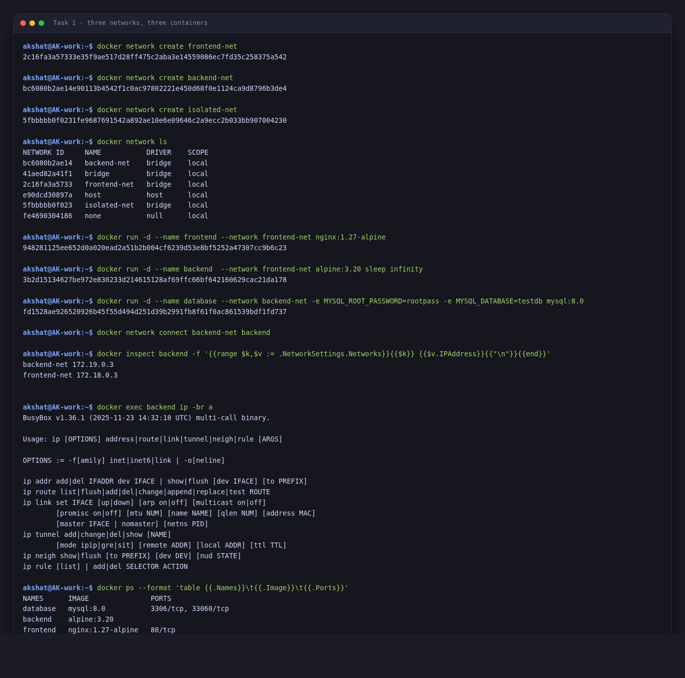
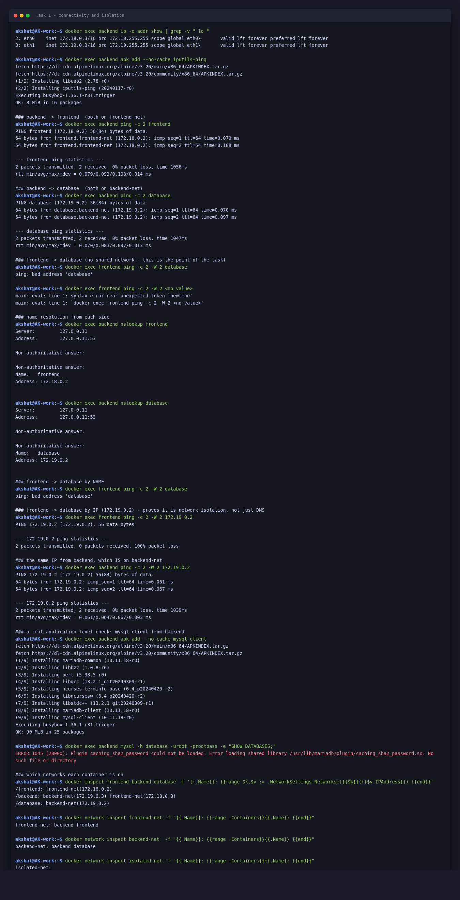
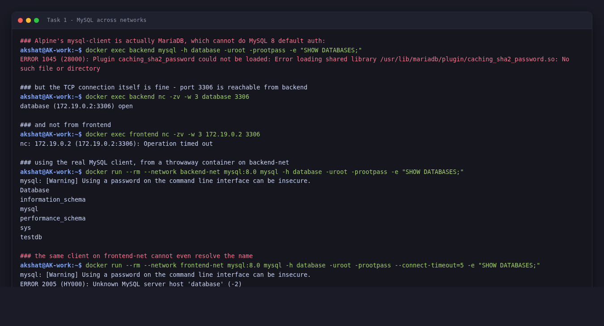
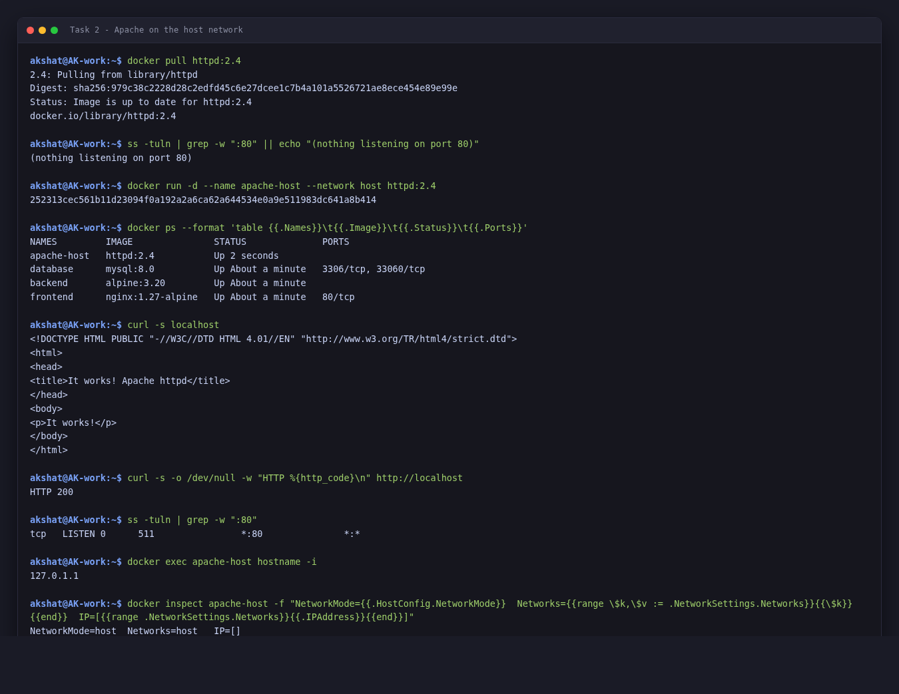
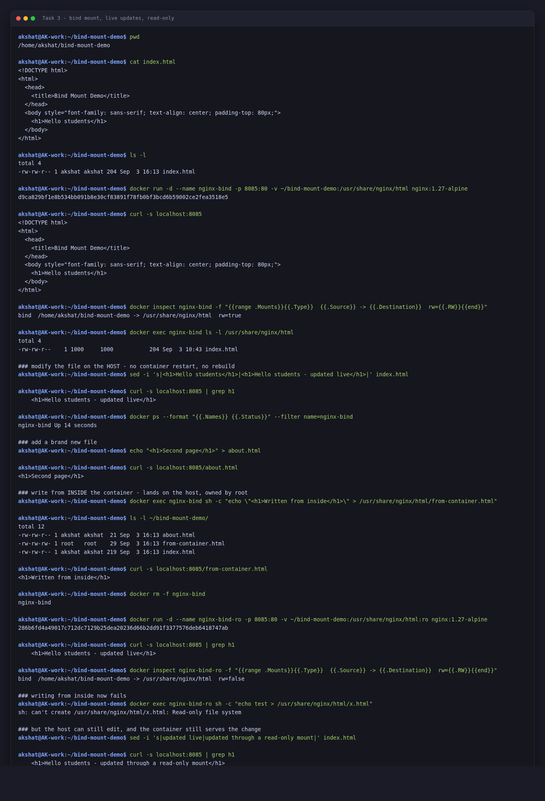

# Docker Networking & Volume Homework

**Akshat Kushwaha**
3 September 2026

```
akshat@AK-work:~$ docker --version
Docker version 28.2.2, build 28.2.2-0ubuntu1~22.04.1
```

Tasks 1–3 were all run on this machine and the output below is what they printed. Task 4 is research, since it needs a multi-host Swarm cluster I do not have.

---

## Task 1: Container networking

Three containers — frontend, backend, database — across three user-defined networks, with the backend deliberately attached to two of them.

### The plan

| Network | Members |
|---|---|
| `frontend-net` | frontend, backend |
| `backend-net` | backend, database |
| `isolated-net` | nobody — created to show an empty network |

The shape is deliberate: **backend is the only container on two networks**, so it is the only one that can reach both the frontend and the database. The frontend and the database share no network at all, which is the isolation the task is asking you to demonstrate.

### Creating the networks and starting the containers

```
akshat@AK-work:~$ docker network create frontend-net
2c16fa3a57333e35f9ae517d28ff475c2aba3e14559086ec7fd35c258375a542

akshat@AK-work:~$ docker network create backend-net
bc6080b2ae14e90113b4542f1c0ac97802221e450d68f0e1124ca9d8796b3de4

akshat@AK-work:~$ docker network create isolated-net
5fbbbbb0f0231fe9687691542a892ae10e6e09646c2a9ecc2b033bb907004230

akshat@AK-work:~$ docker network ls
NETWORK ID     NAME           DRIVER    SCOPE
bc6080b2ae14   backend-net    bridge    local
41aed82a41f1   bridge         bridge    local
2c16fa3a5733   frontend-net   bridge    local
e90dcd30897a   host           host      local
5fbbbbb0f023   isolated-net   bridge    local
fe4690304186   none           null      local

akshat@AK-work:~$ docker run -d --name frontend --network frontend-net nginx:1.27-alpine
948281125ee652d0a020ead2a51b2b004cf6239d53e8bf5252a47307cc9b6c23

akshat@AK-work:~$ docker run -d --name backend  --network frontend-net alpine:3.20 sleep infinity
3b2d15134627be972e830233d214615128af69ffc66bf642160629cac21da178

akshat@AK-work:~$ docker run -d --name database --network backend-net -e MYSQL_ROOT_PASSWORD=rootpass -e MYSQL_DATABASE=testdb mysql:8.0
fd1528ae926520926b45f55d494d251d39b2991fb8f61f0ac861539bdf1fd737

akshat@AK-work:~$ docker network connect backend-net backend

akshat@AK-work:~$ docker inspect backend -f '{{range $k,$v := .NetworkSettings.Networks}}{{$k}} {{$v.IPAddress}}{{"\n"}}{{end}}'
backend-net 172.19.0.3
frontend-net 172.18.0.3

akshat@AK-work:~$ docker exec backend ip -br a
BusyBox v1.36.1 (2025-11-23 14:32:18 UTC) multi-call binary.

Usage: ip [OPTIONS] address|route|link|tunnel|neigh|rule [ARGS]

OPTIONS := -f[amily] inet|inet6|link | -o[neline]

ip addr add|del IFADDR dev IFACE | show|flush [dev IFACE] [to PREFIX]
ip route list|flush|add|del|change|append|replace|test ROUTE
ip link set IFACE [up|down] [arp on|off] [multicast on|off]
	[promisc on|off] [mtu NUM] [name NAME] [qlen NUM] [address MAC]
	[master IFACE | nomaster] [netns PID]
ip tunnel add|change|del|show [NAME]
	[mode ipip|gre|sit] [remote ADDR] [local ADDR] [ttl TTL]
ip neigh show|flush [to PREFIX] [dev DEV] [nud STATE]
ip rule [list] | add|del SELECTOR ACTION

akshat@AK-work:~$ docker ps --format 'table {{.Names}}\t{{.Image}}\t{{.Ports}}'
NAMES      IMAGE               PORTS
database   mysql:8.0           3306/tcp, 33060/tcp
backend    alpine:3.20         
frontend   nginx:1.27-alpine   80/tcp
```

Three things worth reading out of that:

- `docker network ls` shows my three alongside the three Docker always has — `bridge` (the default for `docker run` with no `--network`), `host`, and `none`.
- Each user-defined network got its own subnet: `frontend-net` is 172.18.0.0/16, `backend-net` is 172.19.0.0/16.
- After `docker network connect`, `backend` has **two IPs** — `172.19.0.3` on backend-net and `172.18.0.3` on frontend-net. That is the whole point of the task in one line of output.

`docker exec backend ip -br a` failed, which is a small real-world lesson: `alpine:3.20` ships busybox `ip`, and busybox does not implement the `-br` (brief) flag. `ip -o addr show` works instead:

```
akshat@AK-work:~$ docker exec backend ip -o addr show | grep -v " lo "
2: eth0    inet 172.18.0.3/16 brd 172.18.255.255 scope global eth0\       valid_lft forever preferred_lft forever
3: eth1    inet 172.19.0.3/16 brd 172.19.255.255 scope global eth1\       valid_lft forever preferred_lft forever
```

Two interfaces, `eth0` and `eth1`, one per network. Docker gave the container a second virtual NIC when I connected it to the second network.

### Connectivity tests

`alpine` has no `ping` by default, so that goes in first.

```
akshat@AK-work:~$ docker exec backend ip -o addr show | grep -v " lo "
2: eth0    inet 172.18.0.3/16 brd 172.18.255.255 scope global eth0\       valid_lft forever preferred_lft forever
3: eth1    inet 172.19.0.3/16 brd 172.19.255.255 scope global eth1\       valid_lft forever preferred_lft forever

akshat@AK-work:~$ docker exec backend apk add --no-cache iputils-ping
fetch https://dl-cdn.alpinelinux.org/alpine/v3.20/main/x86_64/APKINDEX.tar.gz
fetch https://dl-cdn.alpinelinux.org/alpine/v3.20/community/x86_64/APKINDEX.tar.gz
(1/2) Installing libcap2 (2.78-r0)
(2/2) Installing iputils-ping (20240117-r0)
Executing busybox-1.36.1-r31.trigger
OK: 8 MiB in 16 packages

# backend -> frontend  (both on frontend-net)
akshat@AK-work:~$ docker exec backend ping -c 2 frontend
PING frontend (172.18.0.2) 56(84) bytes of data.
64 bytes from frontend.frontend-net (172.18.0.2): icmp_seq=1 ttl=64 time=0.079 ms
64 bytes from frontend.frontend-net (172.18.0.2): icmp_seq=2 ttl=64 time=0.108 ms

--- frontend ping statistics ---
2 packets transmitted, 2 received, 0% packet loss, time 1056ms
rtt min/avg/max/mdev = 0.079/0.093/0.108/0.014 ms

# backend -> database  (both on backend-net)
akshat@AK-work:~$ docker exec backend ping -c 2 database
PING database (172.19.0.2) 56(84) bytes of data.
64 bytes from database.backend-net (172.19.0.2): icmp_seq=1 ttl=64 time=0.070 ms
64 bytes from database.backend-net (172.19.0.2): icmp_seq=2 ttl=64 time=0.097 ms

--- database ping statistics ---
2 packets transmitted, 2 received, 0% packet loss, time 1047ms
rtt min/avg/max/mdev = 0.070/0.083/0.097/0.013 ms

# frontend -> database (no shared network - this is the point of the task)
akshat@AK-work:~$ docker exec frontend ping -c 2 -W 2 database
ping: bad address 'database'

akshat@AK-work:~$ docker exec frontend ping -c 2 -W 2 <no value>
main: eval: line 1: syntax error near unexpected token `newline'
main: eval: line 1: `docker exec frontend ping -c 2 -W 2 <no value>'

# name resolution from each side
akshat@AK-work:~$ docker exec backend nslookup frontend
Server:		127.0.0.11
Address:	127.0.0.11:53

Non-authoritative answer:

Non-authoritative answer:
Name:	frontend
Address: 172.18.0.2

akshat@AK-work:~$ docker exec backend nslookup database
Server:		127.0.0.11
Address:	127.0.0.11:53

Non-authoritative answer:

Non-authoritative answer:
Name:	database
Address: 172.19.0.2
```

And the isolation half:

```
# frontend -> database by NAME
akshat@AK-work:~$ docker exec frontend ping -c 2 -W 2 database
ping: bad address 'database'

# frontend -> database by IP (172.19.0.2) - proves it is network isolation, not just DNS
akshat@AK-work:~$ docker exec frontend ping -c 2 -W 2 172.19.0.2
PING 172.19.0.2 (172.19.0.2): 56 data bytes

--- 172.19.0.2 ping statistics ---
2 packets transmitted, 0 packets received, 100% packet loss

# the same IP from backend, which IS on backend-net
akshat@AK-work:~$ docker exec backend ping -c 2 -W 2 172.19.0.2
PING 172.19.0.2 (172.19.0.2) 56(84) bytes of data.
64 bytes from 172.19.0.2: icmp_seq=1 ttl=64 time=0.061 ms
64 bytes from 172.19.0.2: icmp_seq=2 ttl=64 time=0.067 ms

--- 172.19.0.2 ping statistics ---
2 packets transmitted, 2 received, 0% packet loss, time 1039ms
rtt min/avg/max/mdev = 0.061/0.064/0.067/0.003 ms

# a real application-level check: mysql client from backend
akshat@AK-work:~$ docker exec backend apk add --no-cache mysql-client
fetch https://dl-cdn.alpinelinux.org/alpine/v3.20/main/x86_64/APKINDEX.tar.gz
fetch https://dl-cdn.alpinelinux.org/alpine/v3.20/community/x86_64/APKINDEX.tar.gz
(1/9) Installing mariadb-common (10.11.18-r0)
(2/9) Installing libbz2 (1.0.8-r6)
(3/9) Installing perl (5.38.5-r0)
(4/9) Installing libgcc (13.2.1_git20240309-r1)
(5/9) Installing ncurses-terminfo-base (6.4_p20240420-r2)
(6/9) Installing libncursesw (6.4_p20240420-r2)
(7/9) Installing libstdc++ (13.2.1_git20240309-r1)
(8/9) Installing mariadb-client (10.11.18-r0)
(9/9) Installing mysql-client (10.11.18-r0)
Executing busybox-1.36.1-r31.trigger
OK: 90 MiB in 25 packages

akshat@AK-work:~$ docker exec backend mysql -h database -uroot -prootpass -e "SHOW DATABASES;"
ERROR 1045 (28000): Plugin caching_sha2_password could not be loaded: Error loading shared library /usr/lib/mariadb/plugin/caching_sha2_password.so: No such file or directory

# which networks each container is on
akshat@AK-work:~$ docker inspect frontend backend database -f '{{.Name}}: {{range $k,$v := .NetworkSettings.Networks}}{{$k}}({{$v.IPAddress}}) {{end}}'
/frontend: frontend-net(172.18.0.2) 
/backend: backend-net(172.19.0.3) frontend-net(172.18.0.3) 
/database: backend-net(172.19.0.2) 

akshat@AK-work:~$ docker network inspect frontend-net -f "{{.Name}}: {{range .Containers}}{{.Name}} {{end}}"
frontend-net: backend frontend 

akshat@AK-work:~$ docker network inspect backend-net  -f "{{.Name}}: {{range .Containers}}{{.Name}} {{end}}"
backend-net: backend database 

akshat@AK-work:~$ docker network inspect isolated-net -f "{{.Name}}: {{range .Containers}}{{.Name}} {{end}}"
isolated-net:
```

**This is the key result.** Three separate checks:

1. `docker exec frontend ping database` → `ping: bad address 'database'`. The name does not even resolve. Docker's embedded DNS at `127.0.0.11` only answers for containers that share a network with the asker.
2. `docker exec frontend ping 172.19.0.2` → **100% packet loss**. Going straight to the IP and bypassing DNS entirely still fails. So this is genuine network isolation, not just a naming problem — that mattered to check, because "name not found" on its own would not have proved anything.
3. The same IP from `backend` → replies in 0.06ms. Same address, different container, different answer, purely because backend is attached to `backend-net`.

### Talking to MySQL across the networks

Pinging proves reachability; connecting to the database proves it is actually usable.

```
# Alpine's mysql-client is actually MariaDB, which cannot do MySQL 8 default auth:
akshat@AK-work:~$ docker exec backend mysql -h database -uroot -prootpass -e "SHOW DATABASES;"
ERROR 1045 (28000): Plugin caching_sha2_password could not be loaded: Error loading shared library /usr/lib/mariadb/plugin/caching_sha2_password.so: No such file or directory

# but the TCP connection itself is fine - port 3306 is reachable from backend
akshat@AK-work:~$ docker exec backend nc -zv -w 3 database 3306
database (172.19.0.2:3306) open

# and not from frontend
akshat@AK-work:~$ docker exec frontend nc -zv -w 3 172.19.0.2 3306
nc: 172.19.0.2 (172.19.0.2:3306): Operation timed out

# using the real MySQL client, from a throwaway container on backend-net
akshat@AK-work:~$ docker run --rm --network backend-net mysql:8.0 mysql -h database -uroot -prootpass -e "SHOW DATABASES;"
mysql: [Warning] Using a password on the command line interface can be insecure.
Database
information_schema
mysql
performance_schema
sys
testdb

# the same client on frontend-net cannot even resolve the name
akshat@AK-work:~$ docker run --rm --network frontend-net mysql:8.0 mysql -h database -uroot -prootpass --connect-timeout=5 -e "SHOW DATABASES;"
mysql: [Warning] Using a password on the command line interface can be insecure.
ERROR 2005 (HY000): Unknown MySQL server host 'database' (-2)
```

Three findings there:

- **Alpine's `mysql-client` package is really MariaDB's client**, and it cannot handle MySQL 8's default `caching_sha2_password` authentication. The error looks like a connection failure but is not one — it is an auth-plugin problem *after* connecting.
- `nc -zv database 3306` from backend returns `open`, confirming the TCP path is fine. From frontend the same probe to the IP times out.
- Using the real client (a throwaway `mysql:8.0` container attached to `backend-net`) works and lists the databases, including the `testdb` created by `MYSQL_DATABASE`. The same command on `frontend-net` cannot resolve the host at all.

### Results table

| From | To | By name | By IP | Why |
|---|---|---|---|---|
| backend | frontend | works | works | both on `frontend-net` |
| backend | database | works | works | both on `backend-net` |
| frontend | database | `bad address` | 100% loss | no shared network |
| frontend | backend | works | works | both on `frontend-net` |

### What I understood

**User-defined networks give you DNS; the default bridge does not.** On `frontend-net` I could say `ping frontend` and it resolved. That only works on user-defined networks — the legacy default `bridge` network needs `--link` or raw IPs.

**A container gets one virtual NIC per network.** `eth0` and `eth1` on backend, with an address from each subnet. Attaching to a network is literally giving the container another interface.

**Isolation is enforced at the network layer, not the DNS layer.** Proved by going to the IP directly and still timing out. If it were only DNS, hard-coding an IP would be a trivial way around it, and it is not.

**This is the standard way to structure an application.** A database that the public-facing tier physically cannot reach is a real security property, and it costs one extra `docker network create`.

### Cleanup

Done at the end, after Tasks 2 and 3.

---

## Task 2: Host network

```
akshat@AK-work:~$ docker pull httpd:2.4
2.4: Pulling from library/httpd
Digest: sha256:979c38c2228d28c2edfd45c6e27dcee1c7b4a101a5526721ae8ece454e89e99e
Status: Image is up to date for httpd:2.4
docker.io/library/httpd:2.4

akshat@AK-work:~$ ss -tuln | grep -w ":80" || echo "(nothing listening on port 80)"
(nothing listening on port 80)

akshat@AK-work:~$ docker run -d --name apache-host --network host httpd:2.4
252313cec561b11d23094f0a192a2a6ca62a644534e0a9e511983dc641a8b414

akshat@AK-work:~$ docker ps --format 'table {{.Names}}\t{{.Image}}\t{{.Status}}\t{{.Ports}}'
NAMES         IMAGE               STATUS              PORTS
apache-host   httpd:2.4           Up 2 seconds        
database      mysql:8.0           Up About a minute   3306/tcp, 33060/tcp
backend       alpine:3.20         Up About a minute   
frontend      nginx:1.27-alpine   Up About a minute   80/tcp

akshat@AK-work:~$ curl -s localhost
<!DOCTYPE HTML PUBLIC "-//W3C//DTD HTML 4.01//EN" "http://www.w3.org/TR/html4/strict.dtd">
<html>
<head>
<title>It works! Apache httpd</title>
</head>
<body>
<p>It works!</p>
</body>
</html>

akshat@AK-work:~$ curl -s -o /dev/null -w "HTTP %{http_code}\n" http://localhost
HTTP 200

akshat@AK-work:~$ ss -tuln | grep -w ":80"
tcp   LISTEN 0      511                *:80               *:*          

akshat@AK-work:~$ docker exec apache-host hostname -i
127.0.1.1

akshat@AK-work:~$ docker inspect apache-host -f "NetworkMode={{.HostConfig.NetworkMode}}  Networks={{range \$k,\$v := .NetworkSettings.Networks}}{{\$k}} {{end}}  IP=[{{range .NetworkSettings.Networks}}{{.IPAddress}}{{end}}]"
NetworkMode=host  Networks=host   IP=[]
```

### What I understood

**The `PORTS` column is empty** for `apache-host`, while `frontend` in the same listing shows `80/tcp`. There is no port mapping because there is nothing to map — the container is using the host's network stack directly. That empty column is the proof the task is asking for.

**I never passed `-p`.** `curl localhost` returns Apache's "It works!" page anyway, on port 80.

**`ss` shows the listener as `*:80`.** With a normal `-p 80:80` bridge mapping you would see a `docker-proxy` process holding the port. Here httpd itself is bound to the host's port 80 — one less hop.

**`docker exec apache-host hostname -i` returns `127.0.1.1`**, which is the *host's* own entry in `/etc/hosts`, not a container IP. And `docker inspect` confirms it:

```
NetworkMode=host  Networks=host   IP=[]
```

An empty IP field. The container has no address of its own because it is not on a container network at all.

**The trade-off:** no isolation and no port remapping. Two containers that both want port 80 cannot both use `--network host`. It is for when you need the performance of no NAT, or a service that needs to see real client IPs, or something doing network discovery that breaks behind NAT.

**One practical note:** I had to check port 80 was free first (`ss -tuln | grep :80`). With `--network host` there is no port translation to save you — if something already holds the port, Apache simply fails to bind and the container exits.


---

## Task 3: Bind mount

### Setting up the folder and mounting it

```
akshat@AK-work:~/bind-mount-demo$ pwd
/home/akshat/bind-mount-demo

akshat@AK-work:~/bind-mount-demo$ cat index.html
<!DOCTYPE html>
<html>
  <head>
    <title>Bind Mount Demo</title>
  </head>
  <body style="font-family: sans-serif; text-align: center; padding-top: 80px;">
    <h1>Hello students</h1>
  </body>
</html>

akshat@AK-work:~/bind-mount-demo$ ls -l
total 4
-rw-rw-r-- 1 akshat akshat 204 Sep  3 16:13 index.html

akshat@AK-work:~/bind-mount-demo$ docker run -d --name nginx-bind -p 8085:80 -v ~/bind-mount-demo:/usr/share/nginx/html nginx:1.27-alpine
d9ca829bf1e8b534bb091b8e30cf83891f78fb0bf3bcd6b59002ce2fea3518e5

akshat@AK-work:~/bind-mount-demo$ curl -s localhost:8085
<!DOCTYPE html>
<html>
  <head>
    <title>Bind Mount Demo</title>
  </head>
  <body style="font-family: sans-serif; text-align: center; padding-top: 80px;">
    <h1>Hello students</h1>
  </body>
</html>

akshat@AK-work:~/bind-mount-demo$ docker inspect nginx-bind -f "{{range .Mounts}}{{.Type}}  {{.Source}} -> {{.Destination}}  rw={{.RW}}{{end}}"
bind  /home/akshat/bind-mount-demo -> /usr/share/nginx/html  rw=true

akshat@AK-work:~/bind-mount-demo$ docker exec nginx-bind ls -l /usr/share/nginx/html
total 4
-rw-rw-r--    1 1000     1000           204 Sep  3 10:43 index.html
```

`docker inspect` confirms the mount is a `bind` (not a named volume), the host path, the container path, and `rw=true`.

The file listing *inside* the container shows `1000 1000` as the owner rather than a name — the container has no `/etc/passwd` entry for UID 1000, so it shows the raw number. Same file, same inode, just a different view of it.

Serving my `index.html`, not nginx's default page:


### Modifying the file without restarting

This is the part the task is really about.

```
# modify the file on the HOST - no container restart, no rebuild
akshat@AK-work:~/bind-mount-demo$ sed -i 's|<h1>Hello students</h1>|<h1>Hello students - updated live</h1>|' index.html

akshat@AK-work:~/bind-mount-demo$ curl -s localhost:8085 | grep h1
    <h1>Hello students - updated live</h1>

akshat@AK-work:~/bind-mount-demo$ docker ps --format "{{.Names}} {{.Status}}" --filter name=nginx-bind
nginx-bind Up 14 seconds

# add a brand new file
akshat@AK-work:~/bind-mount-demo$ echo "<h1>Second page</h1>" > about.html

akshat@AK-work:~/bind-mount-demo$ curl -s localhost:8085/about.html
<h1>Second page</h1>

# write from INSIDE the container - lands on the host, owned by root
akshat@AK-work:~/bind-mount-demo$ docker exec nginx-bind sh -c "echo \"<h1>Written from inside</h1>\" > /usr/share/nginx/html/from-container.html"

akshat@AK-work:~/bind-mount-demo$ ls -l ~/bind-mount-demo/
total 12
-rw-rw-r-- 1 akshat akshat  21 Sep  3 16:13 about.html
-rw-rw-rw- 1 root   root    29 Sep  3 16:13 from-container.html
-rw-rw-r-- 1 akshat akshat 219 Sep  3 16:13 index.html

akshat@AK-work:~/bind-mount-demo$ curl -s localhost:8085/from-container.html
<h1>Written from inside</h1>
```

**The container was never restarted.** `docker ps` in the middle of that says `Up 14 seconds` — the same container, still running, now serving different content. There was no rebuild, no `docker restart`, no `docker cp`.


Two further things I tried:

**A brand new file appeared immediately.** `about.html` was created on the host after the container started and was served straight away at `/about.html`. The mount is a live view of the directory, not a copy taken at startup.

**Writing from inside the container lands on the host — owned by root.**

```
-rw-rw-r-- 1 akshat akshat  21 Sep  3 16:13 about.html
-rw-rw-rw- 1 root   root    29 Sep  3 16:13 from-container.html
-rw-rw-r-- 1 akshat akshat 219 Sep  3 16:13 index.html
```

`from-container.html` is owned by `root` on my own machine, because nginx runs as root inside the container and the bind mount does no UID translation. **This is the classic bind-mount trap** — a container writing into a mounted directory can leave files your normal user cannot edit or delete. It is the reason bind mounts are a development convenience rather than a production pattern.

### The read-only variant

Appending `:ro` fixes exactly that problem.

```
akshat@AK-work:~/bind-mount-demo$ docker rm -f nginx-bind
nginx-bind

akshat@AK-work:~/bind-mount-demo$ docker run -d --name nginx-bind-ro -p 8085:80 -v ~/bind-mount-demo:/usr/share/nginx/html:ro nginx:1.27-alpine
286b6fd4a49017c712dc7129b25dea20236d66b2dd91f3377576deb6418747ab

akshat@AK-work:~/bind-mount-demo$ curl -s localhost:8085 | grep h1
    <h1>Hello students - updated live</h1>

akshat@AK-work:~/bind-mount-demo$ docker inspect nginx-bind-ro -f "{{range .Mounts}}{{.Type}}  {{.Source}} -> {{.Destination}}  rw={{.RW}}{{end}}"
bind  /home/akshat/bind-mount-demo -> /usr/share/nginx/html  rw=false

# writing from inside now fails
akshat@AK-work:~/bind-mount-demo$ docker exec nginx-bind-ro sh -c "echo test > /usr/share/nginx/html/x.html"
sh: can't create /usr/share/nginx/html/x.html: Read-only file system

# but the host can still edit, and the container still serves the change
akshat@AK-work:~/bind-mount-demo$ sed -i 's|updated live|updated through a read-only mount|' index.html

akshat@AK-work:~/bind-mount-demo$ curl -s localhost:8085 | grep h1
    <h1>Hello students - updated through a read-only mount</h1>
```

`rw=false` in the inspect output, and the write from inside fails with `Read-only file system`. But **edits from the host still show up immediately** — read-only restricts the *container*, not you. That is usually what you want when mounting config or static assets: the app can read them, and it cannot scribble on them.

---

## Task 4: Overlay networks (research)

No swarm cluster to test on, so this is written up from the documentation and reading rather than from commands I ran.

### What it is

Every network in Tasks 1-3 was a `bridge`, which only works **on one host**. Containers on machine A cannot reach containers on machine B through a bridge network.

An **overlay** network spans multiple Docker hosts. Containers on different physical machines get addresses on the same logical network and talk to each other by name, as if they were side by side.

### How it works

It is a VXLAN tunnel. When a container on host A sends a packet to a container on host B:

1. The packet is produced normally, addressed to the target container's overlay IP (say `10.0.1.5`).
2. Docker **encapsulates** it — wraps the whole Ethernet frame inside a UDP packet on port 4789.
3. That UDP packet travels over the real physical network from host A to host B.
4. Host B unwraps it and delivers the original frame to the target container.

So the containers see a flat private network; underneath, it is ordinary UDP between the hosts. The containers never know.

Docker keeps a distributed key-value store (built into Swarm mode) holding which container is on which host and what its overlay IP is, so each host knows where to send things.

Ports that have to be open between hosts:

| Port | Protocol | Purpose |
|---|---|---|
| 2377 | TCP | Swarm cluster management |
| 7946 | TCP + UDP | Node discovery and gossip between hosts |
| 4789 | UDP | The VXLAN data path itself |

If containers can be created but cannot talk across hosts, 4789 being blocked by a firewall is the usual cause.

### Commands

```bash
# On the manager
docker swarm init --advertise-addr <manager-ip>

# On each worker, using the token the init printed
docker swarm join --token SWMTKN-1-xxxx <manager-ip>:2377

# Create the overlay
docker network create -d overlay --attachable my-overlay

# Deploy a service across the cluster
docker service create --name web --network my-overlay --replicas 3 nginx:alpine
```

`--attachable` matters: without it, only Swarm *services* can use the network, and a plain `docker run --network my-overlay` is rejected. With it, standalone containers can attach too, which is what you want for testing.

### Use cases

- **Multi-host applications.** The obvious one. Web tier on three machines, database on another, all on one logical network.
- **Swarm services.** Any Swarm service gets an overlay network by default. Replicas spread across nodes and reach each other by service name.
- **Built-in load balancing.** Overlay networks come with a routing mesh. Resolving a service name gives a virtual IP that load-balances across all healthy replicas, so scaling from 1 to 5 replicas needs no configuration change from the caller.
- **Encryption in transit.** `docker network create -d overlay --opt encrypted` turns on IPsec between hosts, for when the network between machines is not trusted.
- **Keeping tiers separate across a cluster**, the same isolation idea as Task 1 but spanning machines.

### Overlay vs bridge

| | Bridge | Overlay |
|---|---|---|
| Scope | One host | Many hosts |
| Needs Swarm | No | Yes (or an external KV store) |
| How it moves packets | Linux bridge + NAT | VXLAN encapsulation, UDP 4789 |
| DNS by container name | Yes, within the host | Yes, across the cluster |
| Load balancing | No | Yes, via the routing mesh |
| Encryption option | No | Yes, `--opt encrypted` |
| Overhead | Basically none | Some, from encapsulation |

### How this connects to Task 1

The `bridge` networks in Task 1 gave container-name DNS and network isolation on **one** machine. An overlay gives you the same two properties across **many** machines. The `frontend-net` / `backend-net` split I built above would work identically on a three-node cluster — the frontend still could not reach the database — except the containers would be on different physical hosts.

### Honest note

In practice most multi-host container networking has moved to Kubernetes with a CNI plugin like Calico or Flannel, and Flannel's default backend is VXLAN — the same underlying technique. So understanding overlay networks transfers directly, even though Swarm itself is much less common now than it was.

---

## Cleanup

```
akshat@AK-work:~$ docker rm -f frontend backend database apache-host nginx-bind-ro
frontend
backend
database
apache-host
nginx-bind-ro

akshat@AK-work:~$ docker network rm frontend-net backend-net isolated-net
frontend-net
backend-net
isolated-net

akshat@AK-work:~$ docker network ls
NETWORK ID     NAME      DRIVER    SCOPE
41aed82a41f1   bridge    bridge    local
e90dcd30897a   host      host      local
fe4690304186   none      null      local

akshat@AK-work:~$ docker ps
CONTAINER ID   IMAGE     COMMAND   CREATED   STATUS    PORTS     NAMES

akshat@AK-work:~$ rm -rf ~/bind-mount-demo
```

---

## Screenshots

| | |
|---|---|
| Task 1 — networks and containers |  |
| Task 1 — connectivity and isolation |  |
| Task 1 — MySQL across networks |  |
| Task 2 — host network, empty PORTS column |  |
| Task 2 — Apache in the browser on port 80 |  |
| Task 3 — bind mount, live edit, read-only |  |
| Task 3 — the page before and after the edit |   |

---

## Summary

| Task | Status |
|---|---|
| 3 containers: frontend, backend, database | Done — nginx:1.27-alpine, alpine:3.20, mysql:8.0 |
| 3 Docker networks | `frontend-net`, `backend-net`, `isolated-net` |
| Backend on 2 networks | Done, via `docker network connect` — two IPs and two NICs confirmed |
| Check connectivity | Done — backend reaches both; frontend cannot reach database by name **or** by IP |
| Pull Apache2 and run on host network | Done, `httpd:2.4` with `--network host` |
| Access Apache on port 80 | Done, no `-p` flag used, `PORTS` column empty |
| Bind mount a folder with "Hello students" | Done, served on port 8085 |
| Modify and see changes without restart | Done — container stayed `Up`, plus a new file, a container-side write, and a read-only variant |
| Research overlay networks | Written up above (not executed — needs a multi-host swarm) |
