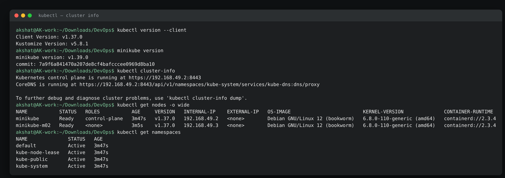
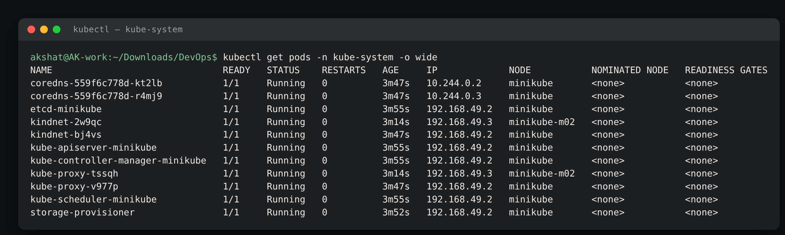
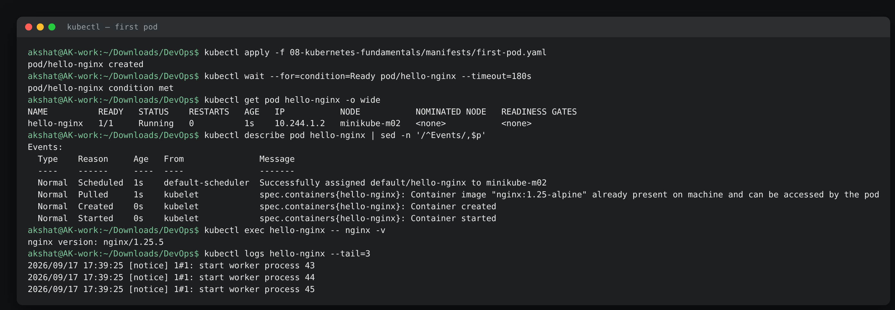
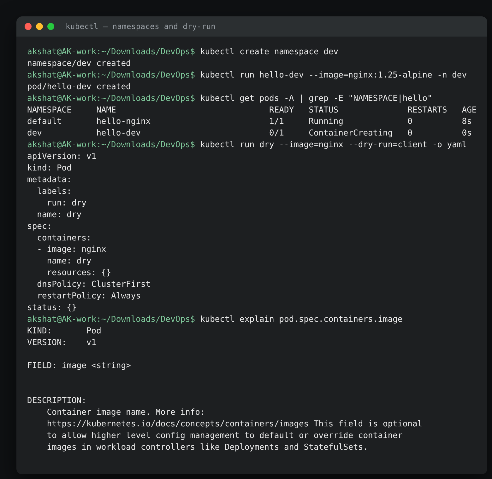

# Kubernetes Fundamentals Homework

**Name:** Akshat Kushwaha
**Enrollment Number:** 24bcs10060
17 September 2026

The session's resources point at the Kubernetes basics tutorial, the minikube quick start and the architecture docs. What follows is that material worked through on a real local cluster — a two-node minikube, not a single node, because half of what makes Kubernetes interesting (scheduling, one agent per node, pod networking across hosts) is invisible when there is only one machine to schedule onto.

Manifest: [`manifests/first-pod.yaml`](./manifests/first-pod.yaml)

---

## Setting up the cluster

`minikube` runs the cluster as Docker containers on this laptop — the same Docker daemon the earlier assignments used. Each "node" is a container running a full kubelet and containerd.

> **On the output below.** minikube printed a nine-line "Docker is nearly out of disk space" suggestion block on every invocation; it is trimmed to its first line here. Nothing else is altered.

```text
akshat@AK-work:~$ minikube start --driver=docker --nodes=2 --cpus=2 --memory=2200 --kubernetes-version=stable
* minikube v1.39.0 on Ubuntu 22.04
* Using the docker driver based on existing profile
! You cannot change the number of nodes for an existing minikube cluster. Please use 'minikube node add' to add nodes to an existing cluster.
* Starting "minikube" primary control-plane node in "minikube" cluster
* Pulling base image v0.0.51 ...
X Docker is nearly out of disk space, which may cause deployments to fail! (88% of capacity). You can pass '--force' to skip this check.
* Preparing Kubernetes v1.37.0 on containerd 2.3.4 ...
* Configuring CNI (Container Networking Interface) ...
* Verifying Kubernetes components...
  - Using image gcr.io/k8s-minikube/storage-provisioner:v5
* Enabled addons: storage-provisioner, default-storageclass
* Done! kubectl is now configured to use "minikube" cluster and "default" namespace by default
akshat@AK-work:~$ minikube node add
* Adding node m02 to cluster minikube as [worker]
* Starting "minikube-m02" worker node in "minikube" cluster
* Pulling base image v0.0.51 ...
X Docker is nearly out of disk space, which may cause deployments to fail! (89% of capacity). You can pass '--force' to skip this check.
* Preparing Kubernetes v1.37.0 on containerd 2.3.4 ...
* Verifying Kubernetes components...
* Successfully added m02 to minikube!
```

**What I understood:** the first command built the control plane, the second attached a worker. Two things in that output are worth keeping:

**`--nodes=2` was silently ignored.** The warning says why: *"You cannot change the number of nodes for an existing minikube cluster."* A profile already existed from an earlier attempt, so the flag applied to nothing and I got a one-node cluster. `minikube node add` is the way to grow an existing cluster; `--nodes` only works when the profile is created from scratch.

**The first attempt failed outright**, and the error is a good example of how much of Kubernetes setup is just downloads:

```text
X Exiting due to K8S_INSTALL_FAILED: Failed to update cluster: update primary control-plane node:
downloading binaries: downloading kubeadm: download failed:
https://dl.k8s.io/release/v1.37.0/bin/linux/amd64/kubeadm: stream error: stream ID 1; PROTOCOL_ERROR; received from peer
```

Nothing was wrong with the cluster configuration — the connection dropped partway through fetching `kubeadm`. Re-running `minikube start` picked up where it left off, reusing the 508 MB base image it had already downloaded. Worth knowing that a failed `minikube start` is usually safe to simply run again.

---

## 1. The architecture, and where each piece actually runs

| Component | Runs on | What it does |
|---|---|---|
| `kube-apiserver` | Control plane | The only thing that talks to etcd. Every other component, and every `kubectl` command, goes through it |
| `etcd` | Control plane | Key-value store holding the entire cluster state. Lose it and you have lost the cluster |
| `kube-scheduler` | Control plane | Watches for Pods with no node assigned and picks a node for each |
| `kube-controller-manager` | Control plane | The control loops — one per object type — that drive actual state toward desired state |
| `kubelet` | Every node | The agent that actually starts containers and reports their status back |
| `kube-proxy` | Every node | Programs the iptables/IPVS rules that make Service virtual IPs work |
| `containerd` | Every node | The container runtime. Docker is not required — this cluster does not use it inside the nodes |
| CNI plugin (`kindnet` here) | Every node | Gives each Pod an IP and makes Pod-to-Pod traffic route between nodes |
| `CoreDNS` | Add-on | In-cluster DNS. Resolves Service names to cluster IPs |

The thing that makes all of this hang together is that Kubernetes is **declarative**. Nothing is a command to do a thing; everything is a statement of what should be true, written into etcd, that some controller then works to make true. `kubectl apply` does not create a Pod — it records that a Pod should exist, and the scheduler and kubelet take it from there.

---

## 2. What the cluster looks like

```text
akshat@AK-work:~/Downloads/DevOps$ kubectl version --client
Client Version: v1.37.0
Kustomize Version: v5.8.1
akshat@AK-work:~/Downloads/DevOps$ minikube version
minikube version: v1.39.0
commit: 7a9f6a841470a207de8cf4bafcccee0969d8ba10
akshat@AK-work:~/Downloads/DevOps$ kubectl cluster-info
Kubernetes control plane is running at https://192.168.49.2:8443
CoreDNS is running at https://192.168.49.2:8443/api/v1/namespaces/kube-system/services/kube-dns:dns/proxy

To further debug and diagnose cluster problems, use 'kubectl cluster-info dump'.
akshat@AK-work:~/Downloads/DevOps$ kubectl get nodes -o wide
NAME           STATUS   ROLES           AGE     VERSION   INTERNAL-IP    EXTERNAL-IP   OS-IMAGE                         KERNEL-VERSION              CONTAINER-RUNTIME
minikube       Ready    control-plane   3m47s   v1.37.0   192.168.49.2   <none>        Debian GNU/Linux 12 (bookworm)   6.8.0-110-generic (amd64)   containerd://2.3.4
minikube-m02   Ready    <none>          3m5s    v1.37.0   192.168.49.3   <none>        Debian GNU/Linux 12 (bookworm)   6.8.0-110-generic (amd64)   containerd://2.3.4
akshat@AK-work:~/Downloads/DevOps$ kubectl get namespaces
NAME              STATUS   AGE
default           Active   3m47s
kube-node-lease   Active   3m47s
kube-public       Active   3m47s
kube-system       Active   3m47s
```

**What I understood:** two nodes, both `Ready`, both running Kubernetes v1.37.0. The `ROLES` column is the difference — `control-plane` on the first, `<none>` on the worker. Note the kernel version: `6.8.0-110-generic`, which is *this laptop's* kernel, because the nodes are containers sharing the host kernel rather than virtual machines. The container runtime is `containerd`, not Docker: Docker runs the node containers from the outside, and inside them Kubernetes talks straight to containerd.

The four namespaces exist on every cluster: `default` (where my objects go if I do not say otherwise), `kube-system` (the cluster's own components), `kube-public` (world-readable cluster info), and `kube-node-lease` (one small Lease object per node, used for heartbeats — cheaper than updating the whole Node object every few seconds).

---

## 3. The control plane components are just Pods

This is the part that made the architecture diagram concrete for me.

```text
akshat@AK-work:~/Downloads/DevOps$ kubectl get pods -n kube-system -o wide
NAME                               READY   STATUS    RESTARTS   AGE     IP             NODE           NOMINATED NODE   READINESS GATES
coredns-559f6c778d-kt2lb           1/1     Running   0          3m47s   10.244.0.2     minikube       <none>           <none>
coredns-559f6c778d-r4mj9           1/1     Running   0          3m47s   10.244.0.3     minikube       <none>           <none>
etcd-minikube                      1/1     Running   0          3m55s   192.168.49.2   minikube       <none>           <none>
kindnet-2w9qc                      1/1     Running   0          3m14s   192.168.49.3   minikube-m02   <none>           <none>
kindnet-bj4vs                      1/1     Running   0          3m47s   192.168.49.2   minikube       <none>           <none>
kube-apiserver-minikube            1/1     Running   0          3m55s   192.168.49.2   minikube       <none>           <none>
kube-controller-manager-minikube   1/1     Running   0          3m55s   192.168.49.2   minikube       <none>           <none>
kube-proxy-tssqh                   1/1     Running   0          3m14s   192.168.49.3   minikube-m02   <none>           <none>
kube-proxy-v977p                   1/1     Running   0          3m47s   192.168.49.2   minikube       <none>           <none>
kube-scheduler-minikube            1/1     Running   0          3m55s   192.168.49.2   minikube       <none>           <none>
storage-provisioner                1/1     Running   0          3m52s   192.168.49.2   minikube       <none>           <none>
```

**What I understood:** every box in the architecture table is visible here as a running Pod, and the placement matches the theory exactly:

- `etcd`, `kube-apiserver`, `kube-controller-manager`, `kube-scheduler` — **one each, control plane only**. They are static Pods: the kubelet reads their manifests off disk in `/etc/kubernetes/manifests` rather than getting them from the API server, which solves the chicken-and-egg problem of how the API server starts before the API server exists.
- `kube-proxy` and `kindnet` — **one each per node**, two of each. That is a DaemonSet, and it is what "one agent per node" looks like in practice.
- `coredns` — two replicas for availability.

The IP column is worth reading too. The four control-plane components show `192.168.49.2`, the *node's* IP, because they run with `hostNetwork: true` — they need to work before Pod networking does. CoreDNS shows `10.244.0.2`, an address from the Pod CIDR, because by the time it starts the CNI is up.

---

## 4. Node capacity and the resource model

```text
akshat@AK-work:~/Downloads/DevOps$ kubectl describe node minikube-m02 | sed -n '/^Capacity/,/^System Info/p'
Capacity:
  cpu:                16
  ephemeral-storage:  150694948864
  hugepages-1Gi:      0
  hugepages-2Mi:      0
  memory:             15634848Ki
  pods:               110
Allocatable:
  cpu:                16
  ephemeral-storage:  150694948864
  hugepages-1Gi:      0
  hugepages-2Mi:      0
  memory:             15634848Ki
  pods:               110
System Info:
akshat@AK-work:~/Downloads/DevOps$ kubectl api-resources | head -14
NAME                                SHORTNAMES   APIVERSION                        NAMESPACED   KIND
bindings                                         v1                                true         Binding
componentstatuses                   cs           v1                                false        ComponentStatus
configmaps                          cm           v1                                true         ConfigMap
endpoints                           ep           v1                                true         Endpoints
events                              ev           v1                                true         Event
limitranges                         limits       v1                                true         LimitRange
namespaces                          ns           v1                                false        Namespace
nodes                               no           v1                                false        Node
persistentvolumeclaims              pvc          v1                                true         PersistentVolumeClaim
persistentvolumes                   pv           v1                                false        PersistentVolume
pods                                po           v1                                true         Pod
podtemplates                                     v1                                true         PodTemplate
replicationcontrollers              rc           v1                                true         ReplicationController
```

**What I understood:** `Allocatable` is what the scheduler is allowed to hand out; `Capacity` is what the machine physically has. On a real node they differ, because the kubelet reserves some for the OS and itself. Here they are identical, and both report 16 CPUs and 15 GB — the whole laptop — even though I started the node with `--cpus=2 --memory=2200`. That is because these nodes are containers: cgroup limits cap what they can actually use, but the kubelet reads the host's `/proc` and reports what it sees there. It is a known minikube-on-Docker quirk and a good reminder that `Capacity` is a claim by the kubelet, not a measurement by the scheduler.

`pods: 110` is the real limit that bites first on a small cluster — the default maximum Pods per node.

`kubectl api-resources` is the map of everything the cluster knows how to store. The `SHORTNAMES` column is where `po`, `svc`, `cm`, `pvc` come from, and `NAMESPACED` says whether an object lives inside a namespace (`pods`) or is cluster-wide (`nodes`, `persistentvolumes`, `namespaces` itself).

---

## 5. My first Pod

```text
akshat@AK-work:~/Downloads/DevOps$ kubectl apply -f 08-kubernetes-fundamentals/manifests/first-pod.yaml
pod/hello-nginx created
akshat@AK-work:~/Downloads/DevOps$ kubectl wait --for=condition=Ready pod/hello-nginx --timeout=180s
pod/hello-nginx condition met
akshat@AK-work:~/Downloads/DevOps$ kubectl get pod hello-nginx -o wide
NAME          READY   STATUS    RESTARTS   AGE   IP           NODE           NOMINATED NODE   READINESS GATES
hello-nginx   1/1     Running   0          1s    10.244.1.2   minikube-m02   <none>           <none>
akshat@AK-work:~/Downloads/DevOps$ kubectl describe pod hello-nginx | sed -n '/^Events/,$p'
Events:
  Type    Reason     Age   From               Message
  ----    ------     ----  ----               -------
  Normal  Scheduled  1s    default-scheduler  Successfully assigned default/hello-nginx to minikube-m02
  Normal  Pulled     1s    kubelet            spec.containers{hello-nginx}: Container image "nginx:1.25-alpine" already present on machine and can be accessed by the pod
  Normal  Created    0s    kubelet            spec.containers{hello-nginx}: Container created
  Normal  Started    0s    kubelet            spec.containers{hello-nginx}: Container started
akshat@AK-work:~/Downloads/DevOps$ kubectl exec hello-nginx -- nginx -v
nginx version: nginx/1.25.5
akshat@AK-work:~/Downloads/DevOps$ kubectl logs hello-nginx --tail=3
2026/09/17 17:39:25 [notice] 1#1: start worker process 43
2026/09/17 17:39:25 [notice] 1#1: start worker process 44
2026/09/17 17:39:25 [notice] 1#1: start worker process 45
```

**What I understood:** the `Events` section is the life of a Pod in four lines, and the `From` column names which component did each step:

```text
default-scheduler   Scheduled   picked minikube-m02 for this Pod
kubelet             Pulled      image was already on that node
kubelet             Created     container created via containerd
kubelet             Started     container started
```

That split is the architecture in miniature: the scheduler only *decides*, the kubelet on the chosen node *does*. Note the Pod landed on `minikube-m02`, the worker — and the Pod IP `10.244.1.2` comes from that node's slice of the Pod CIDR (`10.244.1.0/24`), while Pods on the control plane got `10.244.0.x`. One /24 per node is how kindnet carves it up.

`Pulled` says *"already present on machine"* because I pre-loaded the images with `minikube image load` — on a slow connection that turns a two-minute Pod start into a one-second one.

`kubectl exec` runs a command inside a running container and `kubectl logs` prints what the container wrote to stdout. Those two plus `kubectl describe` are the whole debugging toolkit for a single Pod.

---

## 6. Namespaces

```text
akshat@AK-work:~/Downloads/DevOps$ kubectl create namespace dev
namespace/dev created
akshat@AK-work:~/Downloads/DevOps$ kubectl run hello-dev --image=nginx:1.25-alpine -n dev
pod/hello-dev created
akshat@AK-work:~/Downloads/DevOps$ kubectl get pods -A | grep -E "NAMESPACE|hello"
NAMESPACE     NAME                               READY   STATUS              RESTARTS   AGE
default       hello-nginx                        1/1     Running             0          8s
dev           hello-dev                          0/1     ContainerCreating   0          0s
```

**What I understood:** a namespace is a scope for names, not an isolation boundary in the security sense. Two Pods can share a name as long as they are in different namespaces. `-n <ns>` targets one, `-A` lists all of them, and without either you get `default`. Deleting a namespace deletes everything inside it, which makes it the tidiest way to clean up an experiment.

What a namespace does *not* give you by default is network isolation — a Pod in `dev` can still reach a Service in `default`. That needs NetworkPolicy.

---

## 7. Generating manifests instead of writing them

```text
akshat@AK-work:~/Downloads/DevOps$ kubectl run dry --image=nginx --dry-run=client -o yaml
apiVersion: v1
kind: Pod
metadata:
  labels:
    run: dry
  name: dry
spec:
  containers:
  - image: nginx
    name: dry
    resources: {}
  dnsPolicy: ClusterFirst
  restartPolicy: Always
status: {}
akshat@AK-work:~/Downloads/DevOps$ kubectl explain pod.spec.containers.image
KIND:       Pod
VERSION:    v1

FIELD: image <string>


DESCRIPTION:
    Container image name. More info:
    https://kubernetes.io/docs/concepts/containers/images This field is optional
    to allow higher level config management to default or override container
    images in workload controllers like Deployments and StatefulSets.
```

**What I understood:** `--dry-run=client -o yaml` builds the manifest and prints it without sending anything to the API server, which is the fastest way to get a correct skeleton to edit — much better than typing `apiVersion` from memory. `kubectl explain` is the field reference for every object, served by the cluster itself, so it always matches the version you are actually running.

---

## 8. Which cluster am I talking to

```text
akshat@AK-work:~/Downloads/DevOps$ kubectl config current-context
minikube
akshat@AK-work:~/Downloads/DevOps$ kubectl get nodes -o custom-columns=NAME:.metadata.name,TAINTS:.spec.taints[*].key
NAME           TAINTS
minikube       <none>
minikube-m02   <none>
```

**What I understood:** the context decides which cluster and which namespace every command lands on — the single most important thing to check before running anything destructive.

The taints output is a minikube-specific detail worth knowing: a production control plane carries a `node-role.kubernetes.io/control-plane:NoSchedule` taint so ordinary workloads stay off it. minikube removes that, so both nodes here accept Pods. That is why my first Pod could have been scheduled to either one.

---

## 9. Cleanup

```text
akshat@AK-work:~/Downloads/DevOps$ kubectl delete pod hello-nginx
pod "hello-nginx" deleted from default namespace
akshat@AK-work:~/Downloads/DevOps$ kubectl delete namespace dev
namespace "dev" deleted
akshat@AK-work:~/Downloads/DevOps$ kubectl get pods -A --no-headers | grep -vc kube-system
0
```

Deleting the namespace took `hello-dev` with it — no separate delete needed.

---

## kubectl cheat sheet

| Command | What it is for |
|---|---|
| `kubectl get <type> [-o wide] [-n ns] [-A]` | List objects. `-o wide` adds node and IP, `-A` covers all namespaces |
| `kubectl describe <type> <name>` | Full detail plus the Events list — first stop when something is wrong |
| `kubectl logs <pod> [-f] [--previous] [-c <container>]` | Container stdout. `--previous` reads the crashed instance, not the running one |
| `kubectl exec -it <pod> -- sh` | Shell inside a running container |
| `kubectl apply -f <file>` | Create or update from a manifest — the declarative way |
| `kubectl delete -f <file>` | Delete whatever that manifest created |
| `kubectl run` / `kubectl create` | Quick imperative creation, mostly useful with `--dry-run=client -o yaml` |
| `kubectl explain <type>.<field>` | Field documentation straight from the API server |
| `kubectl get events --sort-by=.lastTimestamp` | Everything that has happened recently, in order |
| `kubectl config current-context` | Which cluster am I about to change |
| `kubectl wait --for=condition=Ready pod/<name>` | Block until it is actually up, instead of sleeping |
| `kubectl api-resources` | Every object type, its short name and whether it is namespaced |

---

## Screenshots

**Cluster info, both nodes and the namespaces**



**The control plane components running as Pods in `kube-system`**



**First Pod: apply, wait, inspect the events, exec into it**



**Namespaces, dry-run manifest generation and `kubectl explain`**



---

## Summary

| Requirement | Status |
|---|---|
| Local Kubernetes cluster running | Done — 2-node minikube, v1.37.0 |
| Understand the architecture components | Done — table above, each one located as a running Pod |
| `kubectl` basics practised | Done — get, describe, logs, exec, apply, delete, explain, wait |
| First Pod created and inspected | Done — `hello-nginx`, scheduled to the worker node |
| Namespaces | Done — created, used with `-n`, deleted with everything in it |
| Cheat sheet | Included |
