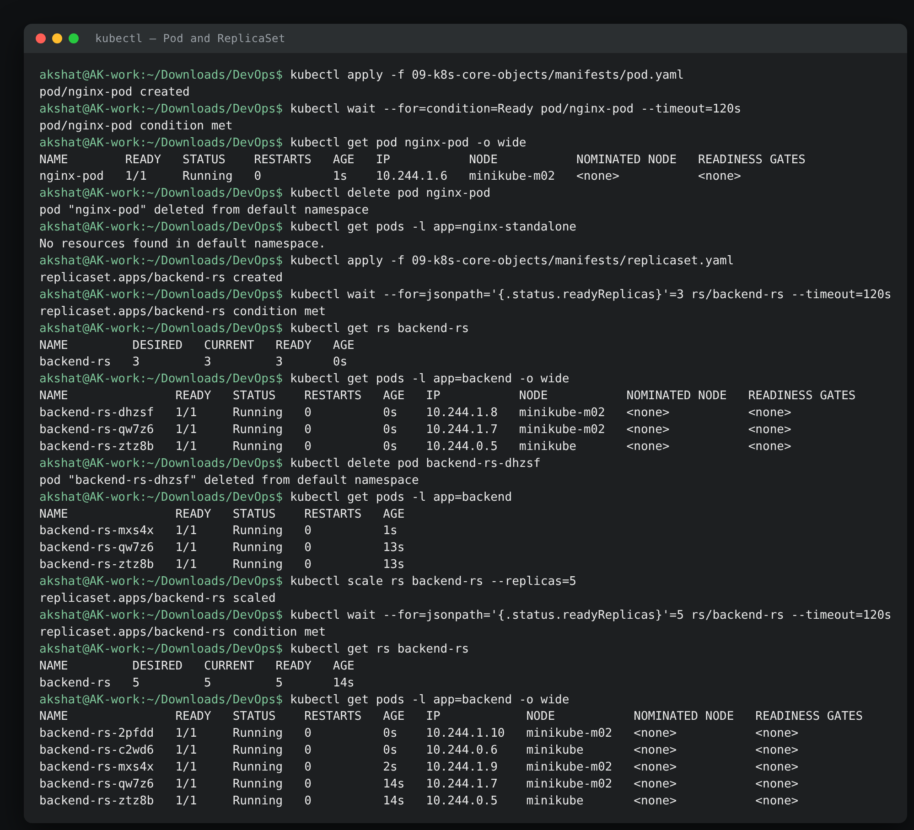
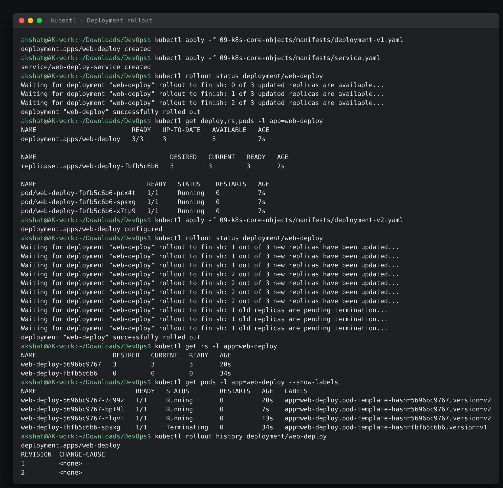
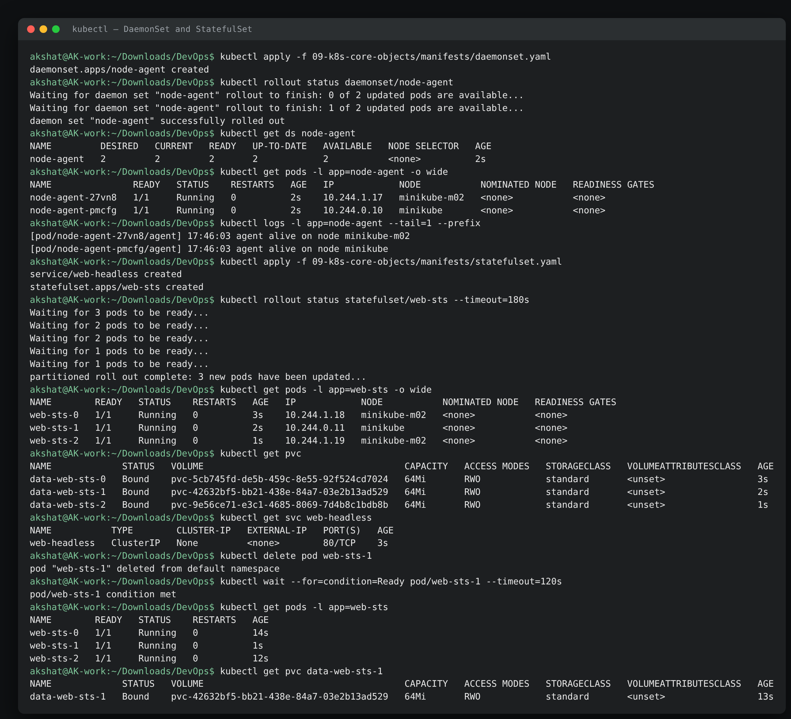
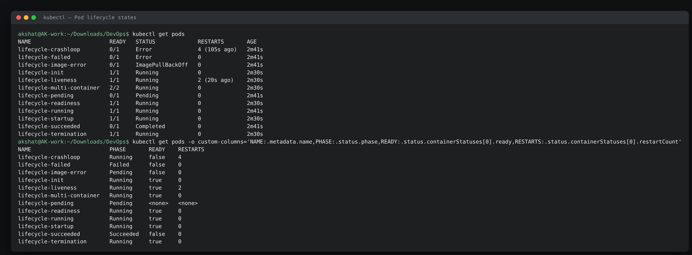
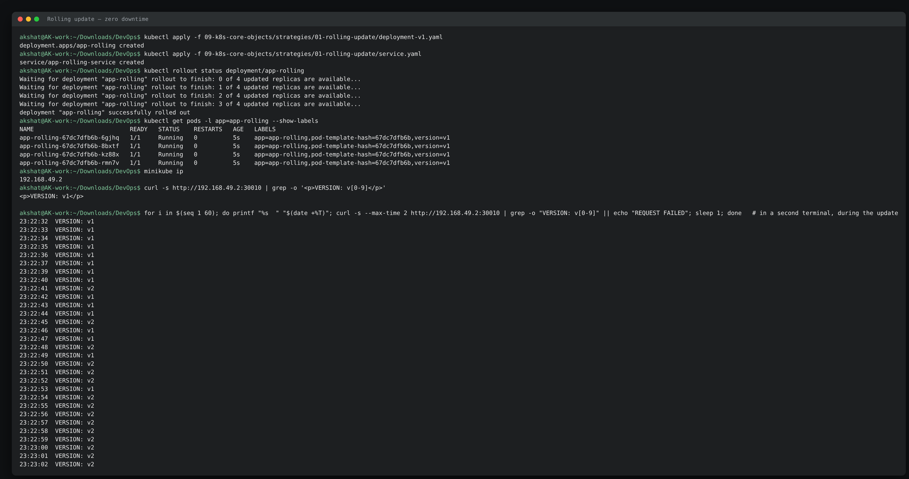
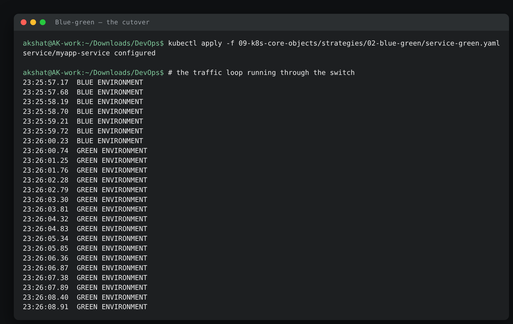
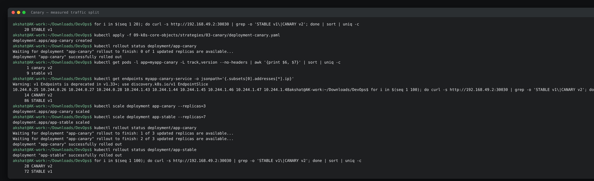
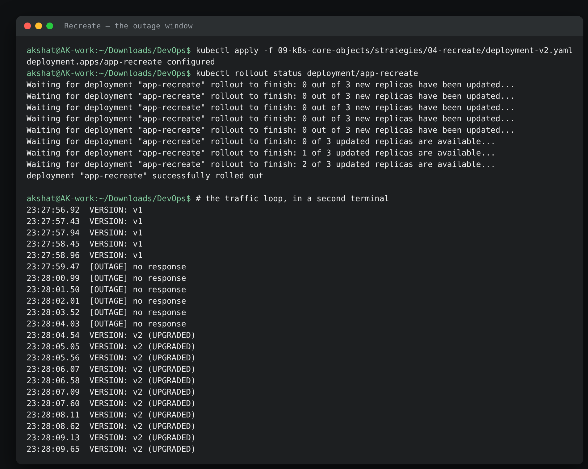
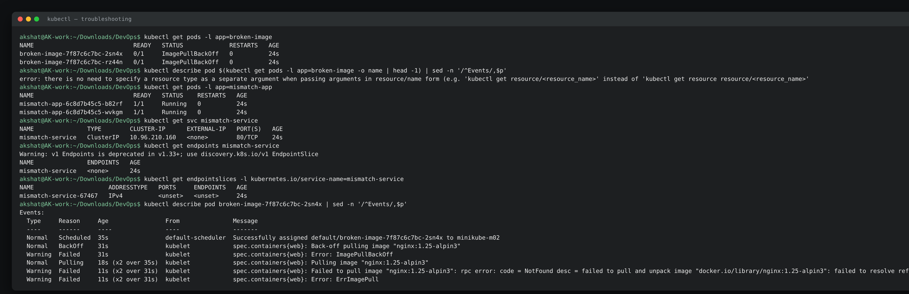

# Kubernetes Core Objects Homework

**Name:** Akshat Kushwaha
**Enrollment Number:** 24bcs10060
17 September 2026

Three things in one: the core workload objects (Pod, ReplicaSet, Deployment, DaemonSet, StatefulSet), the Pod lifecycle lab, and the four deployment strategies. Everything below ran on the two-node minikube cluster from [assignment 08](../08-kubernetes-fundamentals/).

| Folder | What is in it |
|---|---|
| [`manifests/`](./manifests/) | One file per core object |
| [`pod-lifecycle/`](./pod-lifecycle/) | Twelve small Pods, one per lifecycle situation |
| [`strategies/`](./strategies/) | Rolling update, blue-green, canary, recreate |
| [`troubleshooting/`](./troubleshooting/) | Two deliberately broken manifests |

```text
akshat@AK-work:~/Downloads/DevOps$ kubectl get nodes
NAME           STATUS   ROLES           AGE   VERSION
minikube       Ready    control-plane   14m   v1.37.0
minikube-m02   Ready    <none>          13m   v1.37.0
```

---

## Part 1 — Core objects

### 1.1 Pod — and why you do not create one directly

```text
akshat@AK-work:~/Downloads/DevOps$ kubectl apply -f 09-k8s-core-objects/manifests/pod.yaml
pod/nginx-pod created
akshat@AK-work:~/Downloads/DevOps$ kubectl wait --for=condition=Ready pod/nginx-pod --timeout=120s
pod/nginx-pod condition met
akshat@AK-work:~/Downloads/DevOps$ kubectl get pod nginx-pod -o wide
NAME        READY   STATUS    RESTARTS   AGE   IP           NODE           NOMINATED NODE   READINESS GATES
nginx-pod   1/1     Running   0          1s    10.244.1.6   minikube-m02   <none>           <none>
akshat@AK-work:~/Downloads/DevOps$ kubectl delete pod nginx-pod
pod "nginx-pod" deleted from default namespace
akshat@AK-work:~/Downloads/DevOps$ kubectl get pods -l app=nginx-standalone
No resources found in default namespace.
```

**What I understood:** a bare Pod has nobody watching it. Delete it and it is simply gone — no controller notices, nothing replaces it. That is the whole argument for the objects that follow: they exist to keep Pods alive when the Pod, or the node under it, goes away.

### 1.2 ReplicaSet — the thing that watches

```text
akshat@AK-work:~/Downloads/DevOps$ kubectl apply -f 09-k8s-core-objects/manifests/replicaset.yaml
replicaset.apps/backend-rs created
akshat@AK-work:~/Downloads/DevOps$ kubectl wait --for=jsonpath='{.status.readyReplicas}'=3 rs/backend-rs --timeout=120s
replicaset.apps/backend-rs condition met
akshat@AK-work:~/Downloads/DevOps$ kubectl get rs backend-rs
NAME         DESIRED   CURRENT   READY   AGE
backend-rs   3         3         3       0s
akshat@AK-work:~/Downloads/DevOps$ kubectl get pods -l app=backend -o wide
NAME               READY   STATUS    RESTARTS   AGE   IP           NODE           NOMINATED NODE   READINESS GATES
backend-rs-dhzsf   1/1     Running   0          0s    10.244.1.8   minikube-m02   <none>           <none>
backend-rs-qw7z6   1/1     Running   0          0s    10.244.1.7   minikube-m02   <none>           <none>
backend-rs-ztz8b   1/1     Running   0          0s    10.244.0.5   minikube       <none>           <none>
```

Now kill one of them on purpose:

```text
akshat@AK-work:~/Downloads/DevOps$ kubectl delete pod backend-rs-dhzsf
pod "backend-rs-dhzsf" deleted from default namespace
akshat@AK-work:~/Downloads/DevOps$ kubectl get pods -l app=backend
NAME               READY   STATUS    RESTARTS   AGE
backend-rs-mxs4x   1/1     Running   0          1s
backend-rs-qw7z6   1/1     Running   0          13s
backend-rs-ztz8b   1/1     Running   0          13s
akshat@AK-work:~/Downloads/DevOps$ kubectl scale rs backend-rs --replicas=5
replicaset.apps/backend-rs scaled
akshat@AK-work:~/Downloads/DevOps$ kubectl wait --for=jsonpath='{.status.readyReplicas}'=5 rs/backend-rs --timeout=120s
replicaset.apps/backend-rs condition met
akshat@AK-work:~/Downloads/DevOps$ kubectl get rs backend-rs
NAME         DESIRED   CURRENT   READY   AGE
backend-rs   5         5         5       14s
akshat@AK-work:~/Downloads/DevOps$ kubectl get pods -l app=backend -o wide
NAME               READY   STATUS    RESTARTS   AGE   IP            NODE           NOMINATED NODE   READINESS GATES
backend-rs-2pfdd   1/1     Running   0          0s    10.244.1.10   minikube-m02   <none>           <none>
backend-rs-c2wd6   1/1     Running   0          0s    10.244.0.6    minikube       <none>           <none>
backend-rs-mxs4x   1/1     Running   0          2s    10.244.1.9    minikube-m02   <none>           <none>
backend-rs-qw7z6   1/1     Running   0          14s   10.244.1.7    minikube-m02   <none>           <none>
backend-rs-ztz8b   1/1     Running   0          14s   10.244.0.5    minikube       <none>           <none>
```

**What I understood:** the deleted Pod `backend-rs-dhzsf` is gone and `backend-rs-mxs4x` exists in its place, aged 1 second against the others' 13. Nothing "restarted" — the ReplicaSet controller noticed that observed replicas (2) did not match desired (3) and created a brand new Pod with a brand new name and IP. That is the reconciliation loop in one observation, and it is also the reason you can never rely on a Pod IP.

Scaling is the same mechanism with the desired number changed by hand. Note the scheduler spread the new Pods across both nodes without being asked.

### 1.3 Deployment — ReplicaSets with a rollout strategy

```text
akshat@AK-work:~/Downloads/DevOps$ kubectl apply -f 09-k8s-core-objects/manifests/deployment-v1.yaml
deployment.apps/web-deploy created
akshat@AK-work:~/Downloads/DevOps$ kubectl apply -f 09-k8s-core-objects/manifests/service.yaml
service/web-deploy-service created
akshat@AK-work:~/Downloads/DevOps$ kubectl rollout status deployment/web-deploy
Waiting for deployment "web-deploy" rollout to finish: 0 of 3 updated replicas are available...
Waiting for deployment "web-deploy" rollout to finish: 1 of 3 updated replicas are available...
Waiting for deployment "web-deploy" rollout to finish: 2 of 3 updated replicas are available...
deployment "web-deploy" successfully rolled out
akshat@AK-work:~/Downloads/DevOps$ kubectl get deploy,rs,pods -l app=web-deploy
NAME                         READY   UP-TO-DATE   AVAILABLE   AGE
deployment.apps/web-deploy   3/3     3            3           7s

NAME                                   DESIRED   CURRENT   READY   AGE
replicaset.apps/web-deploy-fbfb5c6b6   3         3         3       7s

NAME                             READY   STATUS    RESTARTS   AGE
pod/web-deploy-fbfb5c6b6-pcx4t   1/1     Running   0          7s
pod/web-deploy-fbfb5c6b6-spsxg   1/1     Running   0          7s
pod/web-deploy-fbfb5c6b6-x7tp9   1/1     Running   0          7s
```

**What I understood:** three objects, one command. The Deployment did not create Pods — it created a **ReplicaSet** (`web-deploy-fbfb5c6b6`), and that ReplicaSet created the Pods. The hash in the middle of every Pod name is the ReplicaSet's `pod-template-hash`, derived from the Pod template. Change the template and you get a different hash, which means a different ReplicaSet, which is exactly how rollouts work.

Updating to v2:

```text
akshat@AK-work:~/Downloads/DevOps$ kubectl apply -f 09-k8s-core-objects/manifests/deployment-v2.yaml
deployment.apps/web-deploy configured
akshat@AK-work:~/Downloads/DevOps$ kubectl get rs -l app=web-deploy
NAME                    DESIRED   CURRENT   READY   AGE
web-deploy-5696bc9767   3         3         3       20s
web-deploy-fbfb5c6b6    0         0         0       34s
akshat@AK-work:~/Downloads/DevOps$ kubectl get pods -l app=web-deploy --show-labels
NAME                          READY   STATUS        RESTARTS   AGE   LABELS
web-deploy-5696bc9767-7c99z   1/1     Running       0          20s   app=web-deploy,pod-template-hash=5696bc9767,version=v2
web-deploy-5696bc9767-bpt9l   1/1     Running       0          7s    app=web-deploy,pod-template-hash=5696bc9767,version=v2
web-deploy-5696bc9767-nlqvt   1/1     Running       0          13s   app=web-deploy,pod-template-hash=5696bc9767,version=v2
web-deploy-fbfb5c6b6-spsxg    1/1     Terminating   0          34s   app=web-deploy,pod-template-hash=fbfb5c6b6,version=v1
akshat@AK-work:~/Downloads/DevOps$ kubectl rollout history deployment/web-deploy
deployment.apps/web-deploy 
REVISION  CHANGE-CAUSE
1         <none>
2         <none>
```

**What I understood:** the old ReplicaSet is not deleted — it is **scaled to 0 and kept**. That is the entire trick behind rollback: the previous revision is still sitting there as an object, needing only to be scaled back up. `revisionHistoryLimit: 10` says how many of these to keep.

Rolling back:

```text
akshat@AK-work:~/Downloads/DevOps$ kubectl rollout undo deployment/web-deploy
Warning: resource deployments/web-deploy was previously managed with 'kubectl apply'. Rolling back will not update the kubectl.kubernetes.io/last-applied-configuration annotation, which may cause unexpected behavior on future 'kubectl apply' operations. Consider using 'kubectl apply' with your previous configuration file instead.
deployment.apps/web-deploy rolled back
akshat@AK-work:~/Downloads/DevOps$ kubectl get pods -l app=web-deploy --show-labels
NAME                          READY   STATUS        RESTARTS   AGE   LABELS
web-deploy-5696bc9767-7c99z   1/1     Terminating   0          51s   app=web-deploy,pod-template-hash=5696bc9767,version=v2
web-deploy-fbfb5c6b6-f77th    1/1     Running       0          13s   app=web-deploy,pod-template-hash=fbfb5c6b6,version=v1
web-deploy-fbfb5c6b6-kbd95    1/1     Running       0          7s    app=web-deploy,pod-template-hash=fbfb5c6b6,version=v1
web-deploy-fbfb5c6b6-l7tzv    1/1     Running       0          19s   app=web-deploy,pod-template-hash=fbfb5c6b6,version=v1
akshat@AK-work:~/Downloads/DevOps$ kubectl get rs -l app=web-deploy
NAME                    DESIRED   CURRENT   READY   AGE
web-deploy-5696bc9767   0         0         0       51s
web-deploy-fbfb5c6b6    3         3         3       65s
```

The hash `fbfb5c6b6` is the *same* ReplicaSet from before the update, scaled 0 → 3 again. Nothing was rebuilt.

The warning is worth reading rather than ignoring: `rollout undo` changes the live object but not the `last-applied-configuration` annotation that `kubectl apply` diffs against. So the next `kubectl apply -f deployment-v2.yaml` would take you straight back to v2. In a GitOps setup you roll back by reverting the manifest in git, not with `rollout undo`.

### 1.4 DaemonSet — one Pod per node

```text
akshat@AK-work:~/Downloads/DevOps$ kubectl apply -f 09-k8s-core-objects/manifests/daemonset.yaml
daemonset.apps/node-agent created
akshat@AK-work:~/Downloads/DevOps$ kubectl get ds node-agent
NAME         DESIRED   CURRENT   READY   UP-TO-DATE   AVAILABLE   NODE SELECTOR   AGE
node-agent   2         2         2       2            2           <none>          2s
akshat@AK-work:~/Downloads/DevOps$ kubectl get pods -l app=node-agent -o wide
NAME               READY   STATUS    RESTARTS   AGE   IP            NODE           NOMINATED NODE   READINESS GATES
node-agent-27vn8   1/1     Running   0          2s    10.244.1.17   minikube-m02   <none>           <none>
node-agent-pmcfg   1/1     Running   0          2s    10.244.0.10   minikube       <none>           <none>
akshat@AK-work:~/Downloads/DevOps$ kubectl logs -l app=node-agent --tail=1 --prefix
[pod/node-agent-27vn8/agent] 17:46:03 agent alive on node minikube-m02
[pod/node-agent-pmcfg/agent] 17:46:03 agent alive on node minikube
```

**What I understood:** there is no `replicas` field in the manifest, and `DESIRED` still says 2 — the node count *is* the replica count. Exactly one Pod per node, one on each, and adding a third node would produce a third Pod without touching the manifest. `kube-proxy` and `kindnet` in `kube-system` are the same pattern, which is why there were two of each in assignment 08.

The `NODE_NAME` in the log line comes from the downward API (`fieldRef: spec.nodeName`) — that is how a node agent knows which node it is on.

### 1.5 StatefulSet — stable names and stable storage

```text
akshat@AK-work:~/Downloads/DevOps$ kubectl apply -f 09-k8s-core-objects/manifests/statefulset.yaml
service/web-headless created
statefulset.apps/web-sts created
akshat@AK-work:~/Downloads/DevOps$ kubectl rollout status statefulset/web-sts --timeout=180s
Waiting for 3 pods to be ready...
Waiting for 2 pods to be ready...
Waiting for 1 pods to be ready...
partitioned roll out complete: 3 new pods have been updated...
akshat@AK-work:~/Downloads/DevOps$ kubectl get pods -l app=web-sts -o wide
NAME        READY   STATUS    RESTARTS   AGE   IP            NODE           NOMINATED NODE   READINESS GATES
web-sts-0   1/1     Running   0          3s    10.244.1.18   minikube-m02   <none>           <none>
web-sts-1   1/1     Running   0          2s    10.244.0.11   minikube       <none>           <none>
web-sts-2   1/1     Running   0          1s    10.244.1.19   minikube-m02   <none>           <none>
akshat@AK-work:~/Downloads/DevOps$ kubectl get pvc
NAME             STATUS   VOLUME                                     CAPACITY   ACCESS MODES   STORAGECLASS   VOLUMEATTRIBUTESCLASS   AGE
data-web-sts-0   Bound    pvc-5cb745fd-de5b-459c-8e55-92f524cd7024   64Mi       RWO            standard       <unset>                 3s
data-web-sts-1   Bound    pvc-42632bf5-bb21-438e-84a7-03e2b13ad529   64Mi       RWO            standard       <unset>                 2s
data-web-sts-2   Bound    pvc-9e56ce71-e3c1-4685-8069-7d4b8c1bdb8b   64Mi       RWO            standard       <unset>                 1s
akshat@AK-work:~/Downloads/DevOps$ kubectl get svc web-headless
NAME           TYPE        CLUSTER-IP   EXTERNAL-IP   PORT(S)   AGE
web-headless   ClusterIP   None         <none>        80/TCP    3s
```

The identity survives a delete, which is the entire point:

```text
akshat@AK-work:~/Downloads/DevOps$ kubectl delete pod web-sts-1
pod "web-sts-1" deleted from default namespace
akshat@AK-work:~/Downloads/DevOps$ kubectl wait --for=condition=Ready pod/web-sts-1 --timeout=120s
pod/web-sts-1 condition met
akshat@AK-work:~/Downloads/DevOps$ kubectl get pods -l app=web-sts
NAME        READY   STATUS    RESTARTS   AGE
web-sts-0   1/1     Running   0          14s
web-sts-1   1/1     Running   0          1s
web-sts-2   1/1     Running   0          12s
akshat@AK-work:~/Downloads/DevOps$ kubectl get pvc data-web-sts-1
NAME             STATUS   VOLUME                                     CAPACITY   ACCESS MODES   STORAGECLASS   VOLUMEATTRIBUTESCLASS   AGE
data-web-sts-1   Bound    pvc-42632bf5-bb21-438e-84a7-03e2b13ad529   64Mi       RWO            standard       <unset>                 13s
```

**What I understood:** compare this with the ReplicaSet above. There, the replacement Pod got a new random name. Here it came back as **`web-sts-1` again**, and its PVC is still bound to the same volume `pvc-42632bf5…` — same disk, same data, same name. Pods are also created in order (0, then 1, then 2) and deleted in reverse, which matters when node 0 is the one that has to be up first.

`CLUSTER-IP: None` on the governing Service is the headless Service that gives each Pod its own DNS name; that is the subject of [assignment 10](../10-k8s-services/).

### Object comparison

| Object | Keeps Pods alive | Identity | Update strategy | Typical use |
|---|---|---|---|---|
| Pod | No | Random name | None | Debugging, one-offs |
| ReplicaSet | Yes | Random name | None — replaces all at once | Almost never directly |
| Deployment | Yes, via ReplicaSets | Random name | RollingUpdate / Recreate, with history | Stateless apps — the default |
| DaemonSet | Yes, one per node | Random name | RollingUpdate | Log collectors, CNI, monitoring agents |
| StatefulSet | Yes | **Stable** (`name-0`, `name-1`) | RollingUpdate, ordered | Databases, queues, anything with its own disk |

---

## Part 2 — The Pod lifecycle lab

Twelve Pods, one per situation, applied together. This snapshot is the whole lab in two commands:

```text
akshat@AK-work:~/Downloads/DevOps$ kubectl get pods
NAME                        READY   STATUS             RESTARTS       AGE
lifecycle-crashloop         0/1     Error              4 (105s ago)   2m41s
lifecycle-failed            0/1     Error              0              2m41s
lifecycle-image-error       0/1     ImagePullBackOff   0              2m41s
lifecycle-init              1/1     Running            0              2m30s
lifecycle-liveness          1/1     Running            2 (20s ago)    2m30s
lifecycle-multi-container   2/2     Running            0              2m30s
lifecycle-pending           0/1     Pending            0              2m41s
lifecycle-readiness         1/1     Running            0              2m30s
lifecycle-running           1/1     Running            0              2m41s
lifecycle-startup           1/1     Running            0              2m30s
lifecycle-succeeded         0/1     Completed          0              2m41s
lifecycle-termination       1/1     Running            0              2m30s
akshat@AK-work:~/Downloads/DevOps$ kubectl get pods -o custom-columns='NAME:.metadata.name,PHASE:.status.phase,READY:.status.containerStatuses[0].ready,RESTARTS:.status.containerStatuses[0].restartCount'
NAME                        PHASE       READY    RESTARTS
lifecycle-crashloop         Running     false    4
lifecycle-failed            Failed      false    0
lifecycle-image-error       Pending     false    0
lifecycle-init              Running     true     0
lifecycle-liveness          Running     true     2
lifecycle-multi-container   Running     true     0
lifecycle-pending           Pending     <none>   <none>
lifecycle-readiness         Running     true     0
lifecycle-running           Running     true     0
lifecycle-startup           Running     true     0
lifecycle-succeeded         Succeeded   false    0
lifecycle-termination       Running     true     0
```

**What I understood — and this is the most useful thing in the assignment:** the `STATUS` column of `kubectl get pods` is **not** the Pod phase. Putting the two side by side makes it obvious:

| Pod | `STATUS` shows | Actual phase | What is really going on |
|---|---|---|---|
| `lifecycle-crashloop` | `Error` / `CrashLoopBackOff` | **Running** | The Pod is running; its *container* is in Waiting with reason CrashLoopBackOff |
| `lifecycle-image-error` | `ImagePullBackOff` | **Pending** | No container has ever started, so the Pod never left Pending |
| `lifecycle-succeeded` | `Completed` | **Succeeded** | A terminal phase — the work finished with exit 0 |
| `lifecycle-failed` | `Error` | **Failed** | Terminal too, but exit 1 |

There are only five phases — `Pending`, `Running`, `Succeeded`, `Failed`, `Unknown`. Everything else you see in that column (`ContainerCreating`, `CrashLoopBackOff`, `ImagePullBackOff`, `Completed`, `Terminating`, `Init:0/1`) is kubectl merging the container state and reason into one friendly string. Knowing which is which tells you where to look: a phase problem is a scheduling problem, a container-state problem is an image or application problem.

### Pending — a scheduling failure

```text
akshat@AK-work:~/Downloads/DevOps$ kubectl describe pod lifecycle-pending | sed -n '/^Events/,$p'
Events:
  Type     Reason            Age                    From               Message
  ----     ------            ----                   ----               -------
  Warning  FailedScheduling  2m46s (x7 over 2m51s)  default-scheduler  0/2 nodes are available: 2 Insufficient cpu, 2 Insufficient memory. preemption: 0/2 nodes are available: 2 Preemption is not helpful for scheduling.
```

**What I understood:** the message names the component (`default-scheduler`) and counts the nodes it rejected and why. This Pod asks for 64 CPUs and 256Gi; neither node can satisfy it, so it waits forever rather than failing. A Pod that sits in Pending is almost always resources, a missing PVC, or a taint the Pod does not tolerate — and `describe` says which.

### Succeeded and Failed — the terminal phases

```text
akshat@AK-work:~/Downloads/DevOps$ kubectl logs lifecycle-succeeded
work done
akshat@AK-work:~/Downloads/DevOps$ kubectl logs lifecycle-failed
about to fail
```

Both have `restartPolicy: Never`. The only difference between them is the exit code — 0 gives `Succeeded`/`Completed`, 1 gives `Failed`/`Error`.

### CrashLoopBackOff — and the `--previous` flag

```text
akshat@AK-work:~/Downloads/DevOps$ kubectl describe pod lifecycle-crashloop | grep -A5 'Last State'
    Last State:     Terminated
      Reason:       Error
      Exit Code:    1
      Started:      Thu, 17 Sep 2026 23:18:19 +0530
      Finished:     Thu, 17 Sep 2026 23:18:22 +0530
    Ready:          False
akshat@AK-work:~/Downloads/DevOps$ kubectl logs lifecycle-crashloop
starting up
crashing
```

**What I understood:** `CrashLoopBackOff` is not an error in itself — it is Kubernetes *waiting* before trying again, backing off 10s, 20s, 40s and so on up to five minutes. `Started` and `Finished` three seconds apart is the container's whole life. `Last State: Terminated, Exit Code: 1` is the real diagnosis, and `kubectl logs --previous` reads the dead container's output rather than the one currently sleeping in backoff.

### ImagePullBackOff

```text
akshat@AK-work:~/Downloads/DevOps$ kubectl describe pod broken-image-7f87c6c7bc-2sn4x | sed -n '/^Events/,$p'
Events:
  Type     Reason     Age                From               Message
  ----     ------     ----               ----               -------
  Normal   Scheduled  35s                default-scheduler  Successfully assigned default/broken-image-7f87c6c7bc-2sn4x to minikube-m02
  Normal   BackOff    31s                kubelet            spec.containers{web}: Back-off pulling image "nginx:1.25-alpin3"
  Warning  Failed     31s                kubelet            spec.containers{web}: Error: ImagePullBackOff
  Normal   Pulling    18s (x2 over 35s)  kubelet            spec.containers{web}: Pulling image "nginx:1.25-alpin3"
  Warning  Failed     11s (x2 over 31s)  kubelet            spec.containers{web}: Failed to pull image "nginx:1.25-alpin3": rpc error: code = NotFound desc = failed to pull and unpack image "docker.io/library/nginx:1.25-alpin3": failed to resolve reference "docker.io/library/nginx:1.25-alpin3": docker.io/library/nginx:1.25-alpin3: not found
  Warning  Failed     11s (x2 over 31s)  kubelet            spec.containers{web}: Error: ErrImagePull
```

**What I understood:** `kubectl logs` is useless here — there is no container to have logs. `describe` is the only tool, and it prints the typo (`alpin3`) verbatim. `ErrImagePull` is the first failure; `ImagePullBackOff` is what it becomes once the kubelet starts waiting between retries.

### Readiness — Running is not Ready

```text
akshat@AK-work:~/Downloads/DevOps$ for i in $(seq 1 6); do printf "%s  " "$(date +%T)"; kubectl get pod lifecycle-readiness --no-headers; sleep 5; done
23:21:33  lifecycle-readiness   0/1   ContainerCreating   0     0s
23:21:38  lifecycle-readiness   0/1   Running   0     5s
23:21:43  lifecycle-readiness   0/1   Running   0     10s
23:21:48  lifecycle-readiness   0/1   Running   0     15s
23:21:53  lifecycle-readiness   1/1   Running   0     20s
23:21:58  lifecycle-readiness   1/1   Running   0     25s
```

**What I understood:** for fifteen seconds this Pod was `Running` and `0/1` — the process was up, and Kubernetes was deliberately keeping traffic away from it. The probe has `initialDelaySeconds: 15`, so the first check happened at 15s and the Pod flipped to `1/1` on the next poll.

Readiness answers *"should this Pod receive traffic?"*, and a failing readiness probe removes the Pod from its Service's endpoints **without restarting it**. That is the mechanism the whole of Part 3 depends on: a rolling update only moves on to the next Pod once the new one reports ready.

### Liveness — failing means restart

```text
akshat@AK-work:~/Downloads/DevOps$ kubectl describe pod lifecycle-liveness | sed -n '/^Events/,$p'
Events:
  Type     Reason     Age                  From               Message
  ----     ------     ----                 ----               -------
  Normal   Scheduled  2m50s                default-scheduler  Successfully assigned default/lifecycle-liveness to minikube-m02
  Normal   Pulled     40s (x3 over 2m50s)  kubelet            spec.containers{self-breaking}: Container image "busybox:1.36" already present on machine and can be accessed by the pod
  Normal   Created    40s (x3 over 2m49s)  kubelet            spec.containers{self-breaking}: Container created
  Normal   Started    40s (x3 over 2m49s)  kubelet            spec.containers{self-breaking}: Container started
  Warning  Unhealthy  5s (x9 over 2m25s)   kubelet            spec.containers{self-breaking}: Liveness probe failed: cat: can't open '/tmp/healthy': No such file or directory
  Normal   Killing    5s (x3 over 2m15s)   kubelet            spec.containers{self-breaking}: Container self-breaking failed liveness probe, will be restarted
```

**What I understood:** the container deletes its own health file after 20 seconds, the probe fails three times (`failureThreshold: 3`), and the kubelet kills and restarts it — `(x3 over 2m15s)` is that cycle repeating. The difference from readiness in one line: **readiness takes traffic away, liveness restarts the container.** Getting them backwards is how you turn a slow startup into an endless restart loop, which is exactly what the startup probe exists to prevent.

### Init containers

```text
akshat@AK-work:~/Downloads/DevOps$ kubectl describe pod lifecycle-init | grep -E 'Init Containers|^  setup|State|Ready' | head -8
Init Containers:
  setup:
    State:          Terminated
    Ready:          True
    State:          Running
    Ready:          True
  PodReadyToStartContainers   True 
  Ready                       True 
akshat@AK-work:~/Downloads/DevOps$ kubectl logs lifecycle-init -c setup
init: preparing the page
init: done
```

**What I understood:** the init container shows `Terminated` **and** `Ready: True` — for an init container, finishing successfully *is* success. It ran to completion, wrote `index.html` into a shared `emptyDir`, and only then did the nginx container start and serve that file. The Pod passed through `Init:0/1` on the way. This is the standard place for waiting on a dependency, running a migration, or fetching config.

### Multi-container Pod

```text
akshat@AK-work:~/Downloads/DevOps$ kubectl logs lifecycle-multi-container -c sidecar --tail=2
akshat@AK-work:~/Downloads/DevOps$ kubectl exec lifecycle-multi-container -c sidecar -- wget -qO- http://localhost
<h1>Updated by the sidecar at 17:50:18</h1>
```

The sidecar's logs are empty because it writes to a file rather than stdout — so the `wget` from inside it is what proves the setup works.

**What I understood:** `2/2` in the READY column is two containers in one Pod. They share two things: a volume (the sidecar writes the file nginx serves) and a **network namespace** — which is why the sidecar can reach the web server on `http://localhost` with no service, no DNS and no IP. Containers in a Pod are as close together as two processes on one machine.

### Graceful termination

```text
akshat@AK-work:~/Downloads/DevOps$ kubectl logs -f lifecycle-termination &
application running
akshat@AK-work:~/Downloads/DevOps$ time kubectl delete pod lifecycle-termination
SIGTERM received - flushing state
cleanup complete
pod "lifecycle-termination" deleted from default namespace
kubectl delete pod lifecycle-termination  0.04s user 0.02s system 0% cpu 11.210 total
```

**What I understood:** deleting a Pod is not a kill. The kubelet sends `SIGTERM`, the process traps it, spends ten seconds cleaning up, and exits 0 — the delete took 11.2 seconds because it waited. Only if the process had still been alive at the end of `terminationGracePeriodSeconds` (30 here) would it have been sent `SIGKILL`. An application that ignores SIGTERM gets exactly that grace period of pointless waiting and then a hard kill mid-request.

---

## Part 3 — Deployment strategies

All four use the same shape: an nginx Pod whose page states its version, behind a NodePort Service, with a `curl` loop running against it from a second terminal while the update happens. The loop is the point — it is what turns "the strategy works" into a number.

```text
akshat@AK-work:~/Downloads/DevOps$ minikube ip
192.168.49.2
```

### 3.1 Rolling update — `maxSurge: 1`, `maxUnavailable: 0`

```text
akshat@AK-work:~/Downloads/DevOps$ kubectl get pods -l app=app-rolling --show-labels
NAME                           READY   STATUS    RESTARTS   AGE   LABELS
app-rolling-67dc7dfb6b-6gjhq   1/1     Running   0          5s    app=app-rolling,pod-template-hash=67dc7dfb6b,version=v1
app-rolling-67dc7dfb6b-8bxtf   1/1     Running   0          5s    app=app-rolling,pod-template-hash=67dc7dfb6b,version=v1
app-rolling-67dc7dfb6b-kz88x   1/1     Running   0          5s    app=app-rolling,pod-template-hash=67dc7dfb6b,version=v1
app-rolling-67dc7dfb6b-rmn7v   1/1     Running   0          5s    app=app-rolling,pod-template-hash=67dc7dfb6b,version=v1
akshat@AK-work:~/Downloads/DevOps$ curl -s http://192.168.49.2:30010 | grep -o '<p>VERSION: v[0-9]</p>'
<p>VERSION: v1</p>
```

With a request every second running in another terminal, `kubectl apply -f deployment-v2.yaml`:

```text
akshat@AK-work:~/Downloads/DevOps$ for i in $(seq 1 60); do printf "%s  " "$(date +%T)"; curl -s --max-time 2 http://192.168.49.2:30010 | grep -o "VERSION: v[0-9]" || echo "REQUEST FAILED"; sleep 1; done
23:22:32  VERSION: v1
23:22:33  VERSION: v1
23:22:34  VERSION: v1
23:22:35  VERSION: v1
23:22:36  VERSION: v1
23:22:37  VERSION: v1
23:22:39  VERSION: v1
23:22:40  VERSION: v1
23:22:41  VERSION: v2
23:22:42  VERSION: v1
23:22:43  VERSION: v1
23:22:44  VERSION: v1
23:22:45  VERSION: v2
23:22:46  VERSION: v1
23:22:47  VERSION: v1
23:22:48  VERSION: v2
23:22:49  VERSION: v1
23:22:50  VERSION: v2
23:22:51  VERSION: v2
23:22:52  VERSION: v2
23:22:53  VERSION: v1
23:22:54  VERSION: v2
23:22:55  VERSION: v2
23:22:56  VERSION: v2
23:22:57  VERSION: v2
23:22:58  VERSION: v2
23:22:59  VERSION: v2
23:23:00  VERSION: v2
```

**Failed requests across the whole rollout: 0.**

**What I understood:** the mixed v1/v2 stretch in the middle is not a bug, it is the definition of a rolling update — both versions serve real traffic simultaneously for about twenty seconds, and the Service round-robins across whatever is in its endpoint list at that instant. Which is also the strategy's one real weakness: if v2 changed a database schema in a way v1 cannot read, those twenty seconds are twenty seconds of corruption.

`maxUnavailable: 0` is what bought the zero failures. It tells Kubernetes never to drop below four ready Pods, so a new one must pass its readiness probe *before* an old one is taken away.

Rolling back:

```text
akshat@AK-work:~/Downloads/DevOps$ kubectl rollout history deployment/app-rolling
deployment.apps/app-rolling 
REVISION  CHANGE-CAUSE
1         <none>
2         <none>

akshat@AK-work:~/Downloads/DevOps$ kubectl rollout undo deployment/app-rolling
deployment.apps/app-rolling rolled back
akshat@AK-work:~/Downloads/DevOps$ curl -s http://192.168.49.2:30010 | grep -o '<p>VERSION: v[0-9]</p>'
<p>VERSION: v2</p>
```

That last line looks wrong, and it is worth explaining rather than hiding: **`rollout status` returning "successfully rolled out" does not mean the old Pods are out of the Service yet.** One v2 Pod was still terminating and still listed as an endpoint, so that single request landed on it. A few seconds later:

```text
akshat@AK-work:~/Downloads/DevOps$ for i in 1 2 3 4 5 6; do curl -s http://192.168.49.2:30010 | grep -o "VERSION: v[0-9]"; done
VERSION: v1
VERSION: v1
VERSION: v1
VERSION: v1
VERSION: v1
VERSION: v1
```

Endpoint removal and the kube-proxy rule update that follows it are asynchronous. This is the same lag that makes `preStop` hooks and `terminationGracePeriodSeconds` matter in production: a Pod can keep receiving requests for a moment after Kubernetes has decided to remove it.

### 3.2 Blue-green — two environments, one selector

```text
akshat@AK-work:~/Downloads/DevOps$ kubectl get pods -l app=myapp --show-labels
NAME                         READY   STATUS    RESTARTS   AGE   LABELS
app-blue-7c9754f95-4dqzz     1/1     Running   0          5s    app=myapp,pod-template-hash=7c9754f95,slot=blue,version=v1
app-blue-7c9754f95-gbtzc     1/1     Running   0          5s    app=myapp,pod-template-hash=7c9754f95,slot=blue,version=v1
app-blue-7c9754f95-qndd6     1/1     Running   0          5s    app=myapp,pod-template-hash=7c9754f95,slot=blue,version=v1
app-green-787dbd55d8-brlhz   1/1     Running   0          5s    app=myapp,pod-template-hash=787dbd55d8,slot=green,version=v2
app-green-787dbd55d8-hj6z9   1/1     Running   0          5s    app=myapp,pod-template-hash=787dbd55d8,slot=green,version=v2
app-green-787dbd55d8-ztrvg   1/1     Running   0          5s    app=myapp,pod-template-hash=787dbd55d8,slot=green,version=v2
akshat@AK-work:~/Downloads/DevOps$ kubectl describe svc myapp-service | grep -i selector
Selector:                 app=myapp,slot=blue
akshat@AK-work:~/Downloads/DevOps$ kubectl get endpoints myapp-service
NAME            ENDPOINTS                                      AGE
myapp-service   10.244.0.23:80,10.244.1.39:80,10.244.1.40:80   5s
akshat@AK-work:~/Downloads/DevOps$ curl -s http://192.168.49.2:30020 | grep -o '<p>[A-Z ]*ENVIRONMENT</p>\|Version: v[0-9] | Slot: [a-z]*'
<p>BLUE ENVIRONMENT</p>
Version: v1 | Slot: blue
```

Six Pods running, three of them serving nothing. The switch is one `apply` that changes `slot: blue` to `slot: green` in the Service:

```text
akshat@AK-work:~/Downloads/DevOps$ kubectl apply -f 09-k8s-core-objects/strategies/02-blue-green/service-green.yaml
service/myapp-service configured
akshat@AK-work:~/Downloads/DevOps$ # the traffic loop running through the switch
23:25:57.17  BLUE ENVIRONMENT
23:25:57.68  BLUE ENVIRONMENT
23:25:58.19  BLUE ENVIRONMENT
23:25:58.70  BLUE ENVIRONMENT
23:25:59.21  BLUE ENVIRONMENT
23:25:59.72  BLUE ENVIRONMENT
23:26:00.23  BLUE ENVIRONMENT
23:26:00.74  GREEN ENVIRONMENT
23:26:01.25  GREEN ENVIRONMENT
23:26:01.76  GREEN ENVIRONMENT
23:26:02.28  GREEN ENVIRONMENT
23:26:02.79  GREEN ENVIRONMENT
23:26:03.30  GREEN ENVIRONMENT
23:26:03.81  GREEN ENVIRONMENT
akshat@AK-work:~/Downloads/DevOps$ kubectl describe svc myapp-service | grep -i selector
Selector:                 app=myapp,slot=green
akshat@AK-work:~/Downloads/DevOps$ kubectl get endpoints myapp-service
NAME            ENDPOINTS                                      AGE
myapp-service   10.244.0.24:80,10.244.1.41:80,10.244.1.42:80   20s
```

**What I understood:** sampling twice a second, the changeover happened between `23:26:00.23` and `23:26:00.74` — **under half a second, zero failed requests, and not one mixed response.** Every request was either all blue or all green, which is the property rolling updates cannot give you.

The endpoint list is the proof of what actually changed: three completely different Pod IPs. No Pod was created, deleted or restarted — the Service simply started selecting a different set of labels. Rolling back is the same command with the other file, and takes the same half second.

The cost is in the first output: six Pods for three Pods' worth of traffic, running the whole time.

### 3.3 Canary — traffic split by pod count

```text
akshat@AK-work:~/Downloads/DevOps$ for i in $(seq 1 20); do curl -s http://192.168.49.2:30030 | grep -o 'STABLE v1\|CANARY v2'; done | sort | uniq -c
     20 STABLE v1
akshat@AK-work:~/Downloads/DevOps$ kubectl apply -f 09-k8s-core-objects/strategies/03-canary/deployment-canary.yaml
deployment.apps/app-canary created
akshat@AK-work:~/Downloads/DevOps$ kubectl get pods -l app=myapp-canary -L track,version --no-headers | awk '{print $6, $7}' | sort | uniq -c
      1 canary v2
      9 stable v1
akshat@AK-work:~/Downloads/DevOps$ kubectl get endpoints myapp-canary-service -o jsonpath='{.subsets[0].addresses[*].ip}'
10.244.0.25 10.244.0.26 10.244.0.27 10.244.0.28 10.244.1.43 10.244.1.44 10.244.1.45 10.244.1.46 10.244.1.47 10.244.1.48
```

Ten endpoints — nine stable, one canary — behind one Service. A hundred requests:

```text
akshat@AK-work:~/Downloads/DevOps$ for i in $(seq 1 100); do curl -s http://192.168.49.2:30030 | grep -o 'STABLE v1\|CANARY v2'; done | sort | uniq -c
     14 CANARY v2
     86 STABLE v1
akshat@AK-work:~/Downloads/DevOps$ kubectl scale deployment app-canary --replicas=3
deployment.apps/app-canary scaled
akshat@AK-work:~/Downloads/DevOps$ kubectl scale deployment app-stable --replicas=7
deployment.apps/app-stable scaled
akshat@AK-work:~/Downloads/DevOps$ for i in $(seq 1 100); do curl -s http://192.168.49.2:30030 | grep -o 'STABLE v1\|CANARY v2'; done | sort | uniq -c
     28 CANARY v2
     72 STABLE v1
```

**What I understood:** 14% measured against 10% expected, and 28% against 30%. The split is real but **approximate** — there is no weight field anywhere. The Service selects on `app: myapp-canary` alone, both Deployments carry that label, and kube-proxy load-balances across all ten endpoints. The ratio of Pods *is* the ratio of traffic, which means the finest control you can get with ten Pods is 10% steps, and 1% would need a hundred Pods. That is the reason Argo Rollouts, Flagger and Ingress-level weight annotations exist.

The `track: stable` / `track: canary` labels are deliberately **not** in the Service selector — they exist so a human (or a monitoring query) can tell the two sets apart while both serve traffic.

Rolling the canary back is a scale to zero:

```text
akshat@AK-work:~/Downloads/DevOps$ kubectl scale deployment app-canary --replicas=0
deployment.apps/app-canary scaled
akshat@AK-work:~/Downloads/DevOps$ kubectl scale deployment app-stable --replicas=9
deployment.apps/app-stable scaled
akshat@AK-work:~/Downloads/DevOps$ for i in $(seq 1 30); do curl -s http://192.168.49.2:30030 | grep -o 'STABLE v1\|CANARY v2'; done | sort | uniq -c
     30 STABLE v1
```

### 3.4 Recreate — measuring the outage

```text
akshat@AK-work:~/Downloads/DevOps$ kubectl apply -f 09-k8s-core-objects/strategies/04-recreate/deployment-v2.yaml
deployment.apps/app-recreate configured
akshat@AK-work:~/Downloads/DevOps$ kubectl rollout status deployment/app-recreate
Waiting for deployment "app-recreate" rollout to finish: 0 out of 3 new replicas have been updated...
Waiting for deployment "app-recreate" rollout to finish: 0 out of 3 new replicas have been updated...
Waiting for deployment "app-recreate" rollout to finish: 0 out of 3 new replicas have been updated...
Waiting for deployment "app-recreate" rollout to finish: 0 of 3 updated replicas are available...
Waiting for deployment "app-recreate" rollout to finish: 1 of 3 updated replicas are available...
Waiting for deployment "app-recreate" rollout to finish: 2 of 3 updated replicas are available...
deployment "app-recreate" successfully rolled out
akshat@AK-work:~/Downloads/DevOps$ # the traffic loop, in a second terminal
23:27:56.92  VERSION: v1
23:27:57.43  VERSION: v1
23:27:57.94  VERSION: v1
23:27:58.45  VERSION: v1
23:27:58.96  VERSION: v1
23:27:59.47  [OUTAGE] no response
23:28:00.99  [OUTAGE] no response
23:28:01.50  [OUTAGE] no response
23:28:02.01  [OUTAGE] no response
23:28:03.52  [OUTAGE] no response
23:28:04.03  [OUTAGE] no response
23:28:04.54  VERSION: v2 (UPGRADED)
23:28:05.05  VERSION: v2 (UPGRADED)
23:28:05.56  VERSION: v2 (UPGRADED)
23:28:06.07  VERSION: v2 (UPGRADED)
```

**What I understood:** a real, measurable outage — **`23:27:59.47` to `23:28:04.03`, about 4.6 seconds and six failed requests.** Compare with the rolling update's zero. The `rollout status` output shows why: four lines of *"0 out of 3 new replicas have been updated"* while the old Pods drained, and only then did new Pods start. Nothing was serving in between.

That is not a defect — it is the contract. You choose `Recreate` when running two versions at once is *worse* than a brief outage: an incompatible schema migration, a `ReadWriteOnce` volume that only one node can mount at a time, or a legacy app that will not run as two instances. On this tiny cluster it was five seconds; on real images with real startup times it is comfortably a minute, which is why it belongs in a maintenance window.

### Strategy comparison, with the numbers I measured

| Strategy | Downtime measured | Mixed versions live | Extra capacity needed | Rollback |
|---|---|---|---|---|
| **RollingUpdate** | **0 failed requests** | Yes — ~20s of both | +1 Pod (`maxSurge: 1`) | `rollout undo`, another rolling update |
| **Blue-green** | **0 failed requests**, cutover < 0.5s | **Never** | 2× (6 Pods for 3) | Re-apply the old Service, < 0.5s |
| **Canary** | 0 failed requests | Yes, by design | +1 Pod | `kubectl scale` canary to 0 |
| **Recreate** | **4.6s, 6 failed requests** | Never | None | Another full outage |

---

## Part 4 — Troubleshooting

Two deliberately broken manifests, because the point of a lab is to see the failure with your own eyes before you meet it at work.

### Broken image tag

Covered above under ImagePullBackOff — the tag `nginx:1.25-alpin3` does not exist, `describe` shows the typo, and `logs` gives you nothing.

### Selector mismatch — the empty-endpoints failure

```text
akshat@AK-work:~/Downloads/DevOps$ kubectl get pods -l app=mismatch-app
NAME                            READY   STATUS    RESTARTS   AGE
mismatch-app-6c8d7b45c5-b82rf   1/1     Running   0          24s
mismatch-app-6c8d7b45c5-wvkgm   1/1     Running   0          24s
akshat@AK-work:~/Downloads/DevOps$ kubectl get svc mismatch-service
NAME               TYPE        CLUSTER-IP      EXTERNAL-IP   PORT(S)   AGE
mismatch-service   ClusterIP   10.96.210.160   <none>        80/TCP    24s
akshat@AK-work:~/Downloads/DevOps$ kubectl get endpoints mismatch-service
Warning: v1 Endpoints is deprecated in v1.33+; use discovery.k8s.io/v1 EndpointSlice
NAME               ENDPOINTS   AGE
mismatch-service   <none>      24s
akshat@AK-work:~/Downloads/DevOps$ kubectl get endpointslices -l kubernetes.io/service-name=mismatch-service
NAME                     ADDRESSTYPE   PORTS     ENDPOINTS   AGE
mismatch-service-67467   IPv4          <unset>   <unset>     24s
```

**What I understood:** everything looks healthy. Pods are `1/1 Running`, the Service has a ClusterIP, DNS resolves — and **every request fails**, because `ENDPOINTS` is `<none>`. The Service selector says `app: broken-app`; the Pods are labelled `app: broken-web`. Kubernetes does not warn you about this: a selector that matches nothing is perfectly legal, since a Service can exist before its Pods do.

`kubectl get endpoints <svc>` is the one command that catches it, and it should be the first thing you run when a Service will not answer.

Also visible here: `v1 Endpoints is deprecated in v1.33+`. The replacement is `EndpointSlice`, which splits large endpoint lists into chunks instead of one object that every node has to re-read whenever a single Pod changes. Same information, better scaling — `kubectl get endpointslices` is the newer command, and it shows the same empty result.

---

## Cleanup

```bash
kubectl delete -f 09-k8s-core-objects/pod-lifecycle/
kubectl delete -f 09-k8s-core-objects/strategies/01-rolling-update/
kubectl delete -f 09-k8s-core-objects/strategies/02-blue-green/
kubectl delete -f 09-k8s-core-objects/strategies/03-canary/
kubectl delete -f 09-k8s-core-objects/strategies/04-recreate/
kubectl delete -f 09-k8s-core-objects/troubleshooting/
kubectl delete pvc --all
```

Deleting a StatefulSet does **not** delete its PVCs — that is deliberate, so a mistaken delete does not take your data with it. They have to go separately.

---

## Screenshots

**Pod and ReplicaSet — including the self-healing after a delete**



**Deployment: two ReplicaSets, the rolling update, and `rollout history`**



**DaemonSet (one per node) and StatefulSet (stable names, stable PVCs)**



**The twelve lifecycle Pods — `STATUS` against the real phase**



**Rolling update with a request every second — zero failures**



**Blue-green — the cutover, sampled twice a second**



**Canary — the measured traffic split at 1 and 3 canary Pods**



**Recreate — the outage window, timestamped**



**Troubleshooting — ImagePullBackOff and empty endpoints**



---

## Summary

| Requirement | Status |
|---|---|
| Pod, ReplicaSet, Deployment, DaemonSet, StatefulSet | Done — each applied, inspected and compared |
| ReplicaSet self-healing and scaling | Done — deleted Pod replaced with a new name and IP |
| Deployment rollout, history and rollback | Done — old ReplicaSet kept at 0 and scaled back up |
| Pod lifecycle: all 12 situations | Done — all five phases and every waiting reason observed |
| Phases vs `kubectl get` STATUS understood | Done — side-by-side table from real output |
| Probes: readiness, liveness, startup | Done — including the 15s Running-but-not-Ready window |
| Init container, multi-container Pod, graceful termination | Done — 11.2s delete while SIGTERM was handled |
| Rolling update | Done — 0 failed requests |
| Blue-green | Done — cutover under 0.5s, no mixed traffic |
| Canary | Done — 14% and 28% measured over 100 requests each |
| Recreate | Done — 4.6s outage measured |
| Troubleshooting: broken image, selector mismatch | Done — both diagnosed from `describe` and `get endpoints` |
