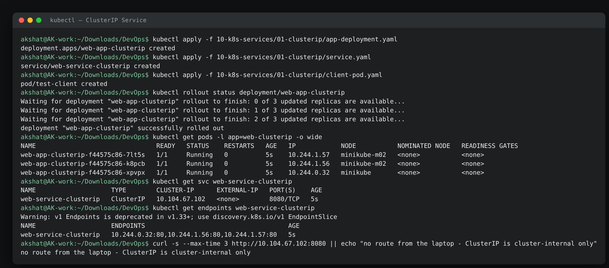
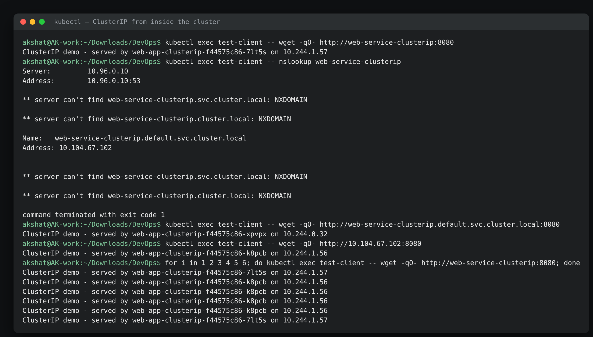
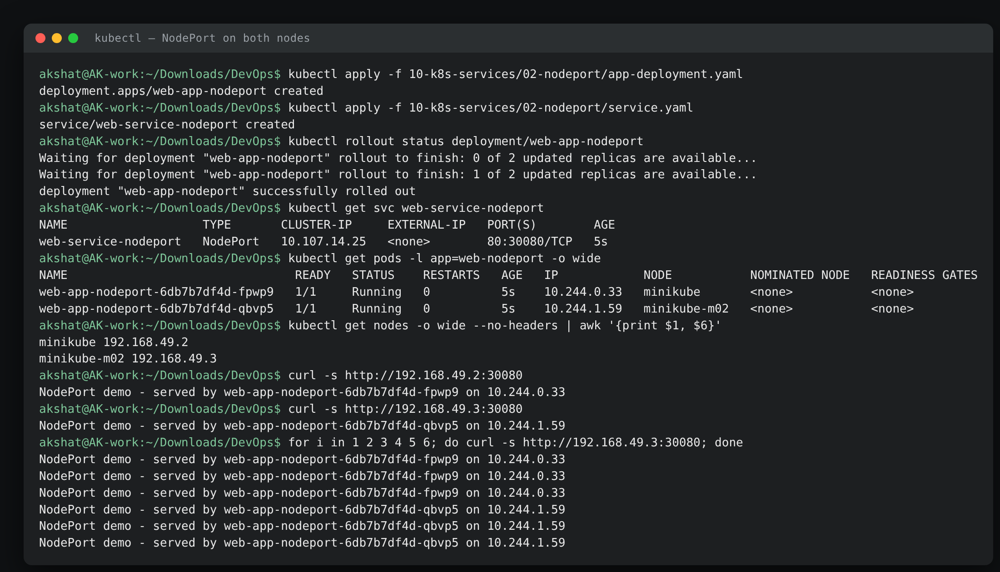
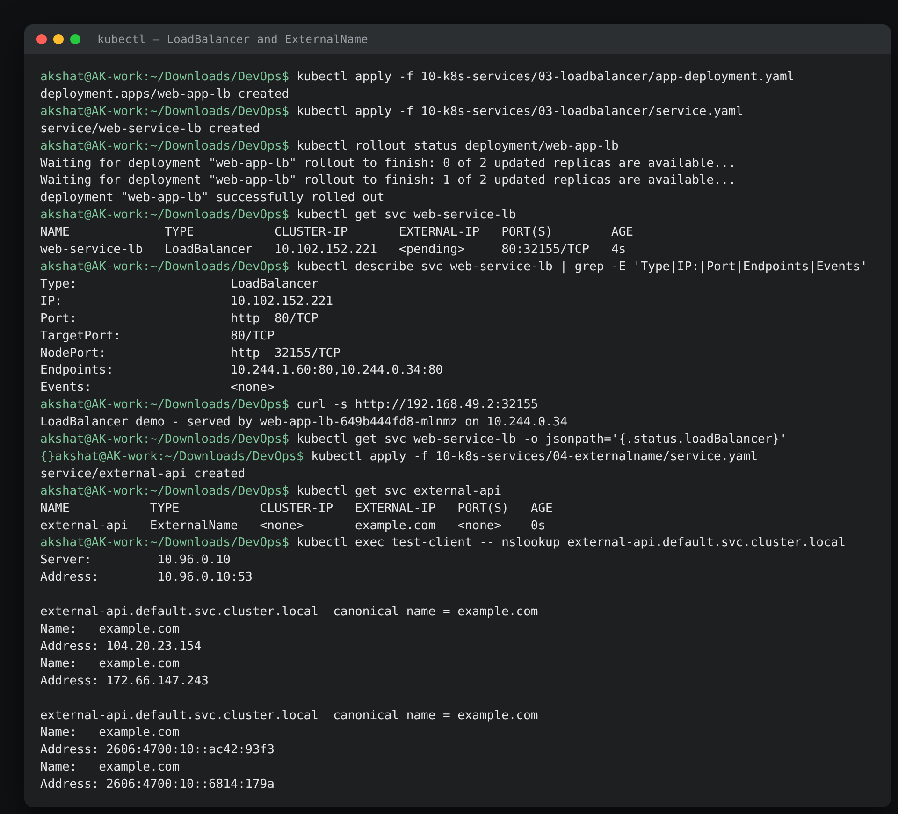
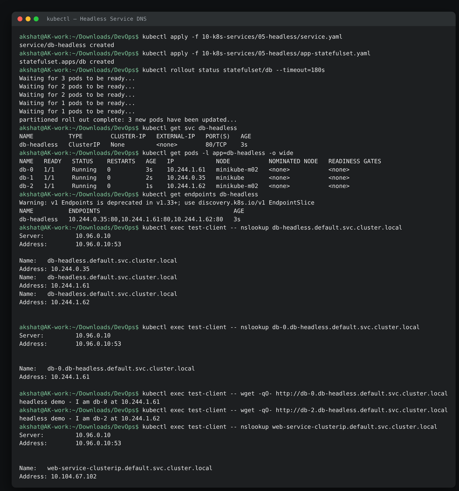
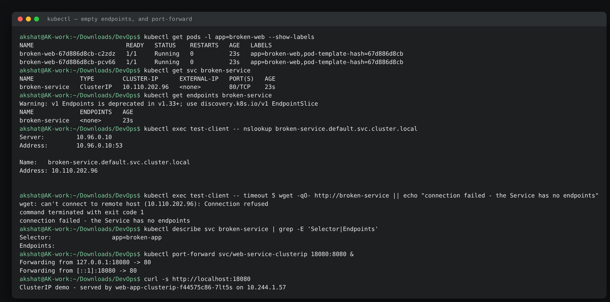

# Kubernetes Networking & Services Homework

**Name:** Akshat Kushwaha
**Enrollment Number:** 24bcs10060
17 September 2026

All five Service types, each deployed and tested on the two-node minikube cluster from [assignment 08](../08-kubernetes-fundamentals/). Every application Pod serves a page naming itself, so the load balancing is visible in the output rather than something you have to take on trust.

| Folder | Type |
|---|---|
| [`01-clusterip/`](./01-clusterip/) | ClusterIP — internal virtual IP (the default) |
| [`02-nodeport/`](./02-nodeport/) | NodePort — a port on every node |
| [`03-loadbalancer/`](./03-loadbalancer/) | LoadBalancer — cloud load balancer |
| [`04-externalname/`](./04-externalname/) | ExternalName — a DNS alias, nothing else |
| [`05-headless/`](./05-headless/) | Headless — `clusterIP: None`, DNS to each Pod |
| [`troubleshooting/`](./troubleshooting/) | The empty-endpoints failure |

---

## The problem Services solve

Assignment 09 showed the problem directly: delete a Pod from a ReplicaSet and the replacement comes back with a **different name and a different IP**. Anything holding that IP is now broken. A Service is a stable name and a stable virtual IP in front of a set of Pods that keeps changing underneath.

The mechanism is the same for every type, and it is worth stating once:

```text
Service (selector: app=web)
        │
        │  the endpoints controller watches Pods matching the selector
        ▼
EndpointSlice: 10.244.0.32:80, 10.244.1.56:80, 10.244.1.57:80
        │
        │  kube-proxy on every node turns that list into iptables rules
        ▼
Traffic to the Service VIP is DNAT'd to one of those Pod IPs, at random
```

Three consequences follow from that, and all three show up in the output below: the Service does not proxy through a process (it is packet-level rules), load balancing is per-connection rather than per-request, and if the selector matches nothing the Service still exists and simply blackholes traffic.

## The four ports, which are easy to confuse

| Field | Where it lives | What it means |
|---|---|---|
| `port` | Service | The port the Service itself answers on |
| `targetPort` | Service | The port on the **Pod** that traffic is forwarded to |
| `containerPort` | Pod spec | Documentation — what the container listens on |
| `nodePort` | Service (NodePort/LoadBalancer) | The port opened on **every node**, 30000–32767 |

In `01-clusterip` I deliberately set `port: 8080` and `targetPort: 80` so the two can never be mistaken for each other.

---

## 1. ClusterIP — the default

```text
akshat@AK-work:~/Downloads/DevOps$ kubectl get pods -l app=web-clusterip -o wide
NAME                                READY   STATUS    RESTARTS   AGE   IP            NODE           NOMINATED NODE   READINESS GATES
web-app-clusterip-f44575c86-7lt5s   1/1     Running   0          5s    10.244.1.57   minikube-m02   <none>           <none>
web-app-clusterip-f44575c86-k8pcb   1/1     Running   0          5s    10.244.1.56   minikube-m02   <none>           <none>
web-app-clusterip-f44575c86-xpvpx   1/1     Running   0          5s    10.244.0.32   minikube       <none>           <none>
akshat@AK-work:~/Downloads/DevOps$ kubectl get svc web-service-clusterip
NAME                    TYPE        CLUSTER-IP      EXTERNAL-IP   PORT(S)    AGE
web-service-clusterip   ClusterIP   10.104.67.102   <none>        8080/TCP   5s
akshat@AK-work:~/Downloads/DevOps$ kubectl get endpoints web-service-clusterip
NAME                    ENDPOINTS                                      AGE
web-service-clusterip   10.244.0.32:80,10.244.1.56:80,10.244.1.57:80   5s
```

**What I understood:** the Service got `10.104.67.102` from the service CIDR (`10.96.0.0/12`), which is a completely different range from the Pod CIDR (`10.244.0.0/16`). The endpoints list is the three Pod IPs at **port 80** — `targetPort`, not the Service's `port: 8080`. `EXTERNAL-IP: <none>` is the type's defining property.

### Reaching it from inside the cluster

```text
akshat@AK-work:~/Downloads/DevOps$ kubectl exec test-client -- wget -qO- http://web-service-clusterip:8080
ClusterIP demo - served by web-app-clusterip-f44575c86-7lt5s on 10.244.1.57
akshat@AK-work:~/Downloads/DevOps$ kubectl exec test-client -- wget -qO- http://web-service-clusterip.default.svc.cluster.local:8080
ClusterIP demo - served by web-app-clusterip-f44575c86-xpvpx on 10.244.0.32
akshat@AK-work:~/Downloads/DevOps$ kubectl exec test-client -- wget -qO- http://10.104.67.102:8080
ClusterIP demo - served by web-app-clusterip-f44575c86-k8pcb on 10.244.1.56
akshat@AK-work:~/Downloads/DevOps$ for i in 1 2 3 4 5 6; do kubectl exec test-client -- wget -qO- http://web-service-clusterip:8080; done
ClusterIP demo - served by web-app-clusterip-f44575c86-7lt5s on 10.244.1.57
ClusterIP demo - served by web-app-clusterip-f44575c86-k8pcb on 10.244.1.56
ClusterIP demo - served by web-app-clusterip-f44575c86-k8pcb on 10.244.1.56
ClusterIP demo - served by web-app-clusterip-f44575c86-k8pcb on 10.244.1.56
ClusterIP demo - served by web-app-clusterip-f44575c86-k8pcb on 10.244.1.56
ClusterIP demo - served by web-app-clusterip-f44575c86-7lt5s on 10.244.1.57
```

**What I understood:** three ways of addressing the same Service — short name, FQDN, raw IP — all work, and each landed on a different Pod. The distribution across six requests (4-2-0) is visibly *not* neat round-robin: iptables mode picks an endpoint at random per connection, so it only evens out over many requests. That is worth knowing before you try to explain an uneven load graph.

The short name works because of the search domains in the Pod's `/etc/resolv.conf`, which is also why `nslookup` looks a little alarming:

```text
akshat@AK-work:~/Downloads/DevOps$ kubectl exec test-client -- nslookup web-service-clusterip
Server:		10.96.0.10
Address:	10.96.0.10:53

** server can't find web-service-clusterip.svc.cluster.local: NXDOMAIN

** server can't find web-service-clusterip.cluster.local: NXDOMAIN

Name:	web-service-clusterip.default.svc.cluster.local
Address: 10.104.67.102
```

Those NXDOMAINs are not errors. The resolver tries each search domain in order — `default.svc.cluster.local`, `svc.cluster.local`, `cluster.local` — and busybox's `nslookup` prints every attempt including the misses. The middle answer is the real one. `10.96.0.10` is CoreDNS.

### It really is internal

```text
akshat@AK-work:~/Downloads/DevOps$ curl -s --max-time 3 http://10.104.67.102:8080 || echo "no route from the laptop - ClusterIP is cluster-internal only"
no route from the laptop - ClusterIP is cluster-internal only
```

**What I understood:** the same request that works from `test-client` fails from the laptop. The ClusterIP is not an address that exists anywhere — it is a number that only means something to the iptables rules kube-proxy installed *on cluster nodes*. My laptop has no such rules and no route.

For debugging from outside without changing the Service type, `port-forward` opens a tunnel through the API server:

```text
akshat@AK-work:~/Downloads/DevOps$ kubectl port-forward svc/web-service-clusterip 18080:8080 &
Forwarding from 127.0.0.1:18080 -> 80
Forwarding from [::1]:18080 -> 80
akshat@AK-work:~/Downloads/DevOps$ curl -s http://localhost:18080
ClusterIP demo - served by web-app-clusterip-f44575c86-7lt5s on 10.244.1.57
```

Note `-> 80`: the forward goes to the Pod's `targetPort`, not to the Service port.

---

## 2. NodePort — a port on every node

```text
akshat@AK-work:~/Downloads/DevOps$ kubectl get svc web-service-nodeport
NAME                   TYPE       CLUSTER-IP     EXTERNAL-IP   PORT(S)        AGE
web-service-nodeport   NodePort   10.107.14.25   <none>        80:30080/TCP   5s
akshat@AK-work:~/Downloads/DevOps$ kubectl get pods -l app=web-nodeport -o wide
NAME                                READY   STATUS    RESTARTS   AGE   IP            NODE           NOMINATED NODE   READINESS GATES
web-app-nodeport-6db7b7df4d-fpwp9   1/1     Running   0          5s    10.244.0.33   minikube       <none>           <none>
web-app-nodeport-6db7b7df4d-qbvp5   1/1     Running   0          5s    10.244.1.59   minikube-m02   <none>           <none>
```

**What I understood:** `PORT(S)` reads `80:30080/TCP` — Service port 80, node port 30080. A NodePort **is** a ClusterIP with an extra door: it still has `10.107.14.25`, and everything from the previous section still works.

### Two nodes, two doors, the same Pods

```text
akshat@AK-work:~/Downloads/DevOps$ kubectl get nodes -o wide --no-headers | awk '{print $1, $6}'
minikube 192.168.49.2
minikube-m02 192.168.49.3
akshat@AK-work:~/Downloads/DevOps$ curl -s http://192.168.49.2:30080
NodePort demo - served by web-app-nodeport-6db7b7df4d-fpwp9 on 10.244.0.33
akshat@AK-work:~/Downloads/DevOps$ curl -s http://192.168.49.3:30080
NodePort demo - served by web-app-nodeport-6db7b7df4d-qbvp5 on 10.244.1.59
akshat@AK-work:~/Downloads/DevOps$ for i in 1 2 3 4 5 6; do curl -s http://192.168.49.3:30080; done
NodePort demo - served by web-app-nodeport-6db7b7df4d-fpwp9 on 10.244.0.33
NodePort demo - served by web-app-nodeport-6db7b7df4d-fpwp9 on 10.244.0.33
NodePort demo - served by web-app-nodeport-6db7b7df4d-fpwp9 on 10.244.0.33
NodePort demo - served by web-app-nodeport-6db7b7df4d-qbvp5 on 10.244.1.59
NodePort demo - served by web-app-nodeport-6db7b7df4d-qbvp5 on 10.244.1.59
NodePort demo - served by web-app-nodeport-6db7b7df4d-qbvp5 on 10.244.1.59
```

**What I understood, and this is the part the two-node cluster was worth setting up for:** every one of those six requests went to **`192.168.49.3`**, the worker node — and three of them were answered by `fpwp9`, which runs on the *other* node, `192.168.49.2`. Port 30080 is open on every node whether or not a backend Pod is running there, and kube-proxy forwards across the node boundary transparently.

That cross-node hop costs an extra network hop and loses the client's source IP (it is SNAT'd). `externalTrafficPolicy: Local` turns that off — traffic then only reaches Pods on the node it arrived at, which preserves the source IP but unbalances the load and returns a connection failure on nodes with no Pod.

Working from the laptop at all is a minikube detail worth naming: the node "IPs" `192.168.49.x` are the Docker bridge addresses of the node containers, which is why `curl` reaches them directly here. On a cloud cluster those are private VPC addresses and you would need a route or a bastion.

---

## 3. LoadBalancer — and what happens without a cloud

```text
akshat@AK-work:~/Downloads/DevOps$ kubectl get svc web-service-lb
NAME             TYPE           CLUSTER-IP       EXTERNAL-IP   PORT(S)        AGE
web-service-lb   LoadBalancer   10.102.152.221   <pending>     80:32155/TCP   4s
akshat@AK-work:~/Downloads/DevOps$ kubectl describe svc web-service-lb | grep -E 'Type|IP:|Port|Endpoints|Events'
Type:                     LoadBalancer
IP:                       10.102.152.221
Port:                     http  80/TCP
TargetPort:               80/TCP
NodePort:                 http  32155/TCP
Endpoints:                10.244.1.60:80,10.244.0.34:80
Events:                   <none>
```

**What I understood:** `EXTERNAL-IP: <pending>` is the correct and expected result here, not a failure. A LoadBalancer Service does not create a load balancer — it *asks* for one, and the thing that answers is the cloud-controller-manager: AWS provisions an ELB, GCP a forwarding rule, Azure a Load Balancer. My minikube has no cloud controller, so nothing ever answers the request and the field stays pending forever. `Events: <none>` confirms nobody is even trying.

What the describe output makes plain is the layering: the Service got a ClusterIP **and** a NodePort (32155) on the way to being a LoadBalancer. Each type is the previous one plus something:

```text
ClusterIP   →  internal VIP
NodePort    →  ClusterIP + a port on every node
LoadBalancer →  NodePort + an external LB pointing at those node ports
```

So even with the external IP pending, the underlying NodePort works:

```text
akshat@AK-work:~/Downloads/DevOps$ curl -s http://192.168.49.2:32155
LoadBalancer demo - served by web-app-lb-649b444fd8-mlnmz on 10.244.0.34
akshat@AK-work:~/Downloads/DevOps$ kubectl get svc web-service-lb -o jsonpath='{.status.loadBalancer}'
{}
```

An empty `status.loadBalancer` is what `<pending>` actually is underneath — the status subresource a cloud controller would have written an address into.

On this machine the ways to fill it in would be `minikube tunnel` (which needs root to add routes on the host) or the MetalLB addon (a real bare-metal LB implementation). I left it pending deliberately, because the pending state is the thing worth understanding: on a bare-metal or on-prem cluster, `type: LoadBalancer` does nothing at all unless something like MetalLB is installed.

**Cost note that matters in a real job:** every `type: LoadBalancer` Service is a separate billed cloud load balancer. Ten microservices exposed this way is ten load balancers. One Ingress in front of ten ClusterIP Services is one — which is [assignment 11](../11-k8s-ingress-configmaps-secrets/).

---

## 4. ExternalName — a DNS alias and nothing more

```text
akshat@AK-work:~/Downloads/DevOps$ kubectl get svc external-api
NAME           TYPE           CLUSTER-IP   EXTERNAL-IP   PORT(S)   AGE
external-api   ExternalName   <none>       example.com   <none>    0s
akshat@AK-work:~/Downloads/DevOps$ kubectl exec test-client -- nslookup external-api.default.svc.cluster.local
Server:		10.96.0.10
Address:	10.96.0.10:53

external-api.default.svc.cluster.local	canonical name = example.com
Name:	example.com
Address: 104.20.23.154
Name:	example.com
Address: 172.66.147.243

external-api.default.svc.cluster.local	canonical name = example.com
Name:	example.com
Address: 2606:4700:10::ac42:93f3
Name:	example.com
Address: 2606:4700:10::6814:179a
```

**What I understood:** look at what this Service does *not* have — no cluster IP, no ports, no selector, no endpoints. CoreDNS answers with `canonical name = example.com`, a **CNAME**, and the client then resolves that itself and connects directly. No traffic passes through Kubernetes at all.

The value is indirection. Application code and manifests say `external-api`, and when the managed database moves from one hostname to another you edit one field here instead of redeploying everything. It is also the standard way to make an external dependency look the same in dev, staging and production while pointing at different hosts.

Two gotchas worth remembering:

- **Ports are ignored.** ExternalName cannot remap `5432` to `1234` — it is DNS, and DNS has no ports.
- **It breaks TLS name checks.** The client connects to a certificate issued for `example.com` while believing it asked for `external-api`, and strict verification fails unless the client is told the real hostname.

---

## 5. Headless — DNS straight to the Pods

```text
akshat@AK-work:~/Downloads/DevOps$ kubectl get svc db-headless
NAME          TYPE        CLUSTER-IP   EXTERNAL-IP   PORT(S)   AGE
db-headless   ClusterIP   None         <none>        80/TCP    3s
akshat@AK-work:~/Downloads/DevOps$ kubectl get pods -l app=db-headless -o wide
NAME   READY   STATUS    RESTARTS   AGE   IP            NODE           NOMINATED NODE   READINESS GATES
db-0   1/1     Running   0          3s    10.244.1.61   minikube-m02   <none>           <none>
db-1   1/1     Running   0          2s    10.244.0.35   minikube       <none>           <none>
db-2   1/1     Running   0          1s    10.244.1.62   minikube-m02   <none>           <none>
```

The whole difference is in what DNS returns. Headless first:

```text
akshat@AK-work:~/Downloads/DevOps$ kubectl exec test-client -- nslookup db-headless.default.svc.cluster.local
Server:		10.96.0.10
Address:	10.96.0.10:53

Name:	db-headless.default.svc.cluster.local
Address: 10.244.0.35
Name:	db-headless.default.svc.cluster.local
Address: 10.244.1.61
Name:	db-headless.default.svc.cluster.local
Address: 10.244.1.62
```

Now the ordinary ClusterIP Service from section 1, for comparison:

```text
akshat@AK-work:~/Downloads/DevOps$ kubectl exec test-client -- nslookup web-service-clusterip.default.svc.cluster.local
Server:		10.96.0.10
Address:	10.96.0.10:53

Name:	web-service-clusterip.default.svc.cluster.local
Address: 10.104.67.102
```

**What I understood:** one name, two completely different answers. The headless Service returns **three A records — the actual Pod IPs**. The normal Service returns **one address, the virtual IP**, and the client never learns that three Pods exist.

That is the point: with `clusterIP: None` there is no VIP, no kube-proxy rule, no load balancing. The client gets the whole membership list and decides for itself — which is exactly what a database driver needs when it has to know which node is the primary, or a cluster member needs when it has to gossip with its peers.

### Per-Pod DNS names

```text
akshat@AK-work:~/Downloads/DevOps$ kubectl exec test-client -- nslookup db-0.db-headless.default.svc.cluster.local
Server:		10.96.0.10
Address:	10.96.0.10:53

Name:	db-0.db-headless.default.svc.cluster.local
Address: 10.244.1.61

akshat@AK-work:~/Downloads/DevOps$ kubectl exec test-client -- wget -qO- http://db-0.db-headless.default.svc.cluster.local
headless demo - I am db-0 at 10.244.1.61
akshat@AK-work:~/Downloads/DevOps$ kubectl exec test-client -- wget -qO- http://db-2.db-headless.default.svc.cluster.local
headless demo - I am db-2 at 10.244.1.62
```

**What I understood:** `<pod>.<service>.<namespace>.svc.cluster.local` addresses **one specific Pod**, and the reply proves it — asking for `db-0` got `db-0`, asking for `db-2` got `db-2`. Combined with the StatefulSet's stable names from assignment 09, this is how `db-0` stays reachable at the same name forever even though its IP changes on every reschedule. It is the addressing scheme behind every StatefulSet-based database, Kafka cluster and etcd deployment.

---

## Comparison

| Type | Cluster IP | Reachable from outside | DNS returns | Use it for |
|---|---|---|---|---|
| **ClusterIP** | Yes | No | The VIP | Internal service-to-service, databases, anything behind an Ingress |
| **NodePort** | Yes | Yes, `<node-ip>:30000-32767` | The VIP | Bare metal, dev clusters, exposing an Ingress controller |
| **LoadBalancer** | Yes | Yes, via a cloud LB | The VIP | Public entry points on a cloud provider |
| **ExternalName** | No | n/a — points outward | A **CNAME** to an external host | Managed DBs, third-party APIs, an alias you can re-point |
| **Headless** (`clusterIP: None`) | No | No | **Every Pod IP** | StatefulSets, clustered databases, client-side load balancing |

---

## Troubleshooting: the Service that resolves but never answers

```text
akshat@AK-work:~/Downloads/DevOps$ kubectl get pods -l app=broken-web --show-labels
NAME                          READY   STATUS    RESTARTS   AGE   LABELS
broken-web-67d886d8cb-c2zdz   1/1     Running   0          23s   app=broken-web,pod-template-hash=67d886d8cb
broken-web-67d886d8cb-pcv66   1/1     Running   0          23s   app=broken-web,pod-template-hash=67d886d8cb
akshat@AK-work:~/Downloads/DevOps$ kubectl get svc broken-service
NAME             TYPE        CLUSTER-IP      EXTERNAL-IP   PORT(S)   AGE
broken-service   ClusterIP   10.110.202.96   <none>        80/TCP    23s
akshat@AK-work:~/Downloads/DevOps$ kubectl get endpoints broken-service
NAME             ENDPOINTS   AGE
broken-service   <none>      23s
akshat@AK-work:~/Downloads/DevOps$ kubectl exec test-client -- nslookup broken-service.default.svc.cluster.local
Server:		10.96.0.10
Address:	10.96.0.10:53

Name:	broken-service.default.svc.cluster.local
Address: 10.110.202.96

akshat@AK-work:~/Downloads/DevOps$ kubectl exec test-client -- timeout 5 wget -qO- http://broken-service || echo "connection failed - the Service has no endpoints"
wget: can't connect to remote host (10.110.202.96): Connection refused
command terminated with exit code 1
connection failed - the Service has no endpoints
akshat@AK-work:~/Downloads/DevOps$ kubectl describe svc broken-service | grep -E 'Selector|Endpoints'
Selector:                 app=broken-app
Endpoints:
```

**What I understood:** every individual check passes. Pods are `1/1 Running`. The Service exists with a ClusterIP. **DNS resolves correctly.** And nothing works, because `ENDPOINTS` is `<none>` — the selector says `app=broken-app`, the Pods are labelled `app=broken-web`.

Two details worth keeping:

- The failure is **`Connection refused`, immediately** — not a timeout. With no endpoints there is no DNAT rule, so the packet hits a closed port on the node and is rejected at once. A timeout would point at a network policy or a firewall instead; instant refusal points at endpoints.
- Kubernetes never warns about this. A selector matching nothing is legal, because a Service is allowed to exist before its Pods do.

**`kubectl get endpoints <svc>` is the first command to run when a Service will not answer**, and a one-character label typo is the most common cause.

---

## Cleanup

```bash
kubectl delete -f 10-k8s-services/01-clusterip/
kubectl delete -f 10-k8s-services/02-nodeport/
kubectl delete -f 10-k8s-services/03-loadbalancer/
kubectl delete -f 10-k8s-services/04-externalname/
kubectl delete -f 10-k8s-services/05-headless/
kubectl delete -f 10-k8s-services/troubleshooting/
```

---

## Screenshots

**ClusterIP: the Service, its endpoints, and why the laptop cannot reach it**



**ClusterIP from inside the cluster — short name, FQDN, raw IP, and the load spread**



**NodePort — port 30080 on both nodes, forwarding across the node boundary**



**LoadBalancer stuck at `<pending>`, and ExternalName returning a CNAME**



**Headless — three A records, and per-Pod DNS names**



**Empty endpoints: resolves, refuses, and `port-forward` for debugging**



---

## Summary

| Requirement | Status |
|---|---|
| ClusterIP Service deployed and tested internally | Done — by name, FQDN and IP, from a client Pod |
| Proven that ClusterIP is not reachable from outside | Done — same request fails from the laptop |
| NodePort deployed and reached on a node IP | Done — on **both** nodes, including cross-node forwarding |
| LoadBalancer deployed | Done — `<pending>` explained, underlying NodePort verified |
| ExternalName deployed and resolved | Done — CNAME to `example.com` |
| Headless Service with a StatefulSet | Done — all Pod IPs from DNS, plus per-Pod names |
| Difference between the five types understood | Done — comparison table above |
| The four ports distinguished | Done — `port: 8080` vs `targetPort: 80` throughout |
| Troubleshooting: empty endpoints | Done — diagnosed from `get endpoints` |
