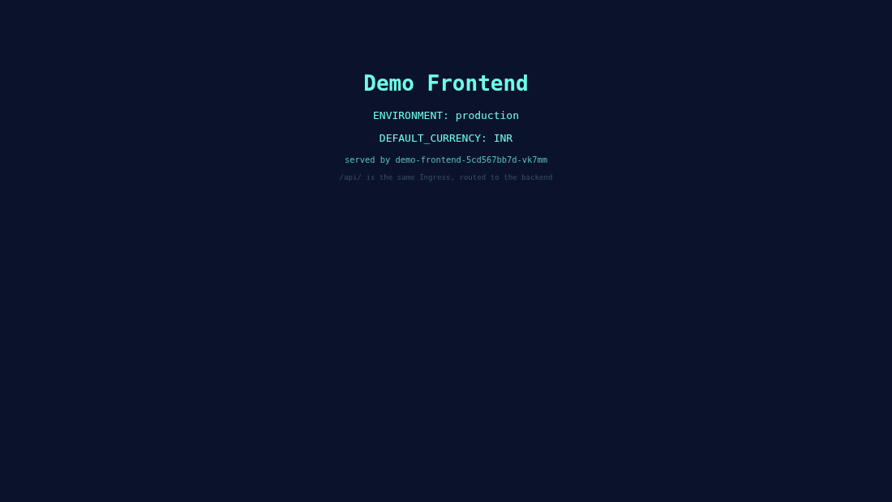
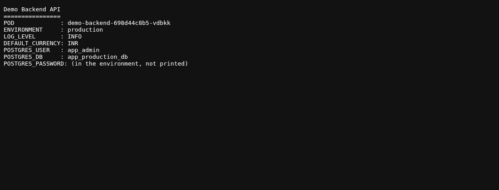
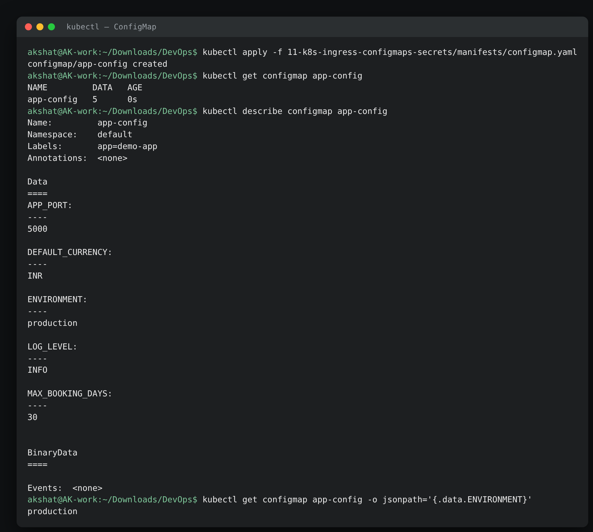
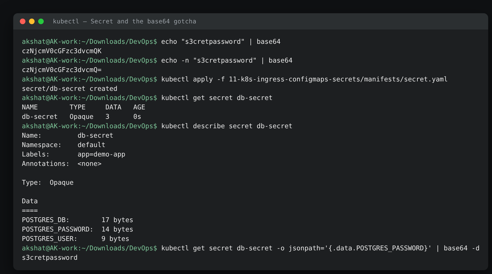
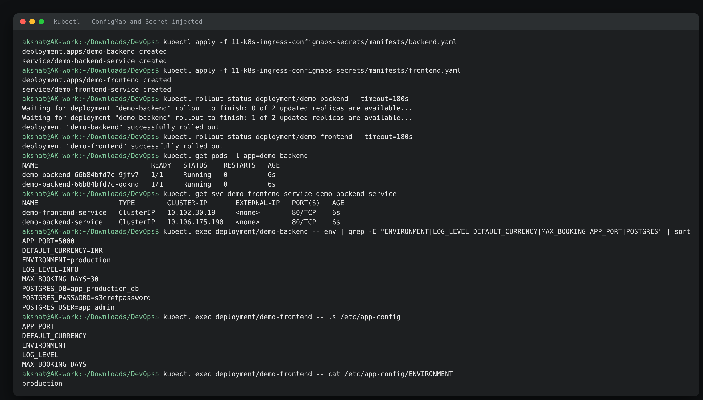
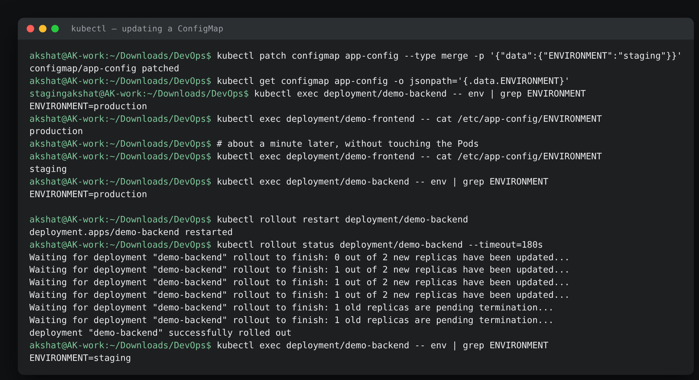
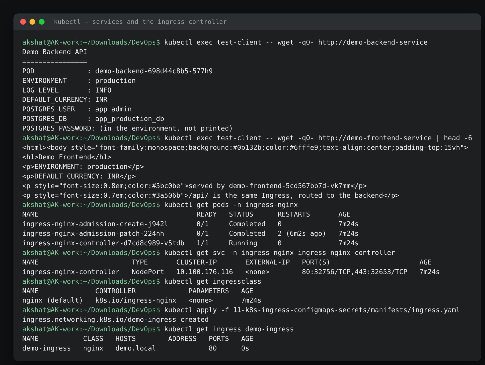
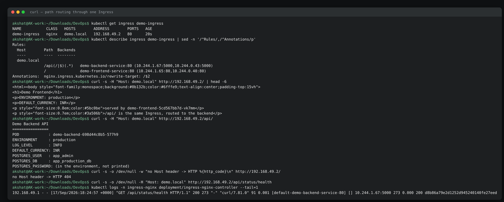
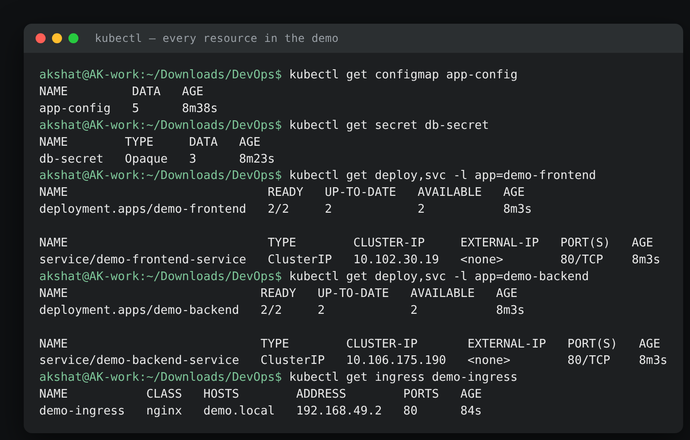

# Kubernetes Ingress, ConfigMaps & Secrets Homework

**Name:** Akshat Kushwaha
**Enrollment Number:** 24bcs10060
17 September 2026

Configuration out of the image, credentials out of the manifest, and one entry point in front of two services. Run on the two-node minikube cluster from [assignment 08](../08-kubernetes-fundamentals/).

| File | What it is |
|---|---|
| [`manifests/configmap.yaml`](./manifests/configmap.yaml) | Five plain-text settings |
| [`manifests/secret.yaml`](./manifests/secret.yaml) | Three base64-encoded credentials |
| [`manifests/backend.yaml`](./manifests/backend.yaml) | Python API that prints the config it was given, + ClusterIP Service |
| [`manifests/frontend.yaml`](./manifests/frontend.yaml) | nginx page built from the same ConfigMap, + ClusterIP Service |
| [`manifests/ingress.yaml`](./manifests/ingress.yaml) | One host, two paths, two backends |

---

## Part 1 — ConfigMap

```text
akshat@AK-work:~/Downloads/DevOps$ kubectl apply -f 11-k8s-ingress-configmaps-secrets/manifests/configmap.yaml
configmap/app-config created
akshat@AK-work:~/Downloads/DevOps$ kubectl get configmap app-config
NAME         DATA   AGE
app-config   5      0s
akshat@AK-work:~/Downloads/DevOps$ kubectl describe configmap app-config
Name:         app-config
Namespace:    default
Labels:       app=demo-app
Annotations:  <none>

Data
====
APP_PORT:
----
5000

DEFAULT_CURRENCY:
----
INR

ENVIRONMENT:
----
production

LOG_LEVEL:
----
INFO

MAX_BOOKING_DAYS:
----
30


BinaryData
====

Events:  <none>
akshat@AK-work:~/Downloads/DevOps$ kubectl get configmap app-config -o jsonpath='{.data.ENVIRONMENT}'
production
```

**What I understood:** `DATA 5` is the number of keys, not bytes. `describe` prints every value in full and in plain text — which is exactly the difference from a Secret, and the reason a ConfigMap must never hold a password. `-o jsonpath='{.data.KEY}'` pulls one value out, which is how you read config in a script without eyeballing YAML.

The point of the object is that the same image runs in dev, staging and production with a different ConfigMap attached. Nothing environment-specific is baked into the build.

---

## Part 2 — Secret, and the newline that breaks logins

Before creating anything, the encoding detail that the lab is built around:

```text
akshat@AK-work:~/Downloads/DevOps$ echo "s3cretpassword" | base64
czNjcmV0cGFzc3dvcmQK
akshat@AK-work:~/Downloads/DevOps$ echo -n "s3cretpassword" | base64
czNjcmV0cGFzc3dvcmQ=
```

**What I understood:** the two differ in the last characters — `…d0K` against `…d0=`. That `K` is the tail of the encoded `\n` that `echo` appends by default. The Secret would then hold `s3cretpassword\n`, fifteen bytes instead of fourteen, and the database would reject the login with a plain "password authentication failed" while the value *looks* perfectly right in every YAML file and log. **`echo -n` every time.**

```text
akshat@AK-work:~/Downloads/DevOps$ kubectl apply -f 11-k8s-ingress-configmaps-secrets/manifests/secret.yaml
secret/db-secret created
akshat@AK-work:~/Downloads/DevOps$ kubectl get secret db-secret
NAME        TYPE     DATA   AGE
db-secret   Opaque   3      0s
akshat@AK-work:~/Downloads/DevOps$ kubectl describe secret db-secret
Name:         db-secret
Namespace:    default
Labels:       app=demo-app
Annotations:  <none>

Type:  Opaque

Data
====
POSTGRES_DB:        17 bytes
POSTGRES_PASSWORD:  14 bytes
POSTGRES_USER:      9 bytes
akshat@AK-work:~/Downloads/DevOps$ kubectl get secret db-secret -o jsonpath='{.data.POSTGRES_PASSWORD}' | base64 -d
s3cretpassword
```

**What I understood:** `describe` shows **`14 bytes`** instead of the value — the mask that stops a password ending up in a screen share or a terminal recording. And `14` is itself the proof that `echo -n` was used: `s3cretpassword` is fourteen characters, so no stray newline got in.

The last command is the other half of the lesson. **Base64 is encoding, not encryption** — one command, no key, no permission beyond `get secret`, and the password is on screen. What actually protects a Secret is:

- **RBAC** — restricting who can `get secret` at all, which is a much tighter set than who can `get pod`.
- **Encryption at rest** — an API-server setting (`EncryptionConfiguration`) so the value is not sitting in plaintext inside etcd.
- **Not putting real secrets in git** — this repository's `secret.yaml` holds obviously fake values. Real ones come from Sealed Secrets, External Secrets, Vault, or a cloud secret manager.

Against `describe configmap`, which printed every value in full, the contrast is the whole design.

---

## Part 3 — Getting them into a Pod

Two mechanisms, and I used both so the difference is visible.

**Backend — environment variables:**

```yaml
envFrom:
  - configMapRef:
      name: app-config          # all five keys in one line
env:
  - name: POSTGRES_USER
    valueFrom:
      secretKeyRef: { name: db-secret, key: POSTGRES_USER }
```

**Frontend — the same ConfigMap mounted as files:**

```yaml
volumes:
  - name: config-volume
    configMap:
      name: app-config          # each key becomes a file
volumeMounts:
  - name: config-volume
    mountPath: /etc/app-config
    readOnly: true
```

```text
akshat@AK-work:~/Downloads/DevOps$ kubectl exec deployment/demo-backend -- env | grep -E "ENVIRONMENT|LOG_LEVEL|DEFAULT_CURRENCY|MAX_BOOKING|APP_PORT|POSTGRES" | sort
APP_PORT=5000
DEFAULT_CURRENCY=INR
ENVIRONMENT=production
LOG_LEVEL=INFO
MAX_BOOKING_DAYS=30
POSTGRES_DB=app_production_db
POSTGRES_PASSWORD=s3cretpassword
POSTGRES_USER=app_admin
akshat@AK-work:~/Downloads/DevOps$ kubectl exec deployment/demo-frontend -- ls /etc/app-config
APP_PORT
DEFAULT_CURRENCY
ENVIRONMENT
LOG_LEVEL
MAX_BOOKING_DAYS
akshat@AK-work:~/Downloads/DevOps$ kubectl exec deployment/demo-frontend -- cat /etc/app-config/ENVIRONMENT
production
```

**What I understood:** the application cannot tell where any of this came from — `POSTGRES_PASSWORD` from a Secret and `LOG_LEVEL` from a ConfigMap arrive as ordinary environment variables, side by side. That is the whole point: config injection needs no library, no SDK and no code changes. The volume form turns each key into a file whose name is the key and whose contents are the value.

Which to use:

| | Environment variables | Mounted files |
|---|---|---|
| Updates without restart | **No** | **Yes** (see below) |
| Visible in `kubectl describe pod` | Yes, name and value | No, only the mount |
| Leaks into child processes and crash dumps | Yes | No |
| Suits a config file (nginx.conf, application.yml) | No | Yes |

For secrets specifically, files are the better default — an environment variable is inherited by every child process and shows up in `/proc/<pid>/environ`.

The end-to-end check through the ClusterIP Services, before any Ingress exists:

```text
akshat@AK-work:~/Downloads/DevOps$ kubectl exec test-client -- wget -qO- http://demo-backend-service
Demo Backend API
================
POD             : demo-backend-698d44c8b5-577h9
ENVIRONMENT     : production
LOG_LEVEL       : INFO
DEFAULT_CURRENCY: INR
POSTGRES_USER   : app_admin
POSTGRES_DB     : app_production_db
POSTGRES_PASSWORD: (in the environment, not printed)
```

---

## Part 4 — What happens when you change a ConfigMap

```text
akshat@AK-work:~/Downloads/DevOps$ kubectl patch configmap app-config --type merge -p '{"data":{"ENVIRONMENT":"staging"}}'
configmap/app-config patched
akshat@AK-work:~/Downloads/DevOps$ kubectl get configmap app-config -o jsonpath='{.data.ENVIRONMENT}'
staging
akshat@AK-work:~/Downloads/DevOps$ kubectl exec deployment/demo-backend -- env | grep ENVIRONMENT
ENVIRONMENT=production
akshat@AK-work:~/Downloads/DevOps$ kubectl exec deployment/demo-frontend -- cat /etc/app-config/ENVIRONMENT
production
```

The ConfigMap says `staging`; both Pods still say `production`. A minute later, with nothing touched:

```text
akshat@AK-work:~/Downloads/DevOps$ kubectl exec deployment/demo-frontend -- cat /etc/app-config/ENVIRONMENT
staging
akshat@AK-work:~/Downloads/DevOps$ kubectl exec deployment/demo-backend -- env | grep ENVIRONMENT
ENVIRONMENT=production
```

**What I understood — and this is the most practically useful result in the assignment:** the two injection methods behave *completely differently* on update.

- **The mounted file updated on its own**, with no restart and no intervention. The kubelet re-syncs ConfigMap volumes periodically (roughly a minute), so a mounted config is eventually consistent with the object.
- **The environment variable did not, and never will.** Environment is set once, at `execve` time, when the container starts. Nothing can change it in a running process.

An application that reads a mounted file on every request picks up config changes live. One that reads an environment variable at startup needs new Pods:

```text
akshat@AK-work:~/Downloads/DevOps$ kubectl rollout restart deployment/demo-backend
deployment.apps/demo-backend restarted
akshat@AK-work:~/Downloads/DevOps$ kubectl rollout status deployment/demo-backend --timeout=180s
Waiting for deployment "demo-backend" rollout to finish: 0 out of 2 new replicas have been updated...
Waiting for deployment "demo-backend" rollout to finish: 1 out of 2 new replicas have been updated...
Waiting for deployment "demo-backend" rollout to finish: 1 old replicas are pending termination...
deployment "demo-backend" successfully rolled out
akshat@AK-work:~/Downloads/DevOps$ kubectl exec deployment/demo-backend -- env | grep ENVIRONMENT
ENVIRONMENT=staging
```

`kubectl rollout restart` is the right tool — it is a **rolling** restart, so it replaces Pods gradually and keeps serving traffic, unlike deleting them by hand.

The trap worth naming: because nothing links a Deployment to the ConfigMap it reads, editing a ConfigMap silently leaves every running Pod on the old value until something happens to restart it — and then a Pod that crashes for an unrelated reason comes back with *different* config from its siblings. The usual fix is to put a hash of the ConfigMap in a Pod-template annotation so any change forces a rollout (Helm's `checksum/config` pattern).

(I patched `ENVIRONMENT` back to `production` and restarted again before continuing, so everything below shows the original values.)

---

## Part 5 — Ingress

### The controller

```text
akshat@AK-work:~/Downloads/DevOps$ kubectl get pods -n ingress-nginx
NAME                                       READY   STATUS      RESTARTS       AGE
ingress-nginx-admission-create-j942l       0/1     Completed   0              7m24s
ingress-nginx-admission-patch-224nh        0/1     Completed   2 (6m2s ago)   7m24s
ingress-nginx-controller-d7cd8c989-v5tdb   1/1     Running     0              7m24s
akshat@AK-work:~/Downloads/DevOps$ kubectl get svc -n ingress-nginx ingress-nginx-controller
NAME                       TYPE       CLUSTER-IP       EXTERNAL-IP   PORT(S)                      AGE
ingress-nginx-controller   NodePort   10.100.176.116   <none>        80:32756/TCP,443:32653/TCP   7m24s
akshat@AK-work:~/Downloads/DevOps$ kubectl get ingressclass
NAME              CONTROLLER             PARAMETERS   AGE
nginx (default)   k8s.io/ingress-nginx   <none>       7m24s
```

**What I understood:** an Ingress **object does nothing on its own**. It is a routing table sitting in etcd, and something has to read it. That something is the controller — here a real nginx running as a Pod, watching the API for Ingress objects and rewriting its own config whenever one changes.

Which means the controller itself still has to be exposed by one of the ordinary Service types from [assignment 10](../10-k8s-services/) — and here it is, a plain `NodePort` on 32756/32653. That is the whole ingress pattern: **one Service exposed to the outside world, any number of ClusterIP Services behind it.**

The two `Completed` Pods are one-off Jobs that generated the TLS certificate for the admission webhook that validates Ingress objects. The `RESTARTS 2` on the patch Job is honest evidence of this connection — it retried while the API was slow, then succeeded.

`kubectl get ingressclass` matters because a cluster can run several controllers (nginx, Traefik, an AWS ALB controller). `ingressClassName: nginx` in my manifest is what picks this one; leaving it out on a cluster with no default means the Ingress is silently ignored by everybody.

### The routing rules

```text
akshat@AK-work:~/Downloads/DevOps$ kubectl apply -f 11-k8s-ingress-configmaps-secrets/manifests/ingress.yaml
ingress.networking.k8s.io/demo-ingress created
akshat@AK-work:~/Downloads/DevOps$ kubectl get ingress demo-ingress
NAME           CLASS   HOSTS        ADDRESS        PORTS   AGE
demo-ingress   nginx   demo.local   192.168.49.2   80      20s
akshat@AK-work:~/Downloads/DevOps$ kubectl describe ingress demo-ingress | sed -n '/^Rules/,/^Annotations/p'
Rules:
  Host        Path  Backends
  ----        ----  --------
  demo.local  
              /api(/|$)(.*)   demo-backend-service:80 (10.244.1.67:5000,10.244.0.43:5000)
              /               demo-frontend-service:80 (10.244.1.65:80,10.244.0.40:80)
Annotations:  nginx.ingress.kubernetes.io/rewrite-target: /$2
```

**What I understood:** `ADDRESS` filled in with `192.168.49.2` once the controller had accepted the object — an empty ADDRESS after a minute means no controller picked it up, usually a wrong or missing `ingressClassName`.

The `Backends` column is the useful part of `describe`: it resolves each Service down to **the actual Pod IPs and their real ports** (`:5000` for the Python backend, `:80` for nginx). If that list is empty, the problem is the Service's selector, not the Ingress.

### Both paths, one IP

```text
akshat@AK-work:~/Downloads/DevOps$ curl -s -H "Host: demo.local" http://192.168.49.2/ | head -6
<html><body style="font-family:monospace;background:#0b132b;color:#6fffe9;text-align:center;padding-top:15vh">
<h1>Demo Frontend</h1>
<p>ENVIRONMENT: production</p>
<p>DEFAULT_CURRENCY: INR</p>
<p style="font-size:0.8em;color:#5bc0be">served by demo-frontend-5cd567bb7d-vk7mm</p>
<p style="font-size:0.7em;color:#3a506b">/api/ is the same Ingress, routed to the backend</p>
akshat@AK-work:~/Downloads/DevOps$ curl -s -H "Host: demo.local" http://192.168.49.2/api/
Demo Backend API
================
POD             : demo-backend-698d44c8b5-577h9
ENVIRONMENT     : production
LOG_LEVEL       : INFO
DEFAULT_CURRENCY: INR
POSTGRES_USER   : app_admin
POSTGRES_DB     : app_production_db
POSTGRES_PASSWORD: (in the environment, not printed)
akshat@AK-work:~/Downloads/DevOps$ curl -s -o /dev/null -w "no Host header -> HTTP %{http_code}\n" http://192.168.49.2/
no Host header -> HTTP 404
```

**What I understood:** same IP, same port, two different applications — the path decides. This is Layer 7 routing, and it is the thing a Service cannot do: a Service is Layer 4 and only ever sees ports.

The third command is the part I found most instructive. **Without the `Host: demo.local` header the same request 404s.** The Ingress rule is scoped to a host, so nginx matches on the header, not on the IP. That is how one load balancer serves `api.example.com`, `app.example.com` and `admin.example.com` from one address — and it is why `-H "Host: …"` (or an `/etc/hosts` entry) is needed to test a host-based rule locally.

`-H "Host: demo.local"` is the honest way to do that without editing `/etc/hosts` and needing root; for the browser screenshots I used Chrome's `--host-resolver-rules="MAP demo.local 192.168.49.2"`, which does the same thing for the browser only.

### The rewrite actually happening

```text
akshat@AK-work:~/Downloads/DevOps$ curl -s -o /dev/null -H "Host: demo.local" http://192.168.49.2/api/status/health
akshat@AK-work:~/Downloads/DevOps$ kubectl logs -n ingress-nginx deployment/ingress-nginx-controller --tail=1
192.168.49.1 - - [17/Sep/2026:18:24:57 +0000] "GET /api/status/health HTTP/1.1" 200 273 "-" "curl/7.81.0" 91 0.001 [default-demo-backend-service-80] [] 10.244.1.67:5000 273 0.000 200 d8b86a79e2d1252d945240140fe27eed
```

**What I understood:** the access log is the ground truth for any Ingress problem. It names the request path, the **upstream it chose** (`default-demo-backend-service-80`), the **exact Pod IP and port** it forwarded to (`10.244.1.67:5000`), the status, and the timings.

The path handling is worth spelling out. The rule is `/api(/|$)(.*)` with `rewrite-target: /$2`:

```text
client asks for   /api/status/health
regex captures    $1 = "/"   $2 = "status/health"
backend receives  /status/health          <- the /api prefix is stripped
```

Without the rewrite, the backend would have to know it lives under `/api`. With it, the backend is written as if it owns the root, and the Ingress handles the prefix. The `(/|$)` group is what makes `/api` (no trailing slash) match as well as `/api/`.

`192.168.49.1` as the client address is the Docker bridge gateway, not my laptop's LAN IP — the request was SNAT'd on the way in. That is the same source-IP loss as NodePort in assignment 10, and the reason `X-Forwarded-For` exists.

### In a browser

**Path `/` — the frontend, with the ConfigMap values in the page:**



**Path `/api/` — the backend, same host, same port:**



---

## The full picture

```text
akshat@AK-work:~/Downloads/DevOps$ kubectl get configmap app-config
NAME         DATA   AGE
app-config   5      8m38s
akshat@AK-work:~/Downloads/DevOps$ kubectl get secret db-secret
NAME        TYPE     DATA   AGE
db-secret   Opaque   3      8m23s
akshat@AK-work:~/Downloads/DevOps$ kubectl get deploy,svc -l app=demo-frontend
NAME                            READY   UP-TO-DATE   AVAILABLE   AGE
deployment.apps/demo-frontend   2/2     2            2           8m3s

NAME                            TYPE        CLUSTER-IP     EXTERNAL-IP   PORT(S)   AGE
service/demo-frontend-service   ClusterIP   10.102.30.19   <none>        80/TCP    8m3s
akshat@AK-work:~/Downloads/DevOps$ kubectl get deploy,svc -l app=demo-backend
NAME                           READY   UP-TO-DATE   AVAILABLE   AGE
deployment.apps/demo-backend   2/2     2            2           8m3s

NAME                           TYPE        CLUSTER-IP       EXTERNAL-IP   PORT(S)   AGE
service/demo-backend-service   ClusterIP   10.106.175.190   <none>        80/TCP    8m3s
akshat@AK-work:~/Downloads/DevOps$ kubectl get ingress demo-ingress
NAME           CLASS   HOSTS        ADDRESS        PORTS   AGE
demo-ingress   nginx   demo.local   192.168.49.2   80      84s
```

Both application Services are **ClusterIP** — neither is reachable from outside the cluster on its own. The only thing exposed is the ingress controller. Ten more services could be added behind the same Ingress without opening anything else, which on a cloud provider is the difference between one billed load balancer and eleven.

```text
                         curl / browser
                               │  Host: demo.local
                               ▼
                    ingress-nginx-controller        (the only exposed thing)
                               │
              ┌────────────────┴────────────────┐
         path /                            path /api/*
              │                                 │  (prefix stripped)
              ▼                                 ▼
   demo-frontend-service              demo-backend-service      ClusterIP, internal
              │                                 │
        2 nginx Pods                      2 Python Pods
              │                                 │
        ConfigMap as files            ConfigMap as env + Secret as env
```

---

## Cleanup

```bash
kubectl delete -f 11-k8s-ingress-configmaps-secrets/manifests/
minikube addons disable ingress
```

---

## Screenshots

**ConfigMap — created, described, and one key read with jsonpath**



**Secret — the `echo` vs `echo -n` difference, masked values, and decoding it back**



**Both injected into Pods — as environment variables and as mounted files**



**Updating a ConfigMap: the file changes on its own, the env var needs a restart**



**The services internally, and the ingress controller**



**Path routing through one Ingress, and the access log showing the rewrite**



**Every resource in the demo**



---

## Summary

| Requirement | Status |
|---|---|
| ConfigMap applied, verified, key read with `-o jsonpath` | Done |
| Secret applied, values shown masked by `describe` | Done — `14 bytes`, not the value |
| `POSTGRES_PASSWORD` decoded with `base64 -d` | Done — base64 is encoding, not encryption |
| `echo` vs `echo -n` newline bug reproduced | Done — `…d0K` against `…d0=` |
| Backend deployed with `envFrom` + `secretKeyRef` | Done — all eight variables verified inside the Pod |
| Frontend deployed, ConfigMap also mounted as files | Done — both injection styles compared |
| Both Services confirmed `ClusterIP` | Done |
| NGINX Ingress controller enabled and Running | Done — ingress-nginx v1.15.1 |
| Ingress applied, `ADDRESS` populated | Done — `192.168.49.2` |
| Path `/` returns the frontend | Done — curl and browser |
| Path `/api/` returns the backend config values | Done — curl and browser |
| ConfigMap update behaviour demonstrated | Done — file updated live, env var needed `rollout restart` |
